# 基础信息

|      |      |
|------|------|
| 名称 | org |
| 编码语言 | .java |
| 代码路径 | spring-ldap/core/src/main/java/org |
| 包名 | spring-ldap.core.src.main.java.org |
| 概述说明 | Spring LDAP核心模块简化LDAP操作，涵盖上下文管理、对象映射、认证策略、路径处理、回调监控、异常处理、类型转换、分页搜索、排序控制、事务管理等功能，支持多种认证机制，确保安全高效交互。 |

# 说明

## 概述

该代码模块是Spring LDAP框架的核心部分，主要围绕LDAP（轻量级目录访问协议）的操作展开，提供了丰富的工具类和功能实现，旨在简化LDAP相关的开发工作。模块涵盖了LDAP上下文管理、对象映射、认证策略、路径处理、回调处理、异常处理、类型转换、事务管理、分页搜索、排序控制等多个方面。通过抽象类和接口的设计，模块为开发者提供了灵活的扩展点，能够根据具体需求实现定制化的LDAP操作。此外，模块还支持多种认证机制（如TLS、DIGEST-MD5、EXTERNAL等），确保与LDAP服务器的安全通信。

## 主要业务场景

1. **LDAP上下文管理**：通过`AbstractContextSource`、`LdapContextSource`和`DirContextSource`等类，模块提供了LDAP上下文的创建、管理和资源释放功能，支持连接池管理和匿名访问，确保与LDAP服务器的高效交互。

2. **对象映射与处理**：`AbstractContextMapper`、`DefaultIncrementalAttributesMapper`等类简化了从`DirContextOperations`到目标对象的映射过程，支持分页查询和多值属性处理，提升了数据处理的灵活性和性能。

3. **认证与安全**：模块提供了多种认证策略，如`DefaultTlsDirContextAuthenticationStrategy`、`DigestMd5DirContextAuthenticationStrategy`和`ExternalTlsDirContextAuthenticationStrategy`，支持TLS、DIGEST-MD5和EXTERNAL等认证机制，确保LDAP操作的安全性。

4. **路径处理与注入**：`BaseLdapPathBeanPostProcessor`和`DelegatingBaseLdapPathContextSourceSupport`等类负责LDAP路径的配置和注入，支持多种路径源配置，确保在Bean初始化时正确设置LDAP路径。

5. **回调与监控**：`CountNameClassPairCallbackHandler`、`LookupAttemptingCallback`和`ObservationContextSource`等类提供了回调机制和监控功能，支持搜索结果的统计、异常处理以及操作过程的观察和跟踪，增强了系统的可观测性和调试能力。

6. **异常处理**：模块提供了多种异常类（如`InvalidSearchFilterException`、`InsufficientResourcesException`、`NotContextException`等），用于处理在LDAP操作中可能出现的各种异常情况，确保系统能够有效地捕获和处理这些错误。

7. **类型转换**：通过`NameToStringConverter`、`StringToNameConverter`等转换器，模块实现了LDAP数据与Java对象之间的类型转换，确保数据类型在LDAP和Java应用之间的无缝传递。

8. **分页搜索与排序控制**：通过`PagedResultsRequestControl`、`SortControlDirContextProcessor`等类，模块支持对LDAP查询结果进行分页处理和排序控制，确保查询结果按照指定顺序返回。

9. **事务管理**：`ContextSourceTransactionManager`和`TransactionAwareContextSourceProxy`等类提供了对LDAP事务的管理功能，确保在LDAP操作中事务的一致性和完整性，特别是在需要回滚或补偿时，能够有效管理和恢复上下文资源。

10. **过滤器构建与查询**：通过`DefaultConditionCriteria`、`DefaultContainerCriteria`和`LdapQueryBuilder`等类，模块支持灵活的条件筛选、逻辑组合以及查询定制，提升系统在LDAP查询场景下的灵活性和效率。

该模块的设计旨在简化LDAP操作的复杂性，提供高效、灵活且安全的工具，适用于需要与LDAP服务器进行交互的各种应用场景，如用户管理、权限控制、目录服务等。

### 包内部结构视图

```mermaid
graph TD
    org --> springframework
    springframework --> ldap
    ldap --> InvalidSearchFilterException.java
    ldap --> filter
    ldap --> core
    ldap --> support
    ldap --> transaction
    ldap --> pool
    ldap --> query
    filter --> HardcodedFilter.java
    filter --> AndFilter.java
    filter --> AbsoluteFalseFilter.java
    filter --> WhitespaceWildcardsFilter.java
    filter --> LikeFilter.java
    filter --> NotFilter.java
    filter --> Filter.java
    filter --> CompareFilter.java
    filter --> BinaryLogicalFilter.java
    filter --> EqualsFilter.java
    filter --> GreaterThanOrEqualsFilter.java
    filter --> LessThanOrEqualsFilter.java
    filter --> OrFilter.java
    filter --> AbsoluteTrueFilter.java
    filter --> PresentFilter.java
    filter --> NotPresentFilter.java
    filter --> AbstractFilter.java
    filter --> FilterEditor.java
    core --> ContextMapperCallbackHandler.java
    core --> SearchExecutor.java
    core --> DirContextProxy.java
    core --> AttributeModificationsAware.java
    core --> LdapEntryIdentificationContextMapper.java
    core --> NameAwareAttributes.java
    core --> DefaultDnParserFactory.java
    core --> NameAwareAttribute.java
    core --> CollectingNameClassPairCallbackHandler.java
    core --> AttributesMapperCallbackHandler.java
    core --> ContextMapper.java
    core --> AttributesMapper.java
    core --> LdapRdn.java
    core --> DefaultLdapClient.java
    core --> IterableNamingEnumeration.java
    core --> DirContextProcessor.java
    core --> ContextExecutor.java
    core --> AuthenticationSource.java
    core --> AuthenticationErrorCallback.java
    core --> NameClassPairCallbackHandler.java
    core --> LdapAttribute.java
    core --> DistinguishedName.java
    core --> DefaultNameClassPairMapper.java
    core --> CollectingAuthenticationErrorCallback.java
    core --> ContextSource.java
    core --> ObjectRetrievalException.java
    core --> LdapClient.java
    core --> LdapEntryIdentification.java
    core --> DistinguishedNameEditor.java
    core --> LdapRdnComponent.java
    core --> support
    support --> AbstractContextMapper.java
    support --> DefaultIncrementalAttributesMapper.java
    support --> BaseLdapNameAware.java
    support --> SingleContextSource.java
    support --> ContextMapperWithControls.java
    support --> AbstractContextSource.java
    support --> LdapContextSource.java
    support --> BaseLdapPathBeanPostProcessor.java
    support --> CountNameClassPairCallbackHandler.java
    support --> AggregateDirContextProcessor.java
    support --> DefaultDirObjectFactory.java
    support --> LookupAttemptingCallback.java
    support --> BaseLdapPathAware.java
    support --> LdapOperationsCallback.java
    support --> AbstractTlsDirContextAuthenticationStrategy.java
    support --> ObservationContextSource.java
    support --> BaseLdapPathContextSource.java
    support --> RangeOption.java
    support --> DirContextSource.java
    support --> BaseLdapPathSource.java
    support --> DefaultTlsDirContextAuthenticationStrategy.java
    support --> ContextSourceObservationPostProcessor.java
    support --> DirContextAuthenticationStrategy.java
    support --> DigestMd5DirContextAuthenticationStrategy.java
    support --> DelegatingBaseLdapPathContextSourceSupport.java
    support --> SimpleDirContextAuthenticationStrategy.java
    support --> ExternalTlsDirContextAuthenticationStrategy.java
    support --> ContextMapperCallbackHandlerWithControls.java
    transaction --> compensating
    compensating --> BindOperationRecorder.java
    compensating --> LdapCompensatingTransactionOperationFactory.java
    compensating --> ModifyAttributesOperationRecorder.java
    compensating --> UnbindOperationExecutor.java
    compensating --> manager
    manager --> ContextSourceTransactionManager.java
    manager --> TransactionAwareDirContextInvocationHandler.java
    manager --> DirContextHolder.java
    manager --> ContextSourceAndDataSourceTransactionManager.java
    manager --> ContextSourceTransactionManagerDelegate.java
    manager --> ContextSourceAndHibernateTransactionManager.java
    manager --> TransactionAwareContextSourceProxy.java
    compensating --> UnbindOperationRecorder.java
    compensating --> RenameOperationExecutor.java
    compensating --> TempEntryRenamingStrategy.java
    compensating --> RebindOperationRecorder.java
    compensating --> LdapTransactionUtils.java
    compensating --> RebindOperationExecutor.java
    compensating --> RenameOperationRecorder.java
    compensating --> BindOperationExecutor.java
    compensating --> support
    support --> DefaultTempEntryRenamingStrategy.java
    support --> DifferentSubtreeTempEntryRenamingStrategy.java
    compensating --> NullOperationExecutor.java
    compensating --> NullOperationRecorder.java
    compensating --> ModifyAttributesOperationExecutor.java
    pool --> DelegatingDirContext.java
    pool --> factory
    factory --> PoolingContextSource.java
    factory --> MutablePoolingContextSource.java
    factory --> DirContextPoolableObjectFactory.java
    pool --> MutableDelegatingLdapContext.java
    pool --> FailureAwareContext.java
    pool --> validation
    validation --> DefaultDirContextValidator.java
    validation --> DirContextValidator.java
    pool --> DelegatingLdapContext.java
    pool --> DirContextType.java
    pool --> DelegatingContext.java
    query --> DefaultConditionCriteria.java
    query --> DefaultContainerCriteria.java
    query --> LdapQueryBuilder.java
    query --> ContainerCriteria.java
    query --> SearchScope.java
    query --> CriteriaContainerType.java
    query --> AppendableContainerCriteria.java
    query --> LdapQuery.java
    query --> ConditionCriteria.java
```

该流程图展示了Spring LDAP模块的核心结构，主要分为`ldap`、`filter`、`core`、`support`、`transaction`、`pool`和`query`等模块。每个模块下包含多个子模块或文件，如`filter`模块下包含多种过滤器实现，`core`模块下包含LDAP核心功能类，`transaction`模块下包含事务补偿相关类。整体结构清晰，反映了Spring LDAP模块的复杂性和功能性。

# 文件列表 File List

| 名称   | 类型  | 说明 |
|-------|------|-------------|
| [springframework](springframework/_module.md) | package | Spring LDAP核心模块简化LDAP操作，涵盖上下文管理、对象映射、认证策略、路径处理、回调监控、异常处理、类型转换、分页搜索、排序控制、事务管理等功能，支持多种认证机制，确保安全高效交互。 |

