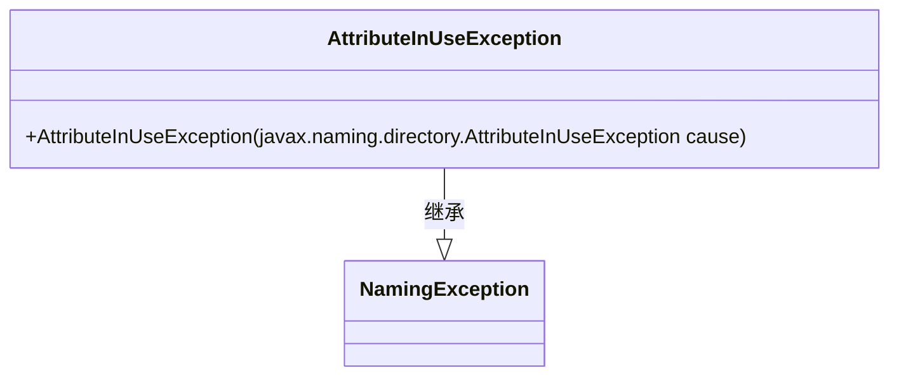
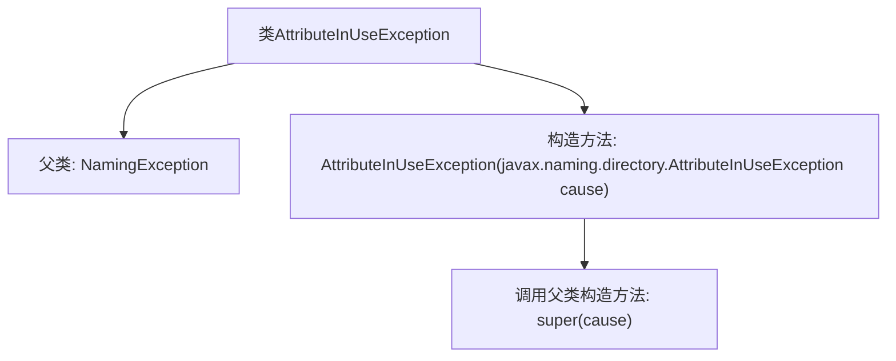

# 基础信息

|      |      |
|------|------|
| 名称 | AttributeInUseException |
| 编码语言 | .java |
| 代码路径 | spring-ldap/core/src/main/java/org/springframework/ldap/AttributeInUseException.java |
| 包名 | org.springframework.ldap |
| 依赖项 | [] |
| 概述说明 | AttributeInUseException继承NamingException，构造函数接收同类型参数。 |

# 说明

AttributeInUseException继承自NamingException，其构造函数接受一个AttributeInUseException类型的参数。这表明AttributeInUseException是一种特定的命名异常，通常用于处理属性正在使用中而无法执行某些操作的情况。通过继承NamingException，它继承了与命名相关的异常处理机制，同时通过构造函数传递相同类型的异常，可能用于传递或包装其他AttributeInUseException实例。这种设计有助于在复杂的命名操作中，更精确地捕获和处理属性使用相关的错误。

# 类列表 Class Summary

| 名称   | 类型  | 说明 |
|-------|------|-------------|
| AttributeInUseException | class | AttributeInUseException继承NamingException，构造函数接收AttributeInUseException作为参数。 |

## 类 AttributeInUseException

|      |      |
|------|------|
| 访问范围 | public |
| 类型 | class |
| 名称 | AttributeInUseException |
| 说明 | AttributeInUseException继承NamingException，构造函数接收AttributeInUseException作为参数。 |

### UML类图

**描述：**  
`AttributeInUseException` 类继承自 `NamingException` 类，表示在命名操作中属性正在被使用时的异常。它包含一个构造函数，接受一个 `javax.naming.directory.AttributeInUseException` 类型的参数，并将其传递给父类的构造函数。该类主要用于处理与命名服务相关的异常情况，特别是在属性被占用时抛出异常。

### 内部方法调用关系图

这段代码定义了一个名为 `AttributeInUseException` 的类，该类继承自 `NamingException`。它包含一个构造函数，该构造函数接受一个 `javax.naming.directory.AttributeInUseException` 类型的参数，并通过 `super(cause)` 调用父类的构造函数。这个异常类通常用于表示在命名操作中尝试使用已经存在的属性时发生的错误。

### 字段列表 Field List

| 名称  | 类型  | 说明 |
|-------|-------|------|

### 方法列表 Method List

| 名称  | 类型  | 说明 |
|-------|-------|------|

