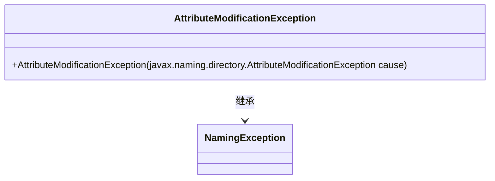
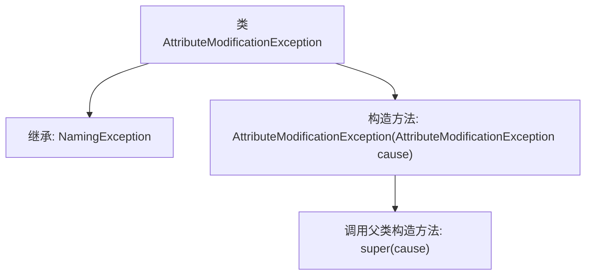

# 基础信息

|      |      |
|------|------|
| 名称 | AttributeModificationException |
| 编码语言 | .java |
| 代码路径 | spring-ldap/core/src/main/java/org/springframework/ldap/AttributeModificationException.java |
| 包名 | org.springframework.ldap |
| 依赖项 | [] |
| 概述说明 | AttributeModificationException继承NamingException，传递异常原因。 |

# 说明

AttributeModificationException是一个继承自NamingException的异常类，用于表示在修改属性时发生的错误。该类包含一个构造方法，用于传递异常的具体原因信息，以便在捕获和处理异常时能够提供详细的错误描述。这种设计使得开发者能够更准确地定位和处理属性修改过程中可能出现的问题。

# 类列表 Class Summary

| 名称   | 类型  | 说明 |
|-------|------|-------------|
| AttributeModificationException | class | AttributeModificationException继承NamingException，包含构造方法传递异常原因。 |

## 类 AttributeModificationException

|      |      |
|------|------|
| 访问范围 | public |
| 类型 | class |
| 名称 | AttributeModificationException |
| 说明 | AttributeModificationException继承NamingException，包含构造方法传递异常原因。 |

### UML类图

这段代码定义了一个名为 `AttributeModificationException` 的类，它继承自 `NamingException` 类。`AttributeModificationException` 类包含一个构造函数，该构造函数接受一个 `javax.naming.directory.AttributeModificationException` 类型的参数，并将其传递给父类的构造函数。这个类通常用于处理在修改属性时发生的异常情况，继承了 `NamingException` 的所有功能，并可能扩展了特定的异常处理逻辑。

### 内部方法调用关系图

这段代码定义了一个名为 `AttributeModificationException` 的类，它继承自 `NamingException`。该类包含一个构造方法，该构造方法接受一个 `javax.naming.directory.AttributeModificationException` 类型的参数，并调用父类的构造方法 `super(cause)` 来初始化异常。这个类的主要作用是封装和处理属性修改相关的异常情况。

### 字段列表 Field List

| 名称  | 类型  | 说明 |
|-------|-------|------|

### 方法列表 Method List

| 名称  | 类型  | 说明 |
|-------|-------|------|

