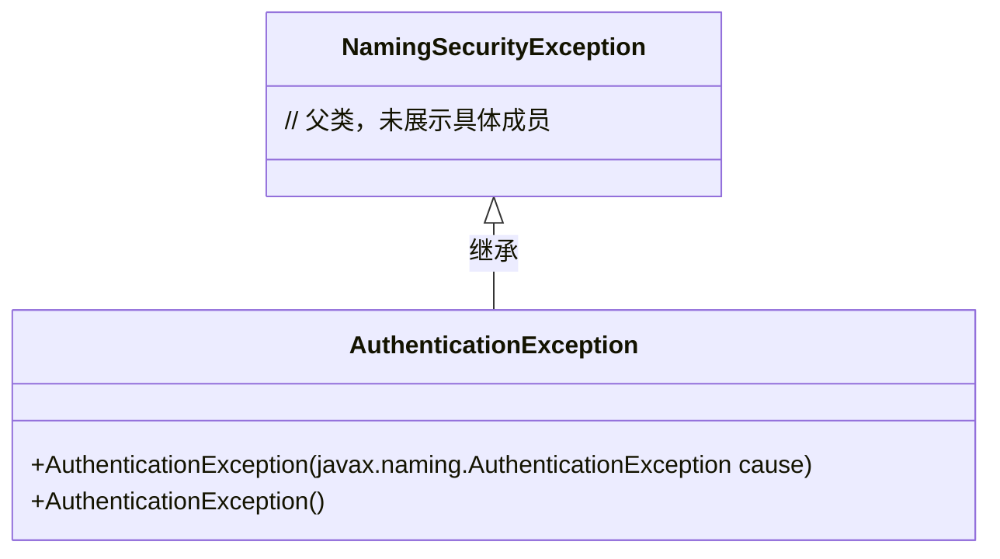
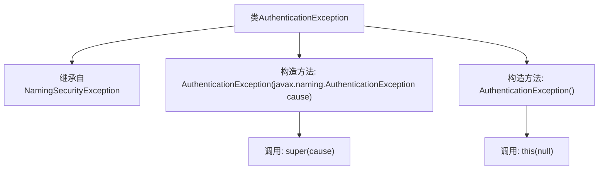

# 基础信息

|      |      |
|------|------|
| 名称 | AuthenticationException |
| 编码语言 | .java |
| 代码路径 | spring-ldap/core/src/main/java/org/springframework/ldap/AuthenticationException.java |
| 包名 | org.springframework.ldap |
| 依赖项 | [] |
| 概述说明 | AuthenticationException继承NamingSecurityException，提供带参和无参构造方法。 |

# 说明

AuthenticationException类继承自NamingSecurityException，提供了两种构造方法：一种是无参构造方法，另一种是带参构造方法。这些构造方法用于在发生身份验证异常时创建异常对象，便于捕获和处理相关错误。

# 类列表 Class Summary

| 名称   | 类型  | 说明 |
|-------|------|-------------|
| AuthenticationException | class | AuthenticationException类继承NamingSecurityException，提供带参和无参构造方法。 |

## 类 AuthenticationException

|      |      |
|------|------|
| 访问范围 | public |
| 类型 | class |
| 名称 | AuthenticationException |
| 说明 | AuthenticationException类继承NamingSecurityException，提供带参和无参构造方法。 |

### UML类图

类图描述：  
`AuthenticationException` 类继承自 `NamingSecurityException`，提供了两个构造函数：一个接受 `javax.naming.AuthenticationException` 作为参数的构造函数，以及一个无参构造函数。无参构造函数内部调用了带参构造函数，并传递 `null` 作为参数。该异常类用于处理与身份验证相关的异常情况。

### 内部方法调用关系图

这段代码定义了一个名为`AuthenticationException`的类，该类继承自`NamingSecurityException`。它包含两个构造方法：一个接受`javax.naming.AuthenticationException`类型的参数，并调用父类的构造方法；另一个无参构造方法，调用第一个构造方法并传入`null`作为参数。这段代码主要用于处理认证相关的异常情况。

### 字段列表 Field List

| 名称  | 类型  | 说明 |
|-------|-------|------|

### 方法列表 Method List

| 名称  | 类型  | 说明 |
|-------|-------|------|

