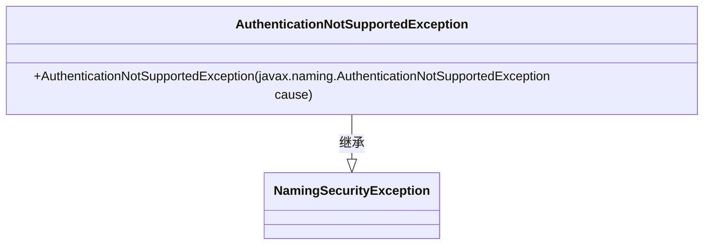
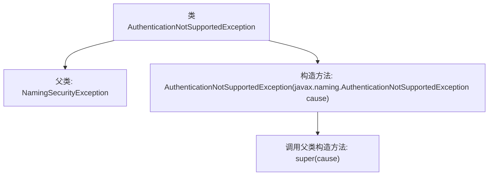

# 基础信息

|      |      |
|------|------|
| 名称 | AuthenticationNotSupportedException |
| 编码语言 | .java |
| 代码路径 | spring-ldap/core/src/main/java/org/springframework/ldap/AuthenticationNotSupportedException.java |
| 包名 | org.springframework.ldap |
| 依赖项 | [] |
| 概述说明 | AuthenticationNotSupportedException继承NamingSecurityException，构造函数接收异常。 |

# 说明

AuthenticationNotSupportedException继承自NamingSecurityException，表示在命名操作中不支持特定的认证机制。该异常的构造函数接收一个AuthenticationNotSupportedException类型的参数，用于初始化异常实例。此异常通常用于指示当前环境或配置不支持所需的认证方式，帮助开发者识别和处理相关安全问题。

# 类列表 Class Summary

| 名称   | 类型  | 说明 |
|-------|------|-------------|
| AuthenticationNotSupportedException | class | AuthenticationNotSupportedException继承NamingSecurityException，构造函数接收AuthenticationNotSupportedException异常。 |

## 类 AuthenticationNotSupportedException

|      |      |
|------|------|
| 访问范围 | public |
| 类型 | class |
| 名称 | AuthenticationNotSupportedException |
| 说明 | AuthenticationNotSupportedException继承NamingSecurityException，构造函数接收AuthenticationNotSupportedException异常。 |

### UML类图

**描述：**  
`AuthenticationNotSupportedException` 是一个继承自 `NamingSecurityException` 的异常类。它通过构造函数接收一个 `javax.naming.AuthenticationNotSupportedException` 类型的参数，并将其传递给父类的构造函数。这个类主要用于处理命名和目录服务中不支持的身份验证异常情况。

### 内部方法调用关系图

这段代码定义了一个名为 `AuthenticationNotSupportedException` 的类，它继承自 `NamingSecurityException`。该类包含一个构造方法，该构造方法接受一个 `javax.naming.AuthenticationNotSupportedException` 类型的参数，并在内部调用父类的构造方法 `super(cause)`。该异常类用于表示在命名操作中不支持的身份验证机制。

### 字段列表 Field List

| 名称  | 类型  | 说明 |
|-------|-------|------|

### 方法列表 Method List

| 名称  | 类型  | 说明 |
|-------|-------|------|

