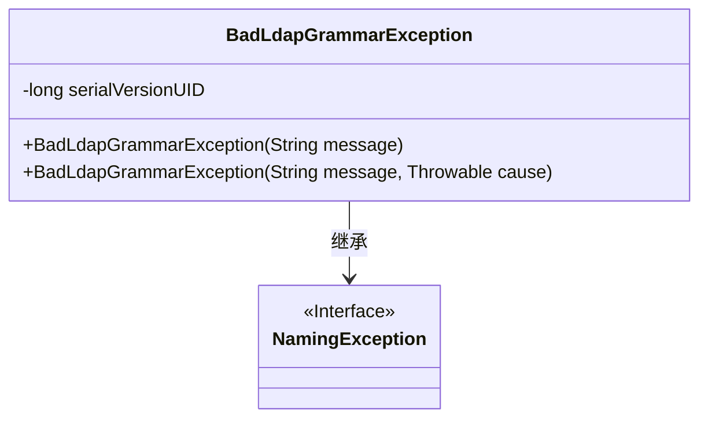
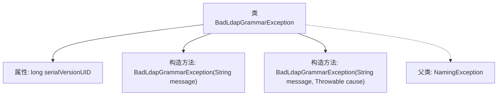

# 基础信息

|      |      |
|------|------|
| 名称 | BadLdapGrammarException |
| 编码语言 | .java |
| 代码路径 | spring-ldap/core/src/main/java/org/springframework/ldap/BadLdapGrammarException.java |
| 包名 | org.springframework.ldap |
| 依赖项 | [] |
| 概述说明 | BadLdapGrammarException继承NamingException，包含两个构造方法。 |

# 说明

BadLdapGrammarException是NamingException的子类，专门用于处理LDAP语法错误相关的异常。该类提供了两个构造方法，分别用于不同的场景。第一个构造方法允许通过传入一个字符串参数来指定异常的具体信息，便于开发者理解错误的详细原因。第二个构造方法则允许传入一个字符串参数和一个Throwable对象，用于在异常信息中包含底层异常的详细信息，有助于调试和追踪问题的根本原因。这两个构造方法的设计使得开发者能够根据具体需求灵活地抛出和捕获异常，提高了代码的可维护性和可读性。

# 类列表 Class Summary

| 名称   | 类型  | 说明 |
|-------|------|-------------|
| BadLdapGrammarException | class | BadLdapGrammarException继承NamingException，包含两个构造方法。 |

## 类 BadLdapGrammarException

|      |      |
|------|------|
| 访问范围 | public |
| 类型 | class |
| 名称 | BadLdapGrammarException |
| 说明 | BadLdapGrammarException继承NamingException，包含两个构造方法。 |

### UML类图

这段代码定义了一个名为 `BadLdapGrammarException` 的异常类，它继承自 `NamingException` 接口。`BadLdapGrammarException` 类包含两个构造函数，分别用于接收一个错误消息或同时接收错误消息和原因。该类还包含一个私有的 `serialVersionUID` 字段，用于序列化控制。这个类的主要作用是处理与 LDAP 语法相关的异常情况，并提供了构造异常的灵活方式。

### 内部方法调用关系图

这段代码定义了一个名为`BadLdapGrammarException`的异常类，继承自`NamingException`。它包含两个构造方法：一个接受`String`类型的参数`message`，另一个接受`String`类型的`message`和`Throwable`类型的`cause`。此外，类中定义了一个`serialVersionUID`属性，用于序列化控制。流程图展示了类的结构及其与父类的关系。

### 字段列表 Field List

| 名称  | 类型  | 说明 |
|-------|-------|------|
| serialVersionUID = 961612585331409470L | long | 定义了一个私有静态常量serialVersionUID，值为961612585331409470L。 |

### 方法列表 Method List

| 名称  | 类型  | 说明 |
|-------|-------|------|

