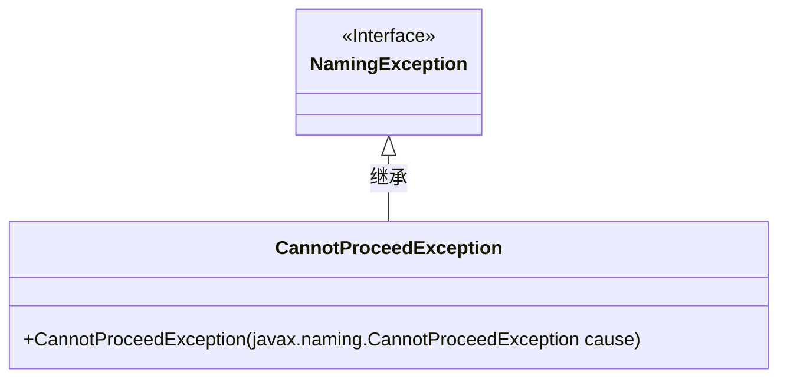
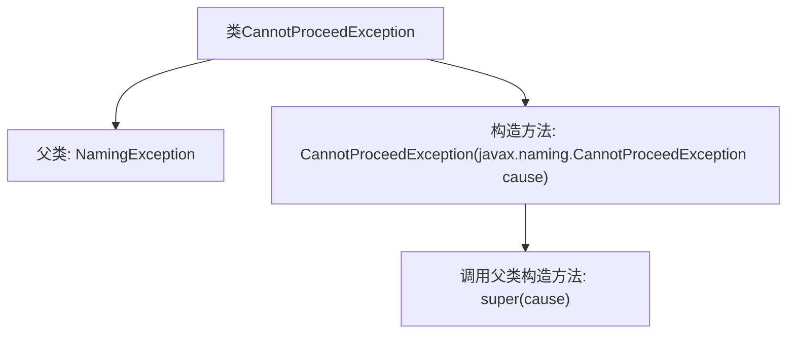

# 基础信息

|      |      |
|------|------|
| 名称 | CannotProceedException |
| 编码语言 | .java |
| 代码路径 | spring-ldap/core/src/main/java/org/springframework/ldap/CannotProceedException.java |
| 包名 | org.springframework.ldap |
| 依赖项 | [] |
| 概述说明 | CannotProceedException继承NamingException，并接受其作为参数。 |

# 说明

CannotProceedException是NamingException的子类，它继承了NamingException的特性。该异常类可以接受一个CannotProceedException类型的参数，用于在特定情况下传递和处理异常信息。这表明CannotProceedException不仅继承了父类的功能，还具备处理相同类型异常的能力，增强了其在命名服务异常处理中的灵活性和适用性。

# 类列表 Class Summary

| 名称   | 类型  | 说明 |
|-------|------|-------------|
| CannotProceedException | class | CannotProceedException继承NamingException，接受CannotProceedException作为参数。 |

## 类 CannotProceedException

|      |      |
|------|------|
| 访问范围 | public |
| 类型 | class |
| 名称 | CannotProceedException |
| 说明 | CannotProceedException继承NamingException，接受CannotProceedException作为参数。 |

### UML类图

这段代码定义了一个名为 `CannotProceedException` 的类，它继承自 `NamingException` 接口。`CannotProceedException` 类包含一个构造函数，该构造函数接受一个 `javax.naming.CannotProceedException` 类型的参数，并调用父类的构造函数来初始化异常。通过继承 `NamingException`，`CannotProceedException` 类能够处理命名操作中无法继续执行的情况。

### 内部方法调用关系图

这段代码定义了一个名为`CannotProceedException`的类，它继承自`NamingException`。该类包含一个构造函数，该构造函数接受一个`javax.naming.CannotProceedException`类型的参数，并在构造函数中调用父类的构造函数`super(cause)`。这个类的主要作用是处理无法继续进行的命名操作异常，并通过继承`NamingException`来扩展异常处理功能。

### 字段列表 Field List

| 名称  | 类型  | 说明 |
|-------|-------|------|

### 方法列表 Method List

| 名称  | 类型  | 说明 |
|-------|-------|------|

