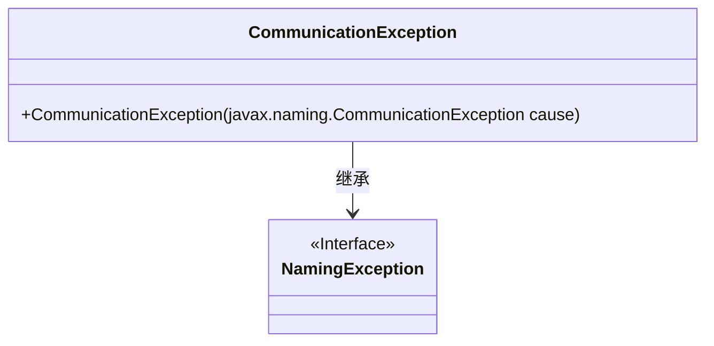
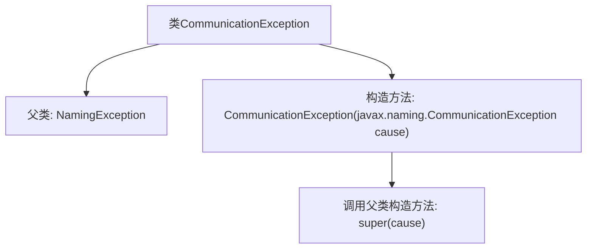

# 基础信息

|      |      |
|------|------|
| 名称 | CommunicationException |
| 编码语言 | .java |
| 代码路径 | spring-ldap/core/src/main/java/org/springframework/ldap/CommunicationException.java |
| 包名 | org.springframework.ldap |
| 依赖项 | [] |
| 概述说明 | CommunicationException继承NamingException，构造方法接收CommunicationException参数。 |

# 说明

CommunicationException是NamingException的子类，其构造方法接受一个CommunicationException类型的参数。这意味着CommunicationException继承了NamingException的所有特性，并且在实例化时可以通过传递另一个CommunicationException对象来初始化。这种设计通常用于异常处理，以便在通信相关的命名操作中捕获和处理特定的异常情况。

# 类列表 Class Summary

| 名称   | 类型  | 说明 |
|-------|------|-------------|
| CommunicationException | class | CommunicationException继承NamingException，构造方法接收CommunicationException参数。 |

## 类 CommunicationException

|      |      |
|------|------|
| 访问范围 | public |
| 类型 | class |
| 名称 | CommunicationException |
| 说明 | CommunicationException继承NamingException，构造方法接收CommunicationException参数。 |

### UML类图

这段代码定义了一个名为 `CommunicationException` 的类，它继承自 `NamingException` 接口。`CommunicationException` 类包含一个构造函数，该构造函数接受一个 `javax.naming.CommunicationException` 类型的参数，并调用父类的构造函数进行初始化。这个类主要用于处理与命名服务相关的通信异常，继承自 `NamingException` 接口表明它属于命名异常体系的一部分。

### 内部方法调用关系图

这段代码定义了一个名为 `CommunicationException` 的类，它继承自 `NamingException` 类。该类包含一个构造方法，该构造方法接受一个 `javax.naming.CommunicationException` 类型的参数，并在内部调用父类的构造方法 `super(cause)`。这个类的目的是创建一个自定义的异常类型，用于处理与通信相关的命名异常。

### 字段列表 Field List

| 名称  | 类型  | 说明 |
|-------|-------|------|

### 方法列表 Method List

| 名称  | 类型  | 说明 |
|-------|-------|------|

