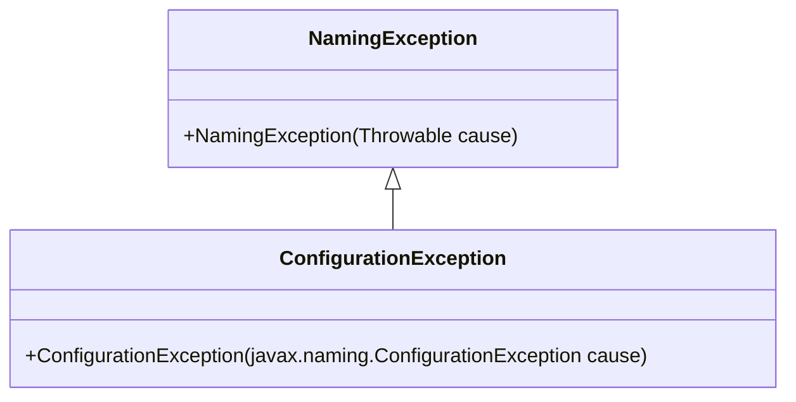
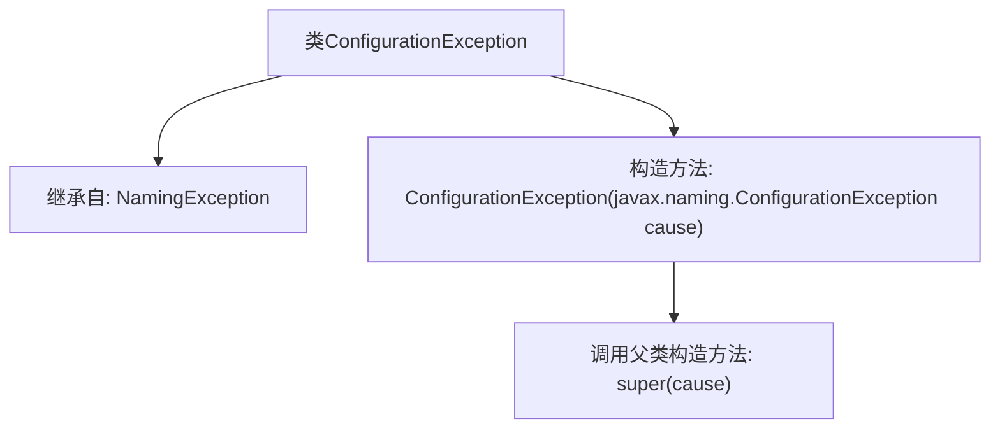

# 基础信息

|      |      |
|------|------|
| 名称 | ConfigurationException |
| 编码语言 | .java |
| 代码路径 | spring-ldap/core/src/main/java/org/springframework/ldap/ConfigurationException.java |
| 包名 | org.springframework.ldap |
| 依赖项 | [] |
| 概述说明 | ConfigurationException继承NamingException，构造方法接收ConfigurationException参数。 |

# 说明

ConfigurationException类继承自NamingException类，其构造方法接受一个ConfigurationException类型的参数。这表明ConfigurationException是NamingException的一个子类，专门用于处理配置相关的异常情况。通过接收同类型的参数，构造方法可以用于创建新的ConfigurationException实例，同时保留或传递原始异常的信息。这种设计有助于在配置过程中捕获和处理特定的异常，确保系统的健壮性和可维护性。

# 类列表 Class Summary

| 名称   | 类型  | 说明 |
|-------|------|-------------|
| ConfigurationException | class | ConfigurationException继承NamingException，构造方法接收ConfigurationException参数。 |

## 类 ConfigurationException

|      |      |
|------|------|
| 访问范围 | public |
| 类型 | class |
| 名称 | ConfigurationException |
| 说明 | ConfigurationException继承NamingException，构造方法接收ConfigurationException参数。 |

### UML类图

这段代码定义了一个 `ConfigurationException` 类，它继承自 `NamingException` 类。`ConfigurationException` 类有一个构造函数，接受一个 `javax.naming.ConfigurationException` 类型的参数，并调用父类的构造函数进行初始化。这个类用于处理配置相关的异常，通常在与命名服务相关的场景中使用。

### 内部方法调用关系图

这段代码定义了一个名为 `ConfigurationException` 的类，它继承自 `NamingException`。类中包含一个构造方法，该构造方法接受一个 `javax.naming.ConfigurationException` 类型的参数，并在方法体内调用父类的构造方法 `super(cause)`。这段代码的主要作用是创建一个自定义的异常类，用于处理配置相关的异常情况，并通过继承 `NamingException` 来复用其异常处理机制。

### 字段列表 Field List

| 名称  | 类型  | 说明 |
|-------|-------|------|

### 方法列表 Method List

| 名称  | 类型  | 说明 |
|-------|-------|------|

