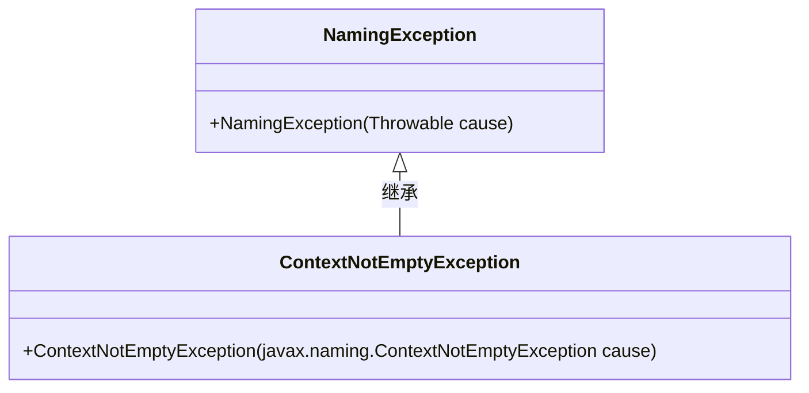
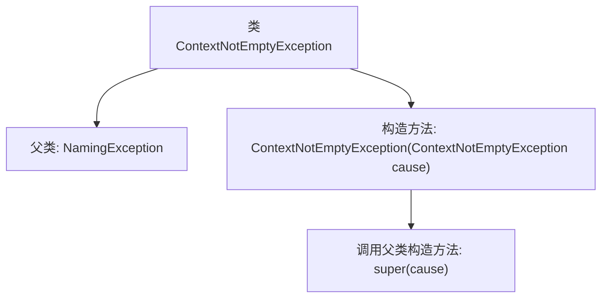

# 基础信息

|      |      |
|------|------|
| 名称 | ContextNotEmptyException |
| 编码语言 | .java |
| 代码路径 | spring-ldap/core/src/main/java/org/springframework/ldap/ContextNotEmptyException.java |
| 包名 | org.springframework.ldap |
| 依赖项 | [] |
| 概述说明 | ContextNotEmptyException继承NamingException，支持带参数构造。 |

# 说明

ContextNotEmptyException是一个继承自NamingException的异常类。它包含一个带参数的构造函数，用于在实例化时传递特定的信息或上下文。这种设计使得该异常能够更具体地描述和处理命名服务中上下文不为空的情况，从而提供更精确的错误信息和处理机制。

# 类列表 Class Summary

| 名称   | 类型  | 说明 |
|-------|------|-------------|
| ContextNotEmptyException | class | ContextNotEmptyException继承NamingException，包含带参数的构造函数。 |

## 类 ContextNotEmptyException

|      |      |
|------|------|
| 访问范围 | public |
| 类型 | class |
| 名称 | ContextNotEmptyException |
| 说明 | ContextNotEmptyException继承NamingException，包含带参数的构造函数。 |

### UML类图

这段代码定义了一个 `ContextNotEmptyException` 类，它继承自 `NamingException` 类。`ContextNotEmptyException` 类包含一个构造函数，该构造函数接受一个 `javax.naming.ContextNotEmptyException` 类型的参数，并将其传递给父类的构造函数。这种设计通常用于异常处理，允许在特定上下文中抛出和捕获自定义异常。

### 内部方法调用关系图

这段代码定义了一个名为 `ContextNotEmptyException` 的异常类，它继承自 `NamingException`。该类包含一个构造方法，接受一个 `javax.naming.ContextNotEmptyException` 类型的参数，并在构造方法中调用父类的构造方法 `super(cause)` 来初始化异常。这个异常类通常用于处理命名操作中上下文不为空的情况。

### 字段列表 Field List

| 名称  | 类型  | 说明 |
|-------|-------|------|

### 方法列表 Method List

| 名称  | 类型  | 说明 |
|-------|-------|------|

