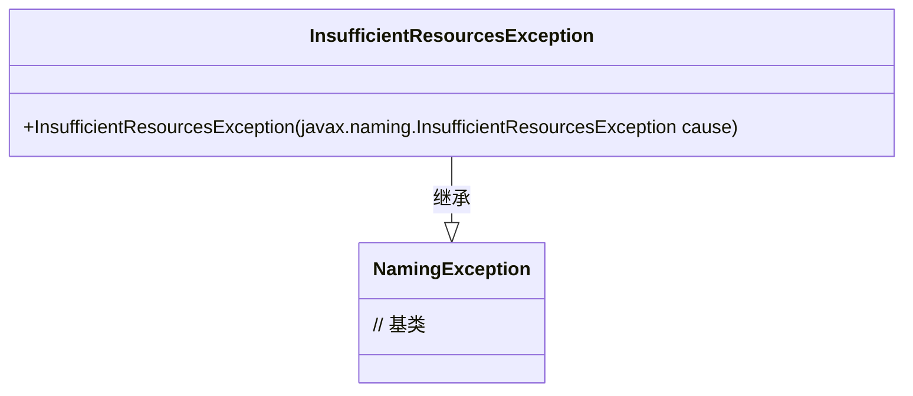
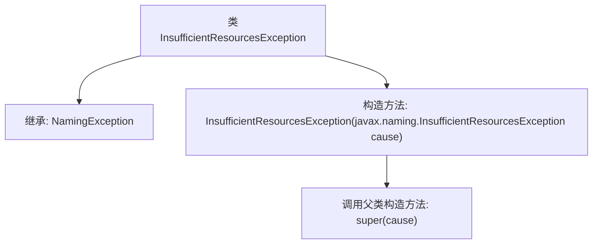

# 基础信息

|      |      |
|------|------|
| 名称 | InsufficientResourcesException |
| 编码语言 | .java |
| 代码路径 | spring-ldap/core/src/main/java/org/springframework/ldap/InsufficientResourcesException.java |
| 包名 | org.springframework.ldap |
| 依赖项 | [] |
| 概述说明 | 自定义异常类继承NamingException，处理资源不足。 |

# 说明

该内容描述了一个自定义异常类，该类继承自NamingException，专门用于处理资源不足的情况。通过继承NamingException，该自定义异常类能够捕获和处理与命名服务相关的资源不足问题，确保在资源不足时能够抛出特定的异常信息，以便开发者能够更好地进行错误处理和调试。

# 类列表 Class Summary

| 名称   | 类型  | 说明 |
|-------|------|-------------|
| InsufficientResourcesException | class | 自定义异常类，继承NamingException，用于处理资源不足情况。 |

## 类 InsufficientResourcesException

|      |      |
|------|------|
| 访问范围 | public |
| 类型 | class |
| 名称 | InsufficientResourcesException |
| 说明 | 自定义异常类，继承NamingException，用于处理资源不足情况。 |

### UML类图

这段代码定义了一个 `InsufficientResourcesException` 类，它继承自 `NamingException`。该类有一个构造函数，接受一个 `javax.naming.InsufficientResourcesException` 类型的参数，并将其传递给父类的构造函数。这个异常类通常用于表示在命名操作中由于资源不足而导致的异常情况。通过继承 `NamingException`，它能够与其他命名相关的异常类保持一致的处理方式。

### 内部方法调用关系图

这段代码定义了一个名为 `InsufficientResourcesException` 的类，该类继承自 `NamingException`。它包含一个构造方法，该构造方法接受一个 `javax.naming.InsufficientResourcesException` 类型的参数，并调用父类的构造方法 `super(cause)` 来初始化异常。这个类主要用于处理资源不足的异常情况，并将其传递给父类进行进一步处理。

### 字段列表 Field List

| 名称  | 类型  | 说明 |
|-------|-------|------|

### 方法列表 Method List

| 名称  | 类型  | 说明 |
|-------|-------|------|

