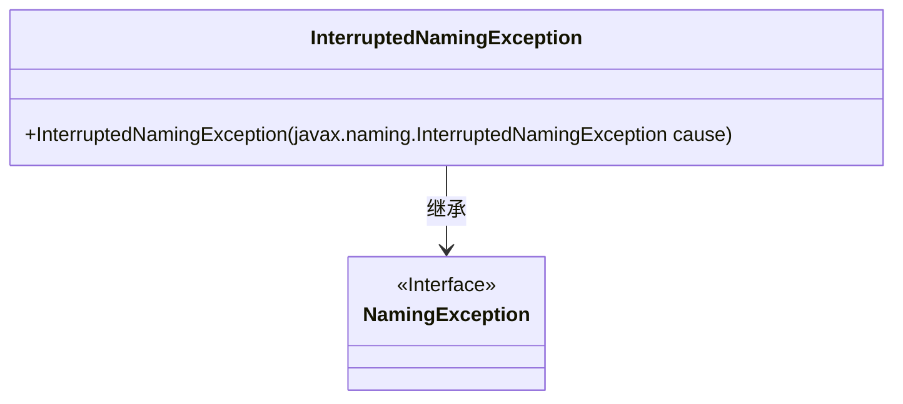
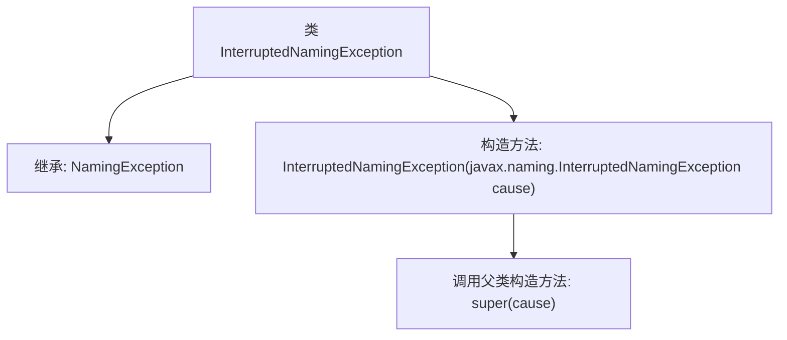

# 基础信息

|      |      |
|------|------|
| 名称 | InterruptedNamingException |
| 编码语言 | .java |
| 代码路径 | spring-ldap/core/src/main/java/org/springframework/ldap/InterruptedNamingException.java |
| 包名 | org.springframework.ldap |
| 依赖项 | [] |
| 概述说明 | InterruptedNamingException继承NamingException，构造函数接受相同类型参数。 |

# 说明

InterruptedNamingException继承自NamingException，其构造函数接受一个InterruptedNamingException类型的参数。这表明该异常类用于处理命名操作中的中断情况，并且可以通过传递另一个InterruptedNamingException实例来初始化新的异常对象。

# 类列表 Class Summary

| 名称   | 类型  | 说明 |
|-------|------|-------------|
| InterruptedNamingException | class | InterruptedNamingException继承NamingException，构造函数接受InterruptedNamingException参数。 |

## 类 InterruptedNamingException

|      |      |
|------|------|
| 访问范围 | public |
| 类型 | class |
| 名称 | InterruptedNamingException |
| 说明 | InterruptedNamingException继承NamingException，构造函数接受InterruptedNamingException参数。 |

### UML类图

这段代码定义了一个名为 `InterruptedNamingException` 的类，它继承自 `NamingException` 接口。`InterruptedNamingException` 类包含一个构造函数，该构造函数接受一个 `javax.naming.InterruptedNamingException` 类型的参数，并将其传递给父类的构造函数。该类主要用于处理命名操作被中断时抛出的异常。

### 内部方法调用关系图

这段代码定义了一个名为 `InterruptedNamingException` 的类，它继承自 `NamingException`。该类包含一个构造方法，该构造方法接受一个 `javax.naming.InterruptedNamingException` 类型的参数，并调用父类的构造方法 `super(cause)` 来初始化异常对象。这个类主要用于处理命名服务中的中断异常，通过继承和调用父类构造方法，确保了异常信息的正确传递和处理。

### 字段列表 Field List

| 名称  | 类型  | 说明 |
|-------|-------|------|

### 方法列表 Method List

| 名称  | 类型  | 说明 |
|-------|-------|------|

