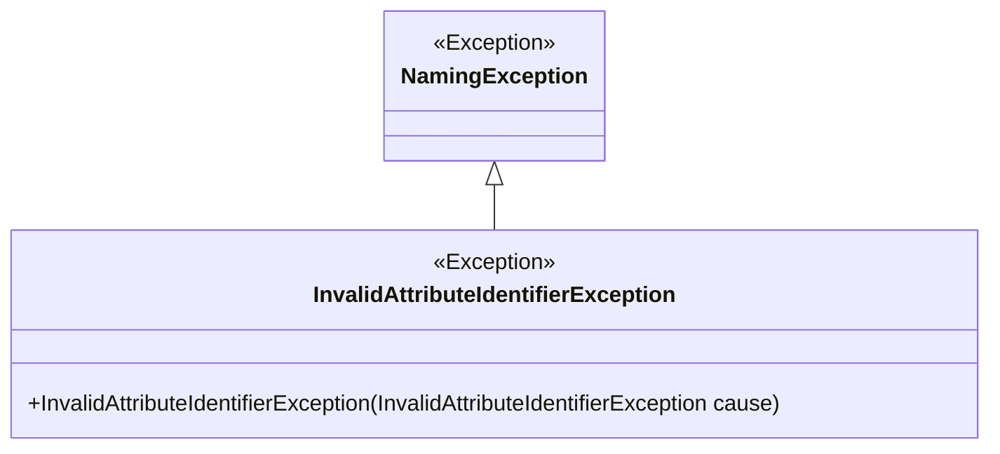
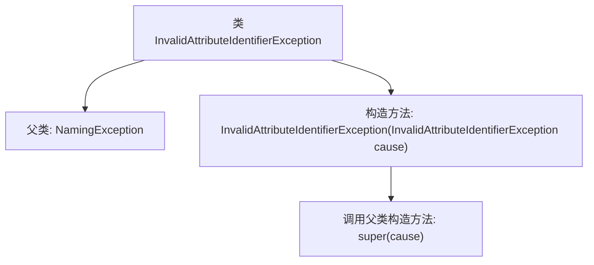

# 基础信息

|      |      |
|------|------|
| 名称 | InvalidAttributeIdentifierException |
| 编码语言 | .java |
| 代码路径 | spring-ldap/core/src/main/java/org/springframework/ldap/InvalidAttributeIdentifierException.java |
| 包名 | org.springframework.ldap |
| 依赖项 | [] |
| 概述说明 | InvalidAttributeIdentifierException继承NamingException，接受自身作为参数。 |

# 说明

InvalidAttributeIdentifierException继承自NamingException，并且可以接受InvalidAttributeIdentifierException作为参数。这表明该异常类属于命名异常的一种，专门用于处理无效属性标识符的情况，并且支持通过传递相同类型的异常实例来进行构造或处理。

# 类列表 Class Summary

| 名称   | 类型  | 说明 |
|-------|------|-------------|
| InvalidAttributeIdentifierException | class | InvalidAttributeIdentifierException继承NamingException，接受InvalidAttributeIdentifierException作为参数。 |

## 类 InvalidAttributeIdentifierException

|      |      |
|------|------|
| 访问范围 | public |
| 类型 | class |
| 名称 | InvalidAttributeIdentifierException |
| 说明 | InvalidAttributeIdentifierException继承NamingException，接受InvalidAttributeIdentifierException作为参数。 |

### UML类图

这段代码定义了一个名为 `InvalidAttributeIdentifierException` 的异常类，它继承自 `NamingException`。该类包含一个构造函数，接受一个 `javax.naming.directory.InvalidAttributeIdentifierException` 类型的参数，并将其传递给父类的构造函数。该异常类用于处理无效的属性标识符异常情况，通常用于命名和目录服务相关的操作中。

### 内部方法调用关系图

这段代码定义了一个名为 `InvalidAttributeIdentifierException` 的异常类，它继承自 `NamingException`。该类的构造方法接受一个 `InvalidAttributeIdentifierException` 类型的参数，并在构造方法中调用父类的构造方法，将传入的异常原因传递给父类。这个类的主要作用是处理无效属性标识符的异常情况，通过继承 `NamingException` 来扩展异常处理的能力。

### 字段列表 Field List

| 名称  | 类型  | 说明 |
|-------|-------|------|

### 方法列表 Method List

| 名称  | 类型  | 说明 |
|-------|-------|------|

