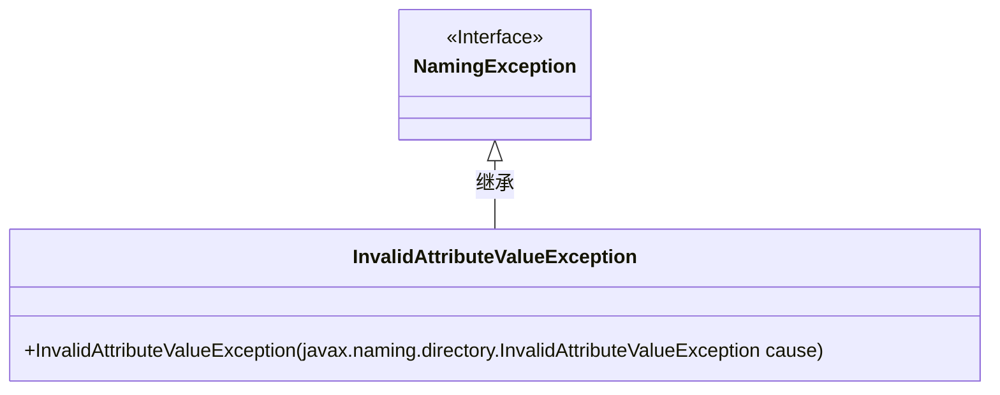
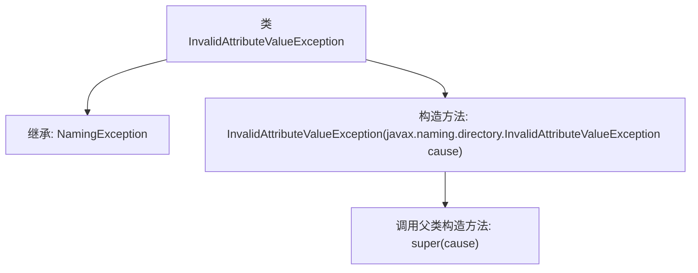

# 基础信息

|      |      |
|------|------|
| 名称 | InvalidAttributeValueException |
| 编码语言 | .java |
| 代码路径 | spring-ldap/core/src/main/java/org/springframework/ldap/InvalidAttributeValueException.java |
| 包名 | org.springframework.ldap |
| 依赖项 | [] |
| 概述说明 | InvalidAttributeValueException继承NamingException，构造方法接受同类异常参数。 |

# 说明

InvalidAttributeValueException是NamingException的子类，其构造方法可以接受一个InvalidAttributeValueException类型的参数。这表明该异常类在处理无效属性值时，能够通过传递另一个相同类型的异常实例来进行初始化，以便在异常处理过程中提供更详细的上下文信息。

# 类列表 Class Summary

| 名称   | 类型  | 说明 |
|-------|------|-------------|
| InvalidAttributeValueException | class | InvalidAttributeValueException继承NamingException，构造方法接受InvalidAttributeValueException作为参数。 |

## 类 InvalidAttributeValueException

|      |      |
|------|------|
| 访问范围 | public |
| 类型 | class |
| 名称 | InvalidAttributeValueException |
| 说明 | InvalidAttributeValueException继承NamingException，构造方法接受InvalidAttributeValueException作为参数。 |

### UML类图

这段代码定义了一个 `InvalidAttributeValueException` 类，它继承自 `NamingException` 接口。`InvalidAttributeValueException` 类包含一个构造函数，该构造函数接受一个 `javax.naming.directory.InvalidAttributeValueException` 类型的参数，并将其传递给父类的构造函数。这个异常类通常用于处理命名服务中属性值无效的情况。

### 内部方法调用关系图

该流程图描述了`InvalidAttributeValueException`类的结构及其内部方法调用关系。该类继承自`NamingException`，并包含一个构造方法，该构造方法接受一个`InvalidAttributeValueException`类型的参数，并调用父类的构造方法进行初始化。通过这种方式，异常信息能够被正确地传递和处理。

### 字段列表 Field List

| 名称  | 类型  | 说明 |
|-------|-------|------|

### 方法列表 Method List

| 名称  | 类型  | 说明 |
|-------|-------|------|

