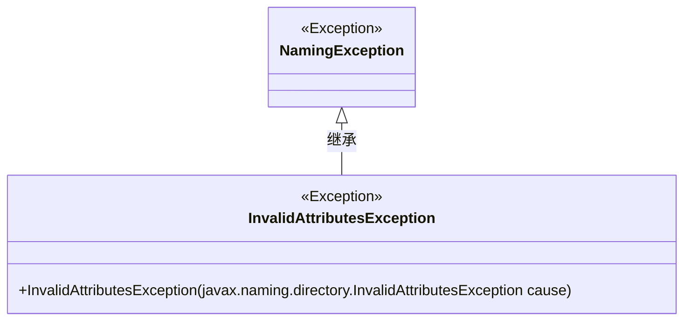
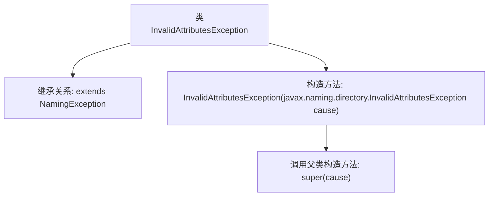

# 基础信息

|      |      |
|------|------|
| 名称 | InvalidAttributesException |
| 编码语言 | .java |
| 代码路径 | spring-ldap/core/src/main/java/org/springframework/ldap/InvalidAttributesException.java |
| 包名 | org.springframework.ldap |
| 依赖项 | [] |
| 概述说明 | InvalidAttributesException继承NamingException，构造函数接收InvalidAttributesException异常。 |

# 说明

InvalidAttributesException类继承自NamingException类，其构造函数接收一个InvalidAttributesException类型的异常作为参数。该设计表明InvalidAttributesException是NamingException的子类，用于处理无效属性的异常情况，并通过构造函数允许传递同类异常实例，以便在异常处理链中进行传递或封装。

# 类列表 Class Summary

| 名称   | 类型  | 说明 |
|-------|------|-------------|
| InvalidAttributesException | class | InvalidAttributesException继承NamingException，构造函数接收InvalidAttributesException异常。 |

## 类 InvalidAttributesException

|      |      |
|------|------|
| 访问范围 | public |
| 类型 | class |
| 名称 | InvalidAttributesException |
| 说明 | InvalidAttributesException继承NamingException，构造函数接收InvalidAttributesException异常。 |

### UML类图

这段代码定义了一个名为 `InvalidAttributesException` 的异常类，它继承自 `NamingException`。`InvalidAttributesException` 类包含一个构造函数，该构造函数接受一个 `javax.naming.directory.InvalidAttributesException` 类型的参数，并将其传递给父类的构造函数。该类用于处理与无效属性相关的命名异常。

### 内部方法调用关系图

这段代码定义了一个名为 `InvalidAttributesException` 的类，它继承自 `NamingException`。类中包含一个构造方法，该构造方法接受一个 `javax.naming.directory.InvalidAttributesException` 类型的参数，并在方法体内调用父类的构造方法 `super(cause)`。这个类主要用于处理命名操作中无效属性的异常情况，通过继承 `NamingException`，它能够更好地集成到现有的异常处理体系中。

### 字段列表 Field List

| 名称  | 类型  | 说明 |
|-------|-------|------|

### 方法列表 Method List

| 名称  | 类型  | 说明 |
|-------|-------|------|

