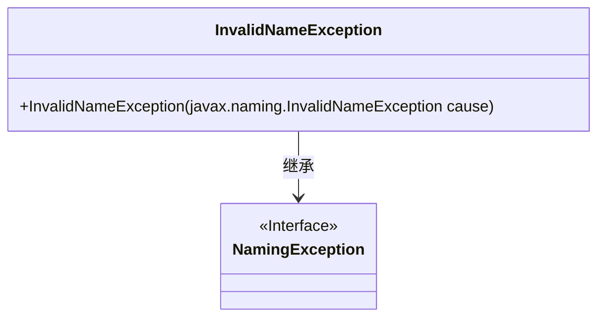
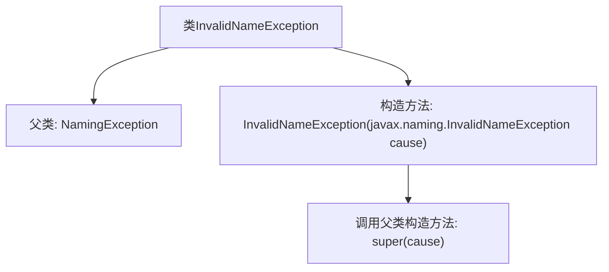

# 基础信息

|      |      |
|------|------|
| 名称 | InvalidNameException |
| 编码语言 | .java |
| 代码路径 | spring-ldap/core/src/main/java/org/springframework/ldap/InvalidNameException.java |
| 包名 | org.springframework.ldap |
| 依赖项 | [] |
| 概述说明 | InvalidNameException继承NamingException，构造函数接受InvalidNameException参数。 |

# 说明

InvalidNameException是NamingException的子类，表示在处理命名时遇到的无效名称异常。该类的构造函数接受一个InvalidNameException类型的参数，用于初始化异常实例。这种设计允许在捕获和处理无效名称异常时，能够传递和保留相关的异常信息，便于后续的调试和错误处理。

# 类列表 Class Summary

| 名称   | 类型  | 说明 |
|-------|------|-------------|
| InvalidNameException | class | InvalidNameException继承NamingException，构造函数接受InvalidNameException参数。 |

## 类 InvalidNameException

|      |      |
|------|------|
| 访问范围 | public |
| 类型 | class |
| 名称 | InvalidNameException |
| 说明 | InvalidNameException继承NamingException，构造函数接受InvalidNameException参数。 |

### UML类图

类图描述：`InvalidNameException` 类继承自 `NamingException` 接口，并包含一个构造函数，该构造函数接受一个 `javax.naming.InvalidNameException` 类型的参数。该异常类用于处理无效名称的情况，通过构造函数将异常原因传递给父类。

### 内部方法调用关系图

该流程图描述了`InvalidNameException`类的结构及其与父类`NamingException`的关系。`InvalidNameException`类继承自`NamingException`，并包含一个构造方法`InvalidNameException(javax.naming.InvalidNameException cause)`，该构造方法调用了父类的构造方法`super(cause)`。流程图清晰地展示了类的继承关系和构造方法的调用流程。

### 字段列表 Field List

| 名称  | 类型  | 说明 |
|-------|-------|------|

### 方法列表 Method List

| 名称  | 类型  | 说明 |
|-------|-------|------|

