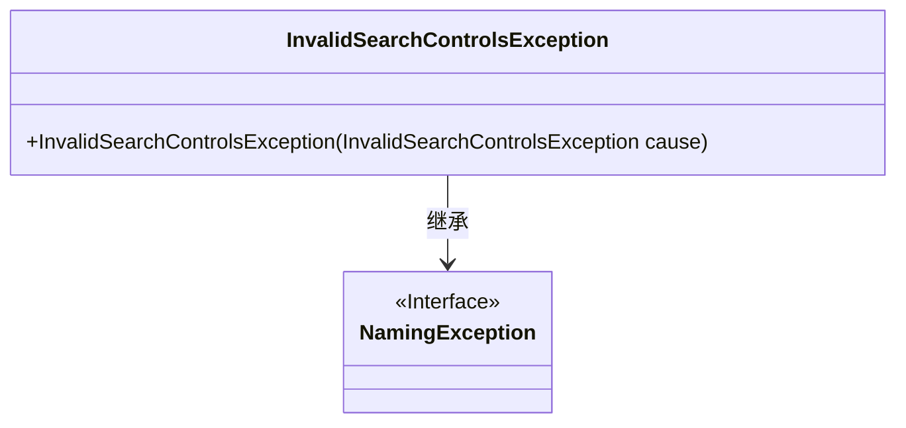
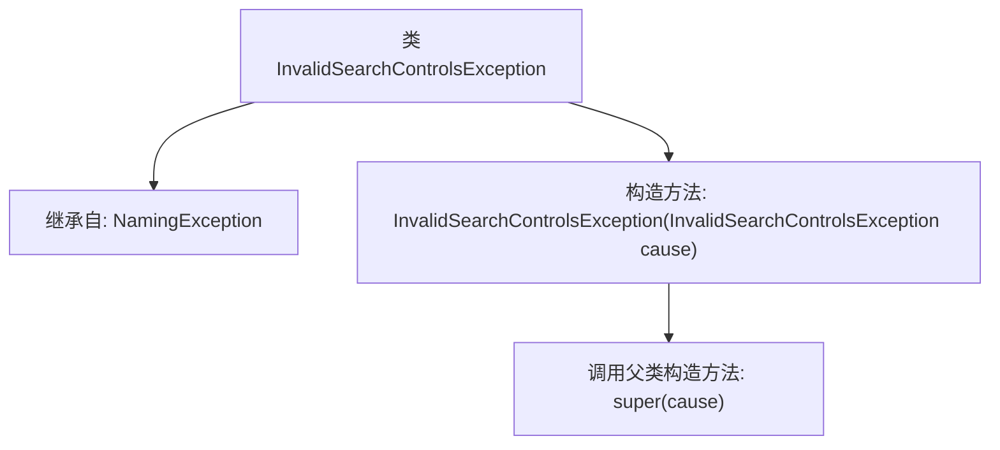

# 基础信息

|      |      |
|------|------|
| 名称 | InvalidSearchControlsException |
| 编码语言 | .java |
| 代码路径 | spring-ldap/core/src/main/java/org/springframework/ldap/InvalidSearchControlsException.java |
| 包名 | org.springframework.ldap |
| 依赖项 | [] |
| 概述说明 | InvalidSearchControlsException继承NamingException，接受自身为参数。 |

# 说明

InvalidSearchControlsException是NamingException的子类，用于处理无效搜索控制异常。该异常类接受InvalidSearchControlsException作为参数，表示在搜索控制过程中出现的无效操作或配置。通过继承NamingException，InvalidSearchControlsException能够捕获和处理与命名服务相关的异常，确保在搜索控制无效时能够提供相应的错误信息和处理机制。

# 类列表 Class Summary

| 名称   | 类型  | 说明 |
|-------|------|-------------|
| InvalidSearchControlsException | class | InvalidSearchControlsException继承NamingException，接受InvalidSearchControlsException作为参数。 |

## 类 InvalidSearchControlsException

|      |      |
|------|------|
| 访问范围 | public |
| 类型 | class |
| 名称 | InvalidSearchControlsException |
| 说明 | InvalidSearchControlsException继承NamingException，接受InvalidSearchControlsException作为参数。 |

### UML类图

这段代码定义了一个 `InvalidSearchControlsException` 类，它继承自 `NamingException` 接口。`InvalidSearchControlsException` 类包含一个构造函数，该构造函数接受一个 `InvalidSearchControlsException` 类型的参数，并将其传递给父类的构造函数。这个异常类通常用于处理与搜索控制相关的命名异常情况。

### 内部方法调用关系图

这段代码定义了一个名为`InvalidSearchControlsException`的类，该类继承自`NamingException`。它包含一个构造方法，该构造方法接受一个`InvalidSearchControlsException`类型的参数，并调用父类的构造方法`super(cause)`来初始化异常。这个类主要用于处理与搜索控制相关的异常情况，确保在出现无效搜索控制时能够正确地抛出异常。

### 字段列表 Field List

| 名称  | 类型  | 说明 |
|-------|-------|------|

### 方法列表 Method List

| 名称  | 类型  | 说明 |
|-------|-------|------|

