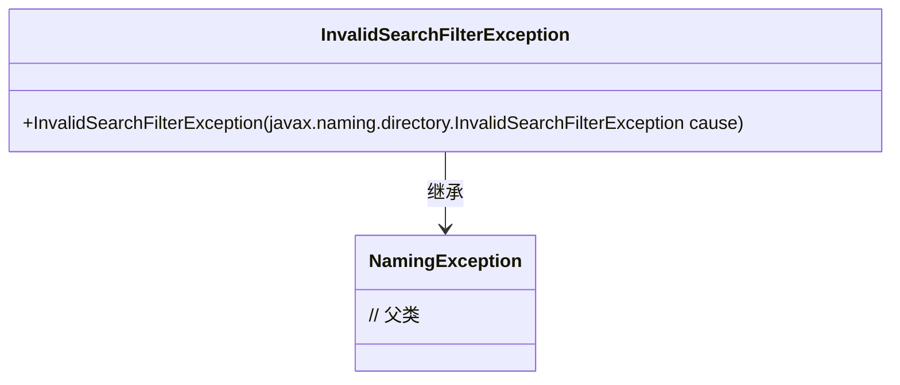
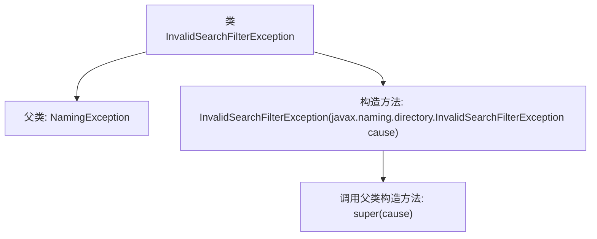

# 基础信息

|      |      |
|------|------|
| 名称 | InvalidSearchFilterException |
| 编码语言 | .java |
| 代码路径 | spring-ldap/core/src/main/java/org/springframework/ldap/InvalidSearchFilterException.java |
| 包名 | org.springframework.ldap |
| 依赖项 | [] |
| 概述说明 | InvalidSearchFilterException继承NamingException，构造方法接收同类型参数。 |

# 说明

InvalidSearchFilterException是NamingException的子类，其构造方法接受一个InvalidSearchFilterException类型的参数。该异常用于处理无效的搜索过滤器情况，表明在命名操作中遇到了不符合预期的搜索条件。通过继承NamingException，它继承了与命名服务相关的异常处理机制，确保了在命名上下文中能够有效地捕获和处理此类错误。

# 类列表 Class Summary

| 名称   | 类型  | 说明 |
|-------|------|-------------|
| InvalidSearchFilterException | class | InvalidSearchFilterException继承NamingException，构造方法接收InvalidSearchFilterException参数。 |

## 类 InvalidSearchFilterException

|      |      |
|------|------|
| 访问范围 | public |
| 类型 | class |
| 名称 | InvalidSearchFilterException |
| 说明 | InvalidSearchFilterException继承NamingException，构造方法接收InvalidSearchFilterException参数。 |

### UML类图

这段代码定义了一个名为 `InvalidSearchFilterException` 的异常类，它继承自 `NamingException` 类。`InvalidSearchFilterException` 类包含一个构造函数，该构造函数接受一个 `javax.naming.directory.InvalidSearchFilterException` 类型的参数，并将其传递给父类的构造函数。这个异常类通常用于处理无效的搜索过滤器场景，表明在命名操作中遇到了无效的搜索过滤器条件。

### 内部方法调用关系图

这段代码定义了一个名为 `InvalidSearchFilterException` 的类，它继承自 `NamingException`。类中包含一个构造方法，该构造方法接受一个 `javax.naming.directory.InvalidSearchFilterException` 类型的参数，并通过 `super(cause)` 调用父类的构造方法。该异常类用于处理无效的搜索过滤器异常，并将异常原因传递给父类进行处理。

### 字段列表 Field List

| 名称  | 类型  | 说明 |
|-------|-------|------|

### 方法列表 Method List

| 名称  | 类型  | 说明 |
|-------|-------|------|

