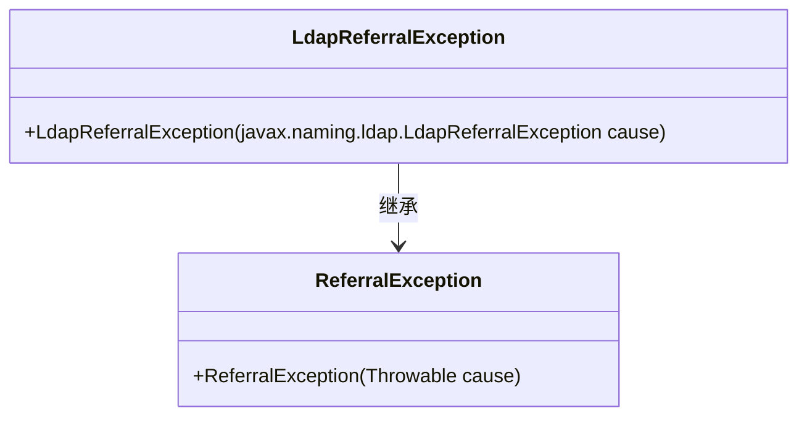
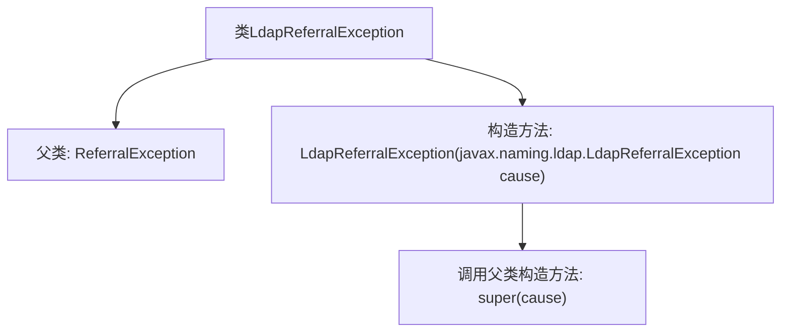

# 基础信息

|      |      |
|------|------|
| 名称 | LdapReferralException |
| 编码语言 | .java |
| 代码路径 | spring-ldap/core/src/main/java/org/springframework/ldap/LdapReferralException.java |
| 包名 | org.springframework.ldap |
| 依赖项 | [] |
| 概述说明 | LdapReferralException继承ReferralException，构造函数接受同类型参数。 |

# 说明

LdapReferralException是ReferralException的子类，其构造函数接受一个LdapReferralException类型的参数。该异常类用于处理LDAP引用异常，通常发生在LDAP操作中需要引用其他服务器时。通过继承ReferralException，LdapReferralException能够处理更复杂的引用异常情况，确保在LDAP操作中能够准确捕获和处理相关异常。

# 类列表 Class Summary

| 名称   | 类型  | 说明 |
|-------|------|-------------|
| LdapReferralException | class | LdapReferralException继承自ReferralException，构造函数接收LdapReferralException作为参数。 |

## 类 LdapReferralException

|      |      |
|------|------|
| 访问范围 | public |
| 类型 | class |
| 名称 | LdapReferralException |
| 说明 | LdapReferralException继承自ReferralException，构造函数接收LdapReferralException作为参数。 |

### UML类图

LdapReferralException 继承自 ReferralException，并提供了一个构造函数，该构造函数接受一个 javax.naming.ldap.LdapReferralException 类型的参数，并将其传递给父类的构造函数。这个类主要用于处理 LDAP 引用异常，确保在发生 LDAP 引用错误时能够正确地捕获和处理异常。

### 内部方法调用关系图

这段代码定义了一个名为 `LdapReferralException` 的类，它继承自 `ReferralException`。类中包含一个构造方法，该构造方法接受一个 `javax.naming.ldap.LdapReferralException` 类型的参数，并在内部调用父类的构造方法 `super(cause)`。这个类的设计主要用于处理 LDAP 引用异常，通过继承和构造方法的调用，确保异常信息能够正确传递和处理。

### 字段列表 Field List

| 名称  | 类型  | 说明 |
|-------|-------|------|

### 方法列表 Method List

| 名称  | 类型  | 说明 |
|-------|-------|------|

