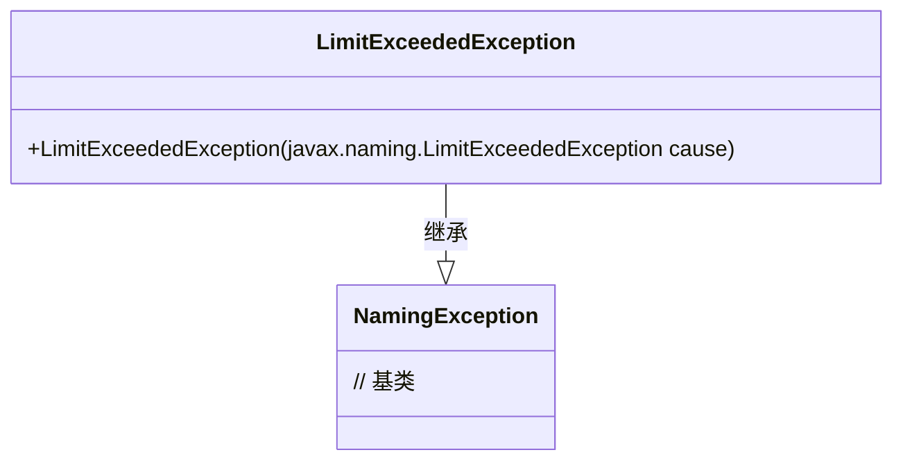
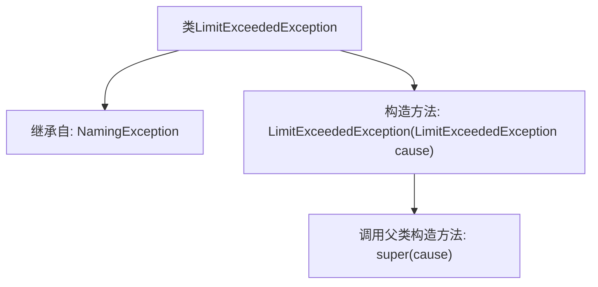

# 基础信息

|      |      |
|------|------|
| 名称 | LimitExceededException |
| 编码语言 | .java |
| 代码路径 | spring-ldap/core/src/main/java/org/springframework/ldap/LimitExceededException.java |
| 包名 | org.springframework.ldap |
| 依赖项 | [] |
| 概述说明 | LimitExceededException继承NamingException，构造函数参数为LimitExceededException。 |

# 说明

LimitExceededException类继承自NamingException类，其构造函数接受一个LimitExceededException类型的参数。这种设计表明LimitExceededException是NamingException的一个子类，专门用于处理超出限制的异常情况。通过构造函数接收同类型的参数，可能用于传递或初始化相关的异常信息。

# 类列表 Class Summary

| 名称   | 类型  | 说明 |
|-------|------|-------------|
| LimitExceededException | class | LimitExceededException继承NamingException，构造函数接收LimitExceededException作为参数。 |

## 类 LimitExceededException

|      |      |
|------|------|
| 访问范围 | public |
| 类型 | class |
| 名称 | LimitExceededException |
| 说明 | LimitExceededException继承NamingException，构造函数接收LimitExceededException作为参数。 |

### UML类图

这段代码定义了一个名为 `LimitExceededException` 的异常类，它继承自 `NamingException`。`LimitExceededException` 类包含一个构造函数，该构造函数接受一个 `javax.naming.LimitExceededException` 类型的参数，并将其传递给父类的构造函数。这个类主要用于处理命名操作中超出限制的情况，通常用于JNDI（Java命名和目录接口）相关的操作中。

### 内部方法调用关系图

这段代码定义了一个名为`LimitExceededException`的类，该类继承自`NamingException`。类中包含一个构造方法，该构造方法接受一个`javax.naming.LimitExceededException`类型的参数，并在内部调用父类的构造方法`super(cause)`。流程图展示了类的继承关系和构造方法的调用过程。

### 字段列表 Field List

| 名称  | 类型  | 说明 |
|-------|-------|------|

### 方法列表 Method List

| 名称  | 类型  | 说明 |
|-------|-------|------|

