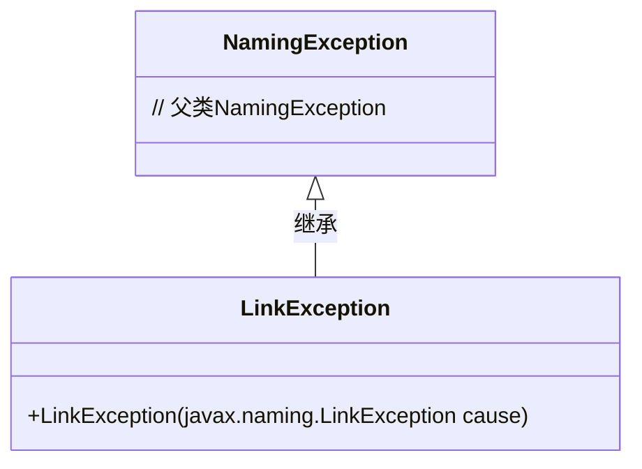
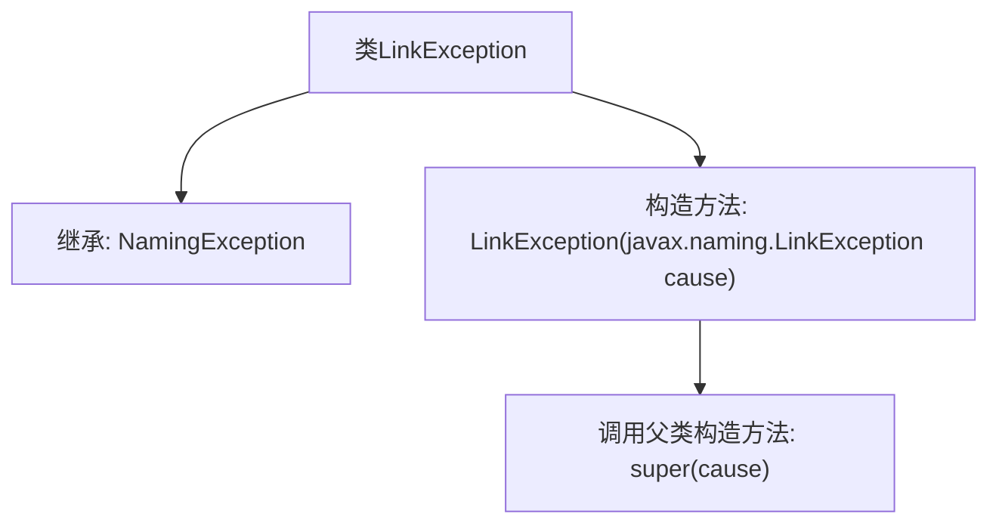

# 基础信息

|      |      |
|------|------|
| 名称 | LinkException |
| 编码语言 | .java |
| 代码路径 | spring-ldap/core/src/main/java/org/springframework/ldap/LinkException.java |
| 包名 | org.springframework.ldap |
| 依赖项 | [] |
| 概述说明 | LinkException继承NamingException，构造函数接收LinkException参数。 |

# 说明

LinkException是NamingException的子类，其构造函数接受一个LinkException类型的参数。这种设计表明LinkException在处理命名服务中的链接相关异常时，能够继承并扩展NamingException的功能，同时通过构造函数接收同类型的异常参数，可能用于异常链的传递或初始化特定的异常状态。

# 类列表 Class Summary

| 名称   | 类型  | 说明 |
|-------|------|-------------|
| LinkException | class | LinkException继承NamingException，构造函数接收LinkException参数。 |

## 类 LinkException

|      |      |
|------|------|
| 访问范围 | public |
| 类型 | class |
| 名称 | LinkException |
| 说明 | LinkException继承NamingException，构造函数接收LinkException参数。 |

### UML类图

类图描述：`LinkException`类继承自`NamingException`类，表示一个特定的命名异常。`LinkException`类包含一个构造函数，接受一个`javax.naming.LinkException`类型的参数，并将其传递给父类的构造函数。该类用于处理与链接相关的异常情况，扩展了`NamingException`的功能。

### 内部方法调用关系图

这段代码定义了一个名为 `LinkException` 的类，该类继承自 `NamingException`。`LinkException` 类包含一个构造方法，该构造方法接受一个 `javax.naming.LinkException` 类型的参数 `cause`，并在构造方法中调用父类 `NamingException` 的构造方法，将 `cause` 传递给父类。这个类的设计目的是为了处理与链接相关的命名异常。

### 字段列表 Field List

| 名称  | 类型  | 说明 |
|-------|-------|------|

### 方法列表 Method List

| 名称  | 类型  | 说明 |
|-------|-------|------|

