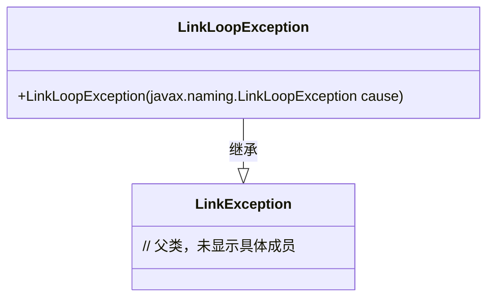
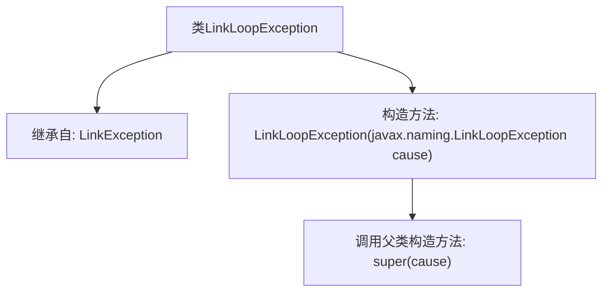

# 基础信息

|      |      |
|------|------|
| 名称 | LinkLoopException |
| 编码语言 | .java |
| 代码路径 | spring-ldap/core/src/main/java/org/springframework/ldap/LinkLoopException.java |
| 包名 | org.springframework.ldap |
| 依赖项 | [] |
| 概述说明 | LinkLoopException继承LinkException，可接受LinkLoopException参数。 |

# 说明

LinkLoopException是LinkException的子类，专门用于处理与链接循环相关的异常情况。它通过接受LinkLoopException作为参数，进一步细化了异常处理的范围和逻辑。这种设计使得在处理复杂的链接关系时，能够更精确地捕获和响应特定的循环异常，从而提高代码的健壮性和可维护性。

# 类列表 Class Summary

| 名称   | 类型  | 说明 |
|-------|------|-------------|
| LinkLoopException | class | LinkLoopException继承LinkException，接受LinkLoopException作为参数。 |

## 类 LinkLoopException

|      |      |
|------|------|
| 访问范围 | public |
| 类型 | class |
| 名称 | LinkLoopException |
| 说明 | LinkLoopException继承LinkException，接受LinkLoopException作为参数。 |

### UML类图

这段代码定义了一个名为 `LinkLoopException` 的异常类，它继承自 `LinkException` 类。`LinkLoopException` 类包含一个构造函数，该构造函数接受一个 `javax.naming.LinkLoopException` 类型的参数，并将其传递给父类的构造函数。这个异常类通常用于处理链接循环异常的场景，确保在出现链接循环时能够抛出特定的异常信息。

### 内部方法调用关系图

这段代码定义了一个名为 `LinkLoopException` 的类，它继承自 `LinkException`。该类包含一个构造方法，该构造方法接受一个 `javax.naming.LinkLoopException` 类型的参数，并在构造方法中调用父类的构造方法 `super(cause)`。这个类的主要作用是处理命名服务中的链接循环异常，通过继承 `LinkException` 来扩展异常处理能力。

### 字段列表 Field List

| 名称  | 类型  | 说明 |
|-------|-------|------|

### 方法列表 Method List

| 名称  | 类型  | 说明 |
|-------|-------|------|

