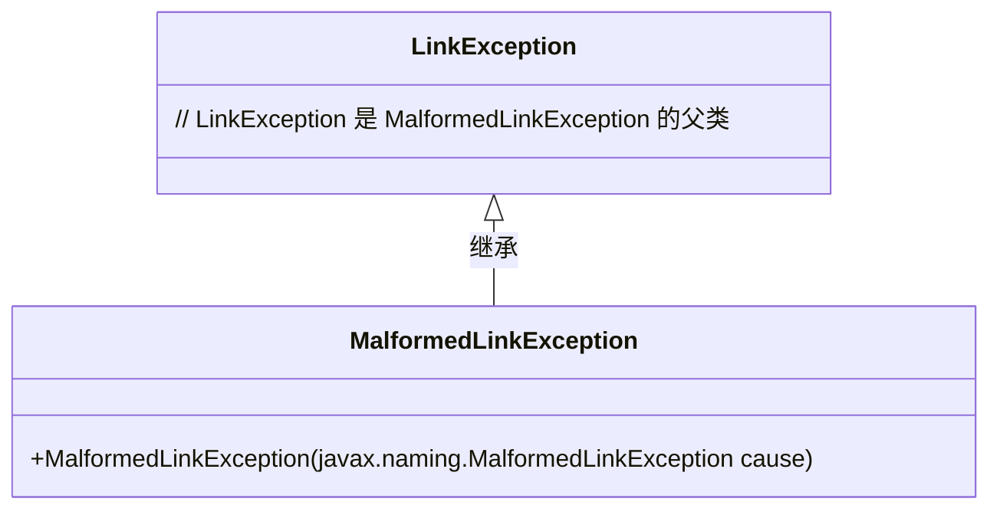
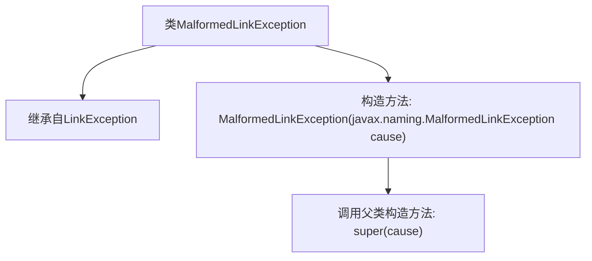

# 基础信息

|      |      |
|------|------|
| 名称 | MalformedLinkException |
| 编码语言 | .java |
| 代码路径 | spring-ldap/core/src/main/java/org/springframework/ldap/MalformedLinkException.java |
| 包名 | org.springframework.ldap |
| 依赖项 | [] |
| 概述说明 | MalformedLinkException继承LinkException，构造方法接收自身类型参数。 |

# 说明

MalformedLinkException继承自LinkException类，其构造方法接受一个MalformedLinkException类型的参数。该异常类用于处理链接格式错误的情况，通过继承LinkException，它能够捕获和处理与链接相关的异常。构造方法的参数允许在创建异常实例时传递另一个MalformedLinkException对象，以便在异常处理链中传递和记录错误信息。

# 类列表 Class Summary

| 名称   | 类型  | 说明 |
|-------|------|-------------|
| MalformedLinkException | class | MalformedLinkException继承LinkException，构造方法接收MalformedLinkException参数。 |

## 类 MalformedLinkException

|      |      |
|------|------|
| 访问范围 | public |
| 类型 | class |
| 名称 | MalformedLinkException |
| 说明 | MalformedLinkException继承LinkException，构造方法接收MalformedLinkException参数。 |

### UML类图

类图描述：`MalformedLinkException` 类继承自 `LinkException` 类，表示一种特定的链接异常。它包含一个构造函数，接受 `javax.naming.MalformedLinkException` 类型的参数，并将其传递给父类的构造函数。这种设计允许在捕获和处理链接异常时，能够区分不同类型的链接错误。

### 内部方法调用关系图

这段代码定义了一个名为`MalformedLinkException`的类，该类继承自`LinkException`。类中包含一个构造方法，该构造方法接受一个`javax.naming.MalformedLinkException`类型的参数，并在内部调用父类的构造方法`super(cause)`。这个类的主要作用是处理链接异常，并将异常原因传递给父类进行处理。

### 字段列表 Field List

| 名称  | 类型  | 说明 |
|-------|-------|------|

### 方法列表 Method List

| 名称  | 类型  | 说明 |
|-------|-------|------|

