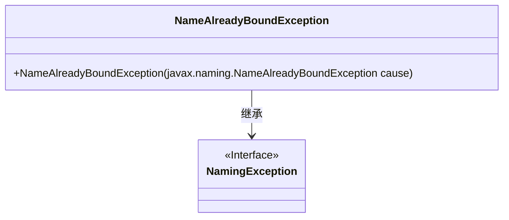
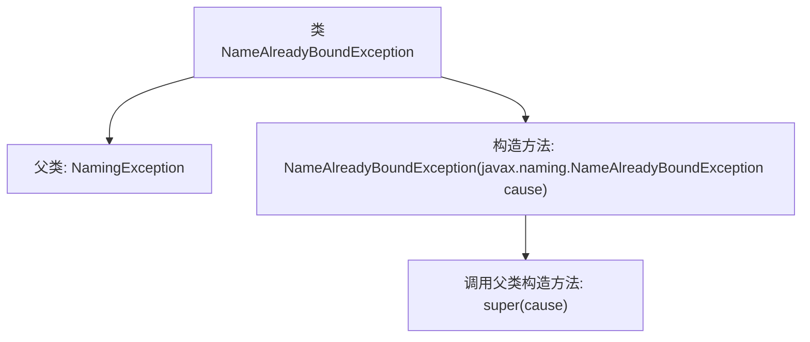

# 基础信息

|      |      |
|------|------|
| 名称 | NameAlreadyBoundException |
| 编码语言 | .java |
| 代码路径 | spring-ldap/core/src/main/java/org/springframework/ldap/NameAlreadyBoundException.java |
| 包名 | org.springframework.ldap |
| 依赖项 | [] |
| 概述说明 | NameAlreadyBoundException继承NamingException，处理名称已绑定异常。 |

# 说明

NameAlreadyBoundException是NamingException的子类，专门用于处理在命名上下文中尝试绑定已存在名称时引发的异常。这种异常通常发生在应用程序试图将一个名称绑定到一个已经绑定的对象时，帮助开发者识别并处理此类命名冲突问题。

# 类列表 Class Summary

| 名称   | 类型  | 说明 |
|-------|------|-------------|
| NameAlreadyBoundException | class | NameAlreadyBoundException继承NamingException，用于处理名称已绑定的异常。 |

## 类 NameAlreadyBoundException

|      |      |
|------|------|
| 访问范围 | public |
| 类型 | class |
| 名称 | NameAlreadyBoundException |
| 说明 | NameAlreadyBoundException继承NamingException，用于处理名称已绑定的异常。 |

### UML类图

这段代码定义了一个 `NameAlreadyBoundException` 类，它继承自 `NamingException` 接口。`NameAlreadyBoundException` 类包含一个构造函数，该构造函数接受一个 `javax.naming.NameAlreadyBoundException` 类型的参数，并将其传递给父类的构造函数。这个类主要用于处理命名服务中名称已绑定的异常情况。

### 内部方法调用关系图

该流程图描述了`NameAlreadyBoundException`类的结构及其与父类`NamingException`的关系。`NameAlreadyBoundException`类继承自`NamingException`，并包含一个构造方法，该构造方法接受一个`javax.naming.NameAlreadyBoundException`类型的参数，并调用父类的构造方法`super(cause)`。该流程图清晰地展示了类的继承关系和构造方法的调用流程。

### 字段列表 Field List

| 名称  | 类型  | 说明 |
|-------|-------|------|

### 方法列表 Method List

| 名称  | 类型  | 说明 |
|-------|-------|------|

