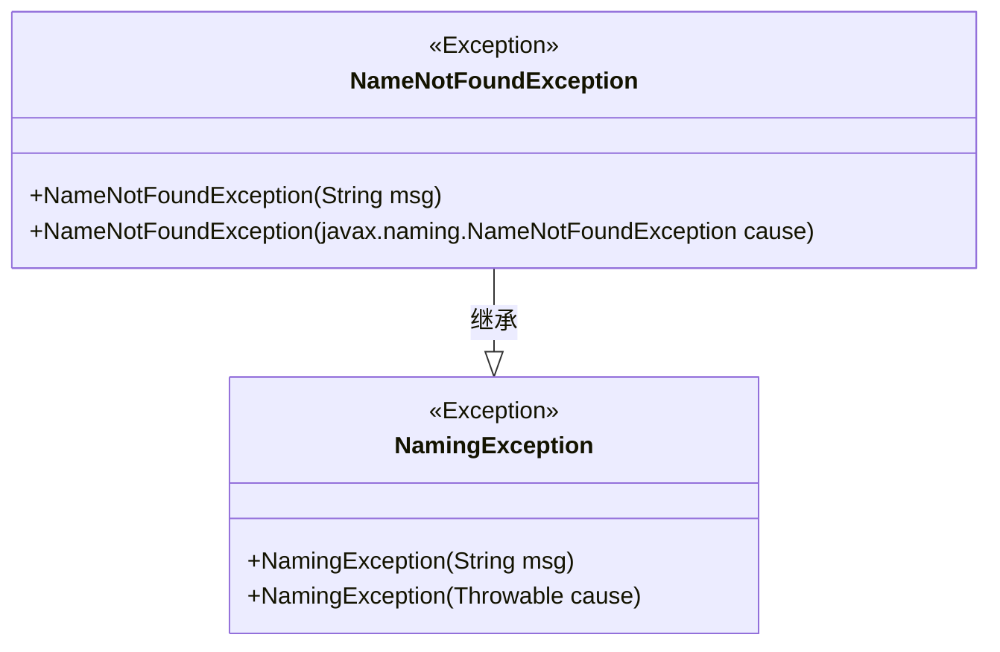
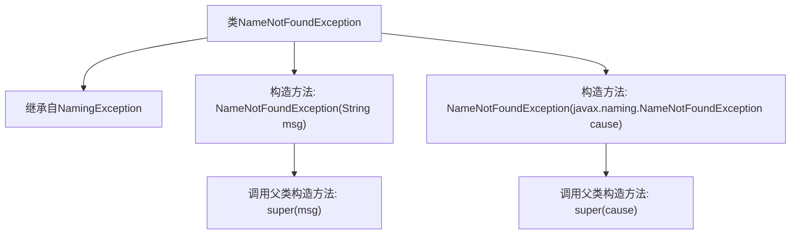

# 基础信息

|      |      |
|------|------|
| 名称 | NameNotFoundException |
| 编码语言 | .java |
| 代码路径 | spring-ldap/core/src/main/java/org/springframework/ldap/NameNotFoundException.java |
| 包名 | org.springframework.ldap |
| 依赖项 | [] |
| 概述说明 | NameNotFoundException继承NamingException，提供两种构造方法。 |

# 说明

NameNotFoundException是NamingException的子类，用于表示在命名操作中未找到指定名称的异常。它提供了两种构造方法，一种是无参构造方法，另一种是接受一个字符串参数的构造方法，该字符串用于描述异常的详细信息。这两种构造方法使得开发者可以根据需要灵活地创建和抛出NameNotFoundException异常实例。

# 类列表 Class Summary

| 名称   | 类型  | 说明 |
|-------|------|-------------|
| NameNotFoundException | class | NameNotFoundException继承NamingException，提供两种构造方法。 |

## 类 NameNotFoundException

|      |      |
|------|------|
| 访问范围 | public |
| 类型 | class |
| 名称 | NameNotFoundException |
| 说明 | NameNotFoundException继承NamingException，提供两种构造方法。 |

### UML类图

**描述：**  
`NameNotFoundException` 是一个自定义异常类，继承自 `NamingException`。它提供了两个构造函数，一个接受字符串消息作为参数，另一个接受 `javax.naming.NameNotFoundException` 类型的异常作为参数。通过继承 `NamingException`，`NameNotFoundException` 能够处理与命名相关的异常情况，特别是在名称查找失败时抛出该异常。

### 内部方法调用关系图

这段代码定义了一个名为`NameNotFoundException`的类，该类继承自`NamingException`。类中包含两个构造方法：一个接受`String`类型的参数`msg`，并调用父类的构造方法`super(msg)`；另一个接受`javax.naming.NameNotFoundException`类型的参数`cause`，并调用父类的构造方法`super(cause)`。这两个构造方法分别用于处理不同的异常情况，确保异常信息能够正确地传递给父类进行处理。

### 字段列表 Field List

| 名称  | 类型  | 说明 |
|-------|-------|------|

### 方法列表 Method List

| 名称  | 类型  | 说明 |
|-------|-------|------|

