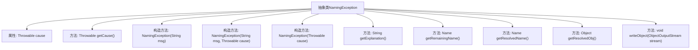

# 基础信息

|      |      |
|------|------|
| 名称 | NamingException |
| 编码语言 | .java |
| 代码路径 | spring-ldap/core/src/main/java/org/springframework/ldap/NamingException.java |
| 包名 | org.springframework.ldap |
| 依赖项 | ['java.io.IOException', 'java.io.ObjectOutputStream', 'java.io.Serializable', 'javax.naming.Name', 'org.springframework.core.NestedRuntimeException'] |
| 概述说明 | NamingException类扩展NestedRuntimeException，处理命名异常，提供解析对象和名称的便捷方法。 |

# 说明

NamingException类继承自NestedRuntimeException，专门用于处理命名相关的异常情况。该类支持传递异常消息和原因，便于开发者理解和调试。此外，NamingException提供了便捷的方法来解析异常涉及的对象和名称，帮助快速定位问题根源，提升异常处理的效率和准确性。

# 类列表 Class Summary

| 名称   | 类型  | 说明 |
|-------|------|-------------|
| NamingException | class | NamingException类扩展NestedRuntimeException，处理命名异常，支持消息和原因，提供解析对象和名称的便捷方法。 |


## 类 NamingException

|      |      |
|------|------|
| 访问范围 | public abstract |
| 类型 | class |
| 名称 | NamingException |
| 说明 | NamingException类扩展NestedRuntimeException，处理命名异常，支持消息和原因，提供解析对象和名称的便捷方法。 |


### UML类图

```mermaid
classDiagram
   class NamingException {
        -Throwable cause
        +NamingException(String msg)
        +NamingException(String msg, Throwable cause)
        +NamingException(Throwable cause)
        +Throwable getCause()
        +String getExplanation()
        +Name getRemainingName()
        +Name getResolvedName()
        +Object getResolvedObj()
        -void writeObject(ObjectOutputStream stream) throws IOException
    }

   class NestedRuntimeException {
        // 基类，NamingException继承自该类
    }

   class <<Interface>> Serializable {
        // 标记接口，表示可序列化
    }

   class javax~naming~NamingException {
        // javax.naming.NamingException类，NamingException的cause可能是该类的实例
    }

   NamingException --|> NestedRuntimeException : 继承
   NamingException --> javax~naming~NamingException : 依赖
   NamingException --> Serializable : 依赖
```

这段代码定义了一个抽象类 `NamingException`，它继承自 `NestedRuntimeException`，并包含了对 `javax.naming.NamingException` 和 `Serializable` 接口的依赖。`NamingException` 类主要用于处理命名相关的异常，提供了多个构造函数和便捷方法来获取异常的详细信息，如解释、未解析的名称、已解析的名称和已解析的对象。此外，它还重写了 `writeObject` 方法，以确保在序列化时正确处理不可序列化的对象。


### 内部方法调用关系图



该流程图展示了抽象类 `NamingException` 的结构及其内部方法调用关系。`NamingException` 继承自 `NestedRuntimeException`，包含一个 `Throwable` 类型的 `cause` 属性，并提供了多个构造方法和便捷方法，用于处理与命名异常相关的操作。特别地，`writeObject` 方法用于在序列化时处理可能不可序列化的 `resolvedObj`，确保异常对象在序列化过程中不会抛出错误。

### 字段列表 Field List

| 名称  | 类型  | 说明 |
|-------|-------|------|
| cause | Throwable | 私有不可变的Throwable类型变量cause。 |

### 方法列表 Method List

| 名称  | 类型  | 说明 |
|-------|-------|------|
| getExplanation | String | 该方法检查异常原因是否为NamingException，若是则返回其解释信息，否则返回null。 |
| getRemainingName | Name | 获取异常原因中的剩余名称，若为NamingException则返回，否则返回null。 |
| getResolvedObj | Object | 获取异常原因中的解析对象，若无则返回空。 |
| writeObject | void | 方法检查对象是否可序列化，不可序列化时临时清空属性并写入对象。 |
| getCause | Throwable | 该方法返回异常原因，若原因非自身则返回原因，否则返回null。 |
| getResolvedName | Name | 方法getResolvedName检查异常类型并返回解析名称。 |


