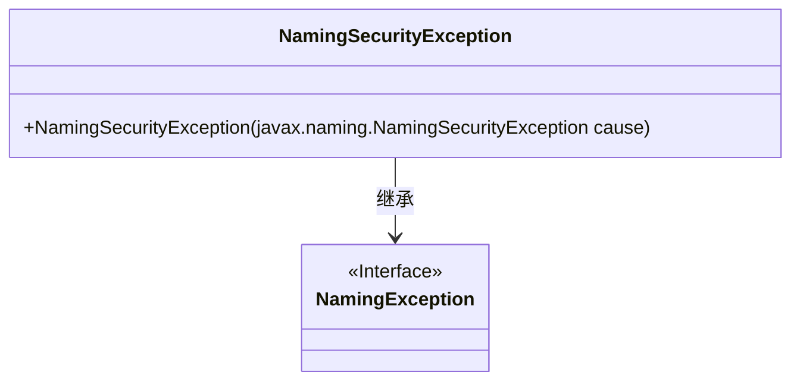
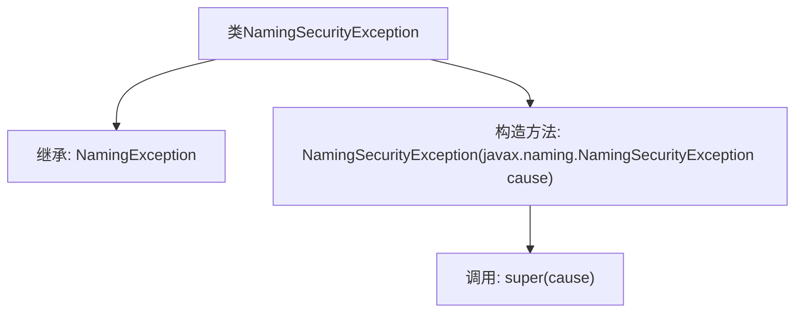

# 基础信息

|      |      |
|------|------|
| 名称 | NamingSecurityException |
| 编码语言 | .java |
| 代码路径 | spring-ldap/core/src/main/java/org/springframework/ldap/NamingSecurityException.java |
| 包名 | org.springframework.ldap |
| 依赖项 | [] |
| 概述说明 | NamingSecurityException继承NamingException，构造函数接受同名参数。 |

# 说明

NamingSecurityException是NamingException的子类，主要用于处理命名服务中的安全相关异常。其构造函数接受一个NamingSecurityException类型的参数，允许在创建异常实例时传递特定的安全异常信息，以便更精确地描述和捕获命名服务中的安全问题。这种设计有助于在复杂的命名服务环境中，提供更细粒度的异常处理机制。

# 类列表 Class Summary

| 名称   | 类型  | 说明 |
|-------|------|-------------|
| NamingSecurityException | class | NamingSecurityException继承NamingException，构造函数接受NamingSecurityException参数。 |

## 类 NamingSecurityException

|      |      |
|------|------|
| 访问范围 | public |
| 类型 | class |
| 名称 | NamingSecurityException |
| 说明 | NamingSecurityException继承NamingException，构造函数接受NamingSecurityException参数。 |

### UML类图

这段代码定义了一个名为 `NamingSecurityException` 的类，它继承自 `NamingException` 接口。`NamingSecurityException` 类包含一个构造函数，该构造函数接受一个 `javax.naming.NamingSecurityException` 类型的参数，并将其传递给父类的构造函数。这个类主要用于处理与命名安全相关的异常情况，通过继承 `NamingException` 接口，它能够与现有的命名异常处理机制无缝集成。

### 内部方法调用关系图

这段代码定义了一个名为 `NamingSecurityException` 的类，该类继承自 `NamingException`。它包含一个构造方法，该构造方法接受一个 `javax.naming.NamingSecurityException` 类型的参数，并在构造方法中调用父类的构造方法 `super(cause)`。这个类主要用于处理与命名安全相关的异常情况，通过继承 `NamingException` 来扩展异常处理的能力。

### 字段列表 Field List

| 名称  | 类型  | 说明 |
|-------|-------|------|

### 方法列表 Method List

| 名称  | 类型  | 说明 |
|-------|-------|------|

