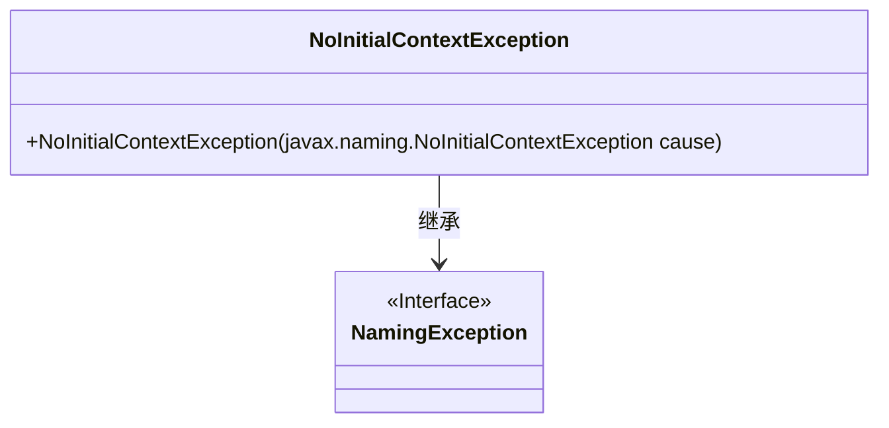
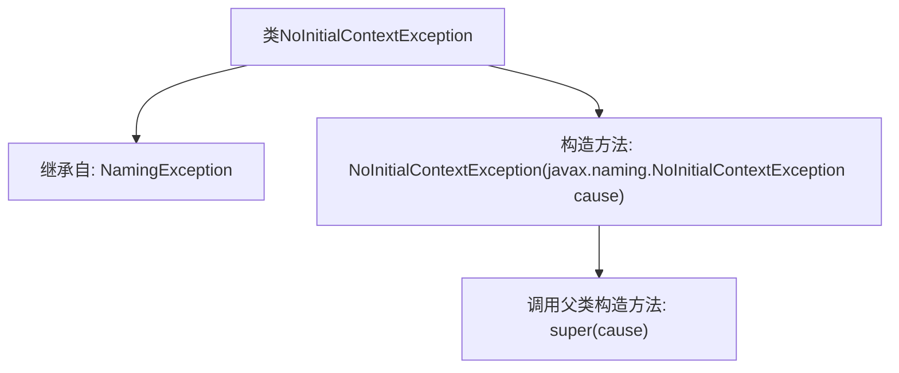

# 基础信息

|      |      |
|------|------|
| 名称 | NoInitialContextException |
| 编码语言 | .java |
| 代码路径 | spring-ldap/core/src/main/java/org/springframework/ldap/NoInitialContextException.java |
| 包名 | org.springframework.ldap |
| 依赖项 | [] |
| 概述说明 | NoInitialContextException继承NamingException，构造方法接收异常。 |

# 说明

NoInitialContextException是NamingException的子类，表示在尝试获取初始上下文时发生的异常。该类的构造方法接收一个NoInitialContextException异常作为参数，用于初始化该异常实例。这种设计使得在捕获和处理与命名服务相关的异常时，能够更具体地识别和处理初始上下文缺失的情况。

# 类列表 Class Summary

| 名称   | 类型  | 说明 |
|-------|------|-------------|
| NoInitialContextException | class | NoInitialContextException继承NamingException，构造方法接收NoInitialContextException异常。 |

## 类 NoInitialContextException

|      |      |
|------|------|
| 访问范围 | public |
| 类型 | class |
| 名称 | NoInitialContextException |
| 说明 | NoInitialContextException继承NamingException，构造方法接收NoInitialContextException异常。 |

### UML类图

这段代码定义了一个名为 `NoInitialContextException` 的类，它继承自 `NamingException` 接口。`NoInitialContextException` 类包含一个构造函数，该构造函数接受一个 `javax.naming.NoInitialContextException` 类型的参数，并将其传递给父类的构造函数。类图清晰地展示了 `NoInitialContextException` 与 `NamingException` 之间的继承关系，表明 `NoInitialContextException` 是 `NamingException` 的一个具体实现。

### 内部方法调用关系图

这段代码定义了一个名为`NoInitialContextException`的类，该类继承自`NamingException`。它包含一个构造方法，该构造方法接受一个`javax.naming.NoInitialContextException`类型的参数，并在内部调用父类的构造方法`super(cause)`。这个类主要用于处理命名服务中的异常情况，特别是在没有初始上下文时抛出异常。

### 字段列表 Field List

| 名称  | 类型  | 说明 |
|-------|-------|------|

### 方法列表 Method List

| 名称  | 类型  | 说明 |
|-------|-------|------|

