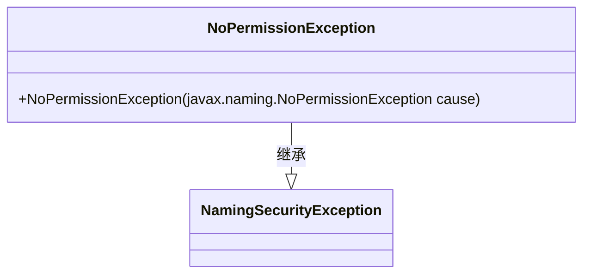
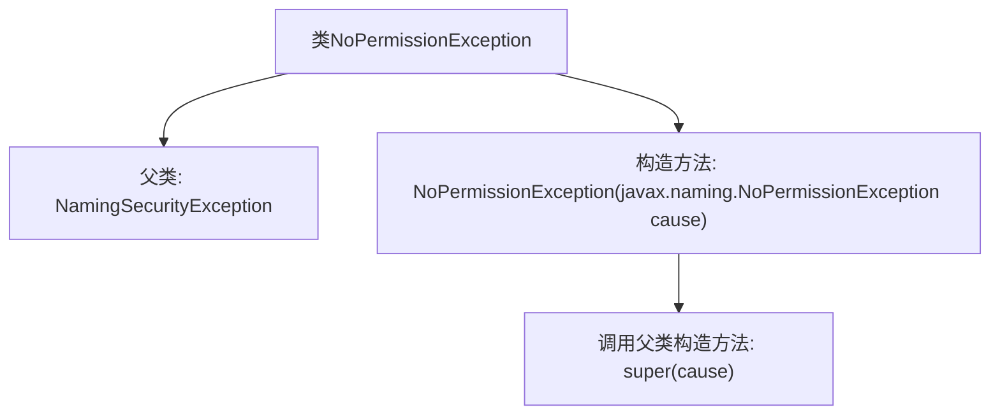

# 基础信息

|      |      |
|------|------|
| 名称 | NoPermissionException |
| 编码语言 | .java |
| 代码路径 | spring-ldap/core/src/main/java/org/springframework/ldap/NoPermissionException.java |
| 包名 | org.springframework.ldap |
| 依赖项 | [] |
| 概述说明 | NoPermissionException继承NamingSecurityException，构造函数接收自身类型参数。 |

# 说明

NoPermissionException继承自NamingSecurityException，表示在命名操作中因权限不足引发的异常。其构造函数接受一个NoPermissionException类型的参数，用于初始化异常实例。

# 类列表 Class Summary

| 名称   | 类型  | 说明 |
|-------|------|-------------|
| NoPermissionException | class | NoPermissionException继承NamingSecurityException，构造函数接收NoPermissionException作为参数。 |

## 类 NoPermissionException

|      |      |
|------|------|
| 访问范围 | public |
| 类型 | class |
| 名称 | NoPermissionException |
| 说明 | NoPermissionException继承NamingSecurityException，构造函数接收NoPermissionException作为参数。 |

### UML类图

**描述：**  
`NoPermissionException` 是一个自定义异常类，继承自 `NamingSecurityException`。它通过构造函数接收一个 `javax.naming.NoPermissionException` 类型的参数，并将其传递给父类的构造函数。这个类主要用于处理命名操作中权限不足的情况，扩展了标准的安全异常处理机制。

### 内部方法调用关系图

这段代码定义了一个名为 `NoPermissionException` 的类，它继承自 `NamingSecurityException`。该类包含一个构造方法，该构造方法接受一个 `javax.naming.NoPermissionException` 类型的参数，并通过 `super(cause)` 调用父类的构造方法。流程图展示了类的继承关系和构造方法的调用过程，清晰地描述了类的结构和行为。

### 字段列表 Field List

| 名称  | 类型  | 说明 |
|-------|-------|------|

### 方法列表 Method List

| 名称  | 类型  | 说明 |
|-------|-------|------|

