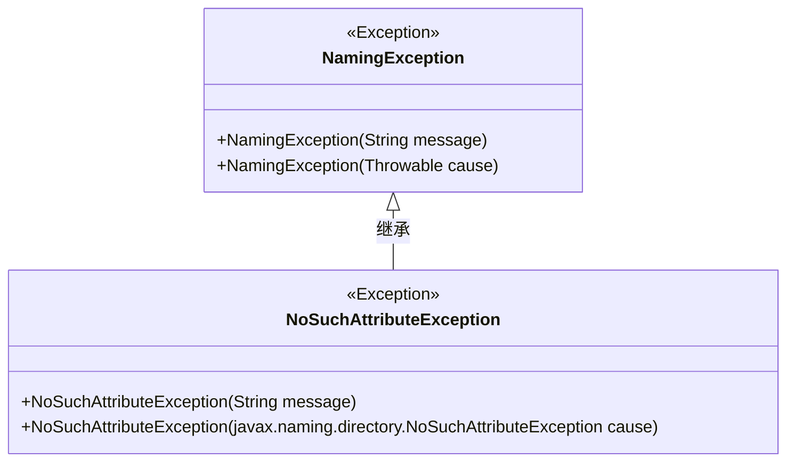
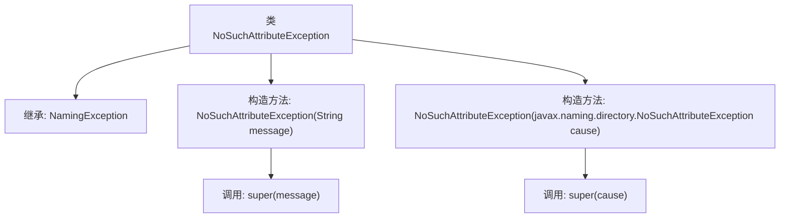

# 基础信息

|      |      |
|------|------|
| 名称 | NoSuchAttributeException |
| 编码语言 | .java |
| 代码路径 | spring-ldap/core/src/main/java/org/springframework/ldap/NoSuchAttributeException.java |
| 包名 | org.springframework.ldap |
| 依赖项 | [] |
| 概述说明 | NoSuchAttributeException继承NamingException，提供两种构造方法。 |

# 说明

NoSuchAttributeException继承自NamingException，提供了两种构造方法。该异常通常用于表示在命名上下文中未找到指定属性的情况。通过继承NamingException，它继承了与命名操作相关的异常处理机制。两种构造方法允许开发者在抛出异常时选择是否包含详细错误信息或仅提供异常类型，从而更灵活地处理命名上下文中的属性缺失问题。

# 类列表 Class Summary

| 名称   | 类型  | 说明 |
|-------|------|-------------|
| NoSuchAttributeException | class | NoSuchAttributeException继承NamingException，提供两种构造方法。 |

## 类 NoSuchAttributeException

|      |      |
|------|------|
| 访问范围 | public |
| 类型 | class |
| 名称 | NoSuchAttributeException |
| 说明 | NoSuchAttributeException继承NamingException，提供两种构造方法。 |

### UML类图

这段代码定义了一个名为 `NoSuchAttributeException` 的异常类，它继承自 `NamingException`。`NoSuchAttributeException` 类有两个构造函数：一个接受字符串消息作为参数，另一个接受 `javax.naming.directory.NoSuchAttributeException` 类型的异常作为参数。这两个构造函数都通过 `super` 调用了父类的构造函数，分别用于初始化异常的消息或原因。该类主要用于处理在命名操作中找不到属性的异常情况。

### 内部方法调用关系图

这段代码定义了一个名为`NoSuchAttributeException`的类，该类继承自`NamingException`。它包含两个构造方法：一个接受`String`类型的参数`message`，并调用父类的构造方法`super(message)`；另一个接受`javax.naming.directory.NoSuchAttributeException`类型的参数`cause`，并调用父类的构造方法`super(cause)`。这两个构造方法分别用于处理不同的异常情况，确保异常信息能够正确地传递给父类进行处理。

### 字段列表 Field List

| 名称  | 类型  | 说明 |
|-------|-------|------|

### 方法列表 Method List

| 名称  | 类型  | 说明 |
|-------|-------|------|

