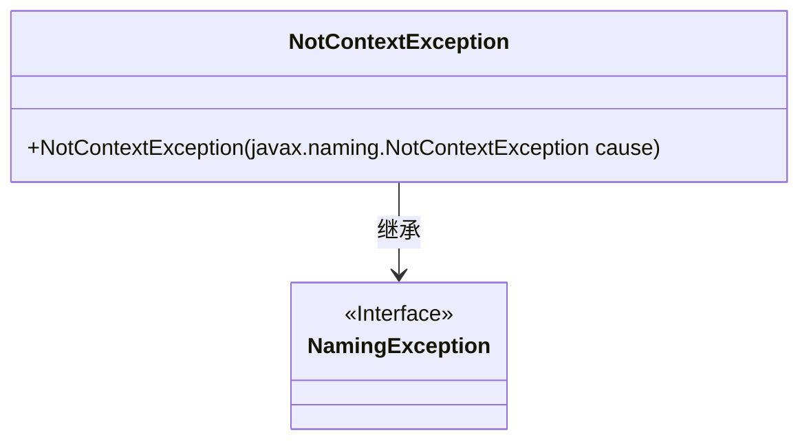
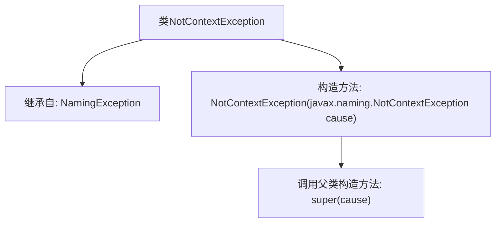

# 基础信息

|      |      |
|------|------|
| 名称 | NotContextException |
| 编码语言 | .java |
| 代码路径 | spring-ldap/core/src/main/java/org/springframework/ldap/NotContextException.java |
| 包名 | org.springframework.ldap |
| 依赖项 | [] |
| 概述说明 | NotContextException继承NamingException，构造参数为NotContextException。 |

# 说明

NotContextException是NamingException的子类，它可以通过接受NotContextException作为构造参数来创建实例。这种设计使得NotContextException能够继承NamingException的特性，并通过构造参数传递特定的异常信息。

# 类列表 Class Summary

| 名称   | 类型  | 说明 |
|-------|------|-------------|
| NotContextException | class | NotContextException继承NamingException，接受NotContextException作为构造参数。 |

## 类 NotContextException

|      |      |
|------|------|
| 访问范围 | public |
| 类型 | class |
| 名称 | NotContextException |
| 说明 | NotContextException继承NamingException，接受NotContextException作为构造参数。 |

### UML类图

这段代码定义了一个 `NotContextException` 类，它继承自 `NamingException` 接口。`NotContextException` 类包含一个构造函数，该构造函数接受一个 `javax.naming.NotContextException` 类型的参数，并将其传递给父类的构造函数。这个类主要用于处理命名操作中的异常情况，特别是当操作的对象不是一个上下文时抛出此异常。

### 内部方法调用关系图

该流程图展示了`NotContextException`类的结构及其与父类`NamingException`的关系。`NotContextException`类继承自`NamingException`，并包含一个构造方法，该构造方法接收一个`javax.naming.NotContextException`类型的参数，并调用父类的构造方法进行初始化。该流程图清晰地反映了类的继承关系和构造方法的调用逻辑。

### 字段列表 Field List

| 名称  | 类型  | 说明 |
|-------|-------|------|

### 方法列表 Method List

| 名称  | 类型  | 说明 |
|-------|-------|------|

