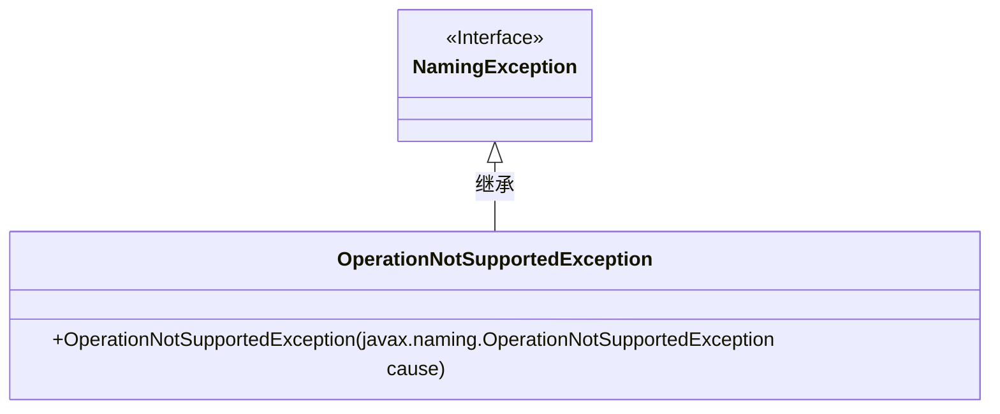
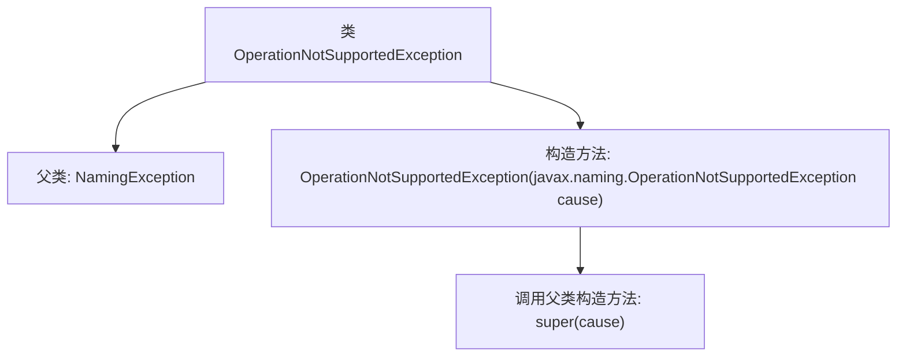

# 基础信息

|      |      |
|------|------|
| 名称 | OperationNotSupportedException |
| 编码语言 | .java |
| 代码路径 | spring-ldap/core/src/main/java/org/springframework/ldap/OperationNotSupportedException.java |
| 包名 | org.springframework.ldap |
| 依赖项 | [] |
| 概述说明 | OperationNotSupportedException继承NamingException，可传入原因。 |

# 说明

OperationNotSupportedException继承自NamingException，并且支持将OperationNotSupportedException作为原因传入。这意味着当发生操作不支持的情况时，可以抛出此异常，并且可以通过传递另一个OperationNotSupportedException实例来提供更详细的异常原因信息。

# 类列表 Class Summary

| 名称   | 类型  | 说明 |
|-------|------|-------------|
| OperationNotSupportedException | class | OperationNotSupportedException继承NamingException，支持传入OperationNotSupportedException作为原因。 |

## 类 OperationNotSupportedException

|      |      |
|------|------|
| 访问范围 | public |
| 类型 | class |
| 名称 | OperationNotSupportedException |
| 说明 | OperationNotSupportedException继承NamingException，支持传入OperationNotSupportedException作为原因。 |

### UML类图

这段代码定义了一个名为 `OperationNotSupportedException` 的类，它继承自 `NamingException` 接口。`OperationNotSupportedException` 类包含一个构造函数，该构造函数接受一个 `javax.naming.OperationNotSupportedException` 类型的参数，并将其传递给父类的构造函数。这种设计通常用于扩展异常处理能力，允许捕获和处理特定的命名操作不支持的情况。

### 内部方法调用关系图

这段代码定义了一个名为 `OperationNotSupportedException` 的异常类，它继承自 `NamingException`。该类包含一个构造方法，该构造方法接受一个 `javax.naming.OperationNotSupportedException` 类型的参数，并调用父类的构造方法 `super(cause)` 来初始化异常。这个异常类主要用于处理命名操作不被支持的情况。

### 字段列表 Field List

| 名称  | 类型  | 说明 |
|-------|-------|------|

### 方法列表 Method List

| 名称  | 类型  | 说明 |
|-------|-------|------|

