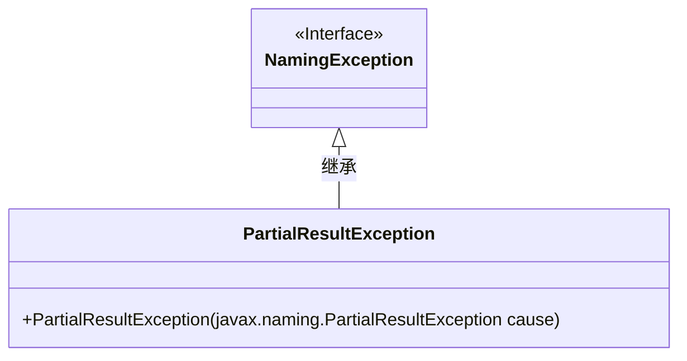
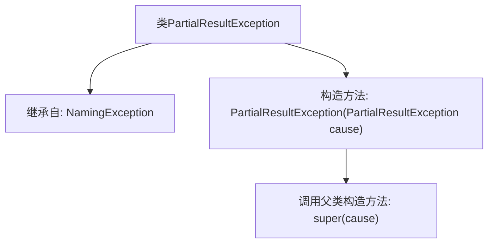

# 基础信息

|      |      |
|------|------|
| 名称 | PartialResultException |
| 编码语言 | .java |
| 代码路径 | spring-ldap/core/src/main/java/org/springframework/ldap/PartialResultException.java |
| 包名 | org.springframework.ldap |
| 依赖项 | [] |
| 概述说明 | PartialResultException继承NamingException，构造参数为PartialResultException。 |

# 说明

PartialResultException是NamingException的子类，它在构造时可以接受另一个PartialResultException作为参数。这意味着PartialResultException不仅继承了NamingException的特性，还能通过传递已有的PartialResultException实例来初始化新的异常对象。这种设计允许在异常处理中保持上下文信息，便于调试和错误追踪。

# 类列表 Class Summary

| 名称   | 类型  | 说明 |
|-------|------|-------------|
| PartialResultException | class | PartialResultException继承NamingException，接受PartialResultException作为构造参数。 |

## 类 PartialResultException

|      |      |
|------|------|
| 访问范围 | public |
| 类型 | class |
| 名称 | PartialResultException |
| 说明 | PartialResultException继承NamingException，接受PartialResultException作为构造参数。 |

### UML类图

这段代码定义了一个 `PartialResultException` 类，它继承自 `NamingException` 接口。`PartialResultException` 类包含一个构造函数，接受一个 `javax.naming.PartialResultException` 类型的参数，并将其传递给父类的构造函数。该类的设计目的是处理命名操作中的部分结果异常，通常用于在命名服务中处理不完整的操作结果。

### 内部方法调用关系图

这段代码定义了一个名为`PartialResultException`的类，该类继承自`NamingException`。它包含一个构造方法，该构造方法接受一个`javax.naming.PartialResultException`类型的参数，并调用父类`NamingException`的构造方法进行初始化。流程图清晰地展示了类的继承关系和构造方法的调用流程。

### 字段列表 Field List

| 名称  | 类型  | 说明 |
|-------|-------|------|

### 方法列表 Method List

| 名称  | 类型  | 说明 |
|-------|-------|------|

