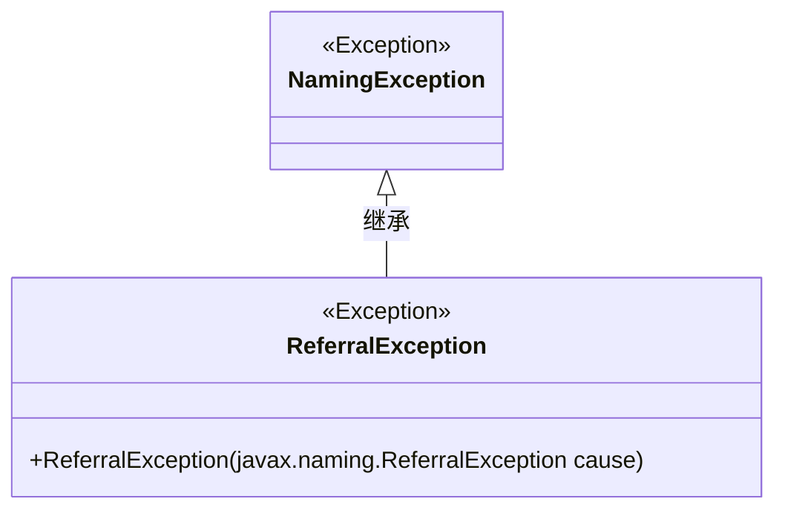
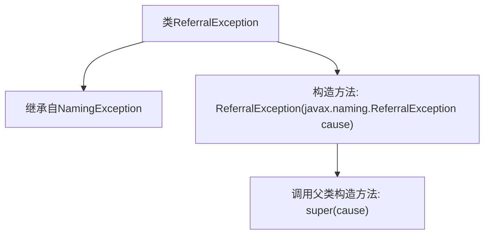

# 基础信息

|      |      |
|------|------|
| 名称 | ReferralException |
| 编码语言 | .java |
| 代码路径 | spring-ldap/core/src/main/java/org/springframework/ldap/ReferralException.java |
| 包名 | org.springframework.ldap |
| 依赖项 | [] |
| 概述说明 | ReferralException继承NamingException，构造参数为ReferralException。 |

# 说明

ReferralException继承自NamingException，并且在构造过程中可以接受另一个ReferralException作为参数。这种设计表明ReferralException类可能用于处理命名服务中的引用异常，并且允许在异常链中传递或封装其他ReferralException实例，以便更详细地描述或追踪异常的发生过程。

# 类列表 Class Summary

| 名称   | 类型  | 说明 |
|-------|------|-------------|
| ReferralException | class | ReferralException继承NamingException，接受ReferralException作为构造参数。 |

## 类 ReferralException

|      |      |
|------|------|
| 访问范围 | public |
| 类型 | class |
| 名称 | ReferralException |
| 说明 | ReferralException继承NamingException，接受ReferralException作为构造参数。 |

### UML类图

**描述**：`ReferralException` 是一个继承自 `NamingException` 的自定义异常类。它通过构造函数接收一个 `javax.naming.ReferralException` 类型的参数，并将其传递给父类的构造函数。这个类主要用于处理命名服务中的引用异常情况。

### 内部方法调用关系图

这段代码定义了一个名为 `ReferralException` 的类，该类继承自 `NamingException`。`ReferralException` 类包含一个构造方法，该构造方法接受一个 `javax.naming.ReferralException` 类型的参数，并在内部调用父类 `NamingException` 的构造方法。这个类的设计目的是为了处理与命名服务相关的异常情况，特别是那些涉及到引用（Referral）的异常。

### 字段列表 Field List

| 名称  | 类型  | 说明 |
|-------|-------|------|

### 方法列表 Method List

| 名称  | 类型  | 说明 |
|-------|-------|------|

