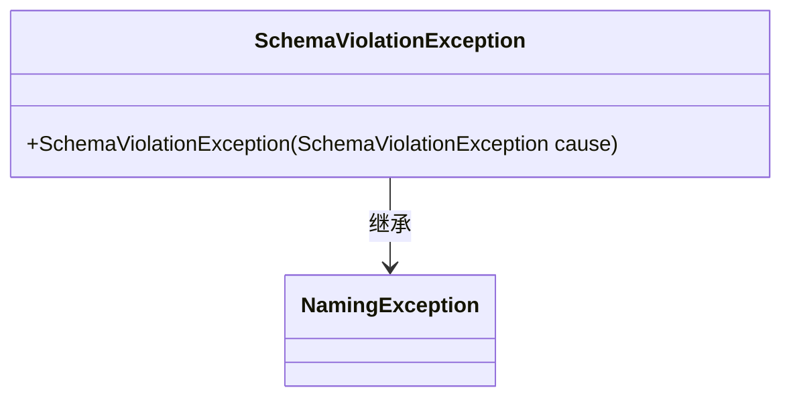
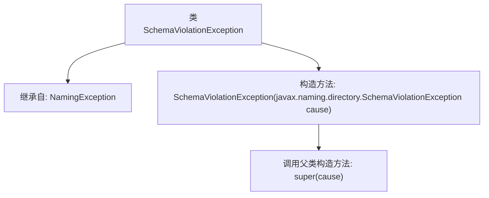

# 基础信息

|      |      |
|------|------|
| 名称 | SchemaViolationException |
| 编码语言 | .java |
| 代码路径 | spring-ldap/core/src/main/java/org/springframework/ldap/SchemaViolationException.java |
| 包名 | org.springframework.ldap |
| 依赖项 | [] |
| 概述说明 | SchemaViolationException继承NamingException，构造函数接受SchemaViolationException参数。 |

# 说明

SchemaViolationException是NamingException的子类，其构造函数接受一个SchemaViolationException类型的参数。这意味着SchemaViolationException不仅继承了NamingException的特性，还能通过其构造函数处理同类型的异常实例，从而在异常处理中提供更灵活的方式。

# 类列表 Class Summary

| 名称   | 类型  | 说明 |
|-------|------|-------------|
| SchemaViolationException | class | SchemaViolationException继承NamingException，构造函数接收SchemaViolationException作为参数。 |

## 类 SchemaViolationException

|      |      |
|------|------|
| 访问范围 | public |
| 类型 | class |
| 名称 | SchemaViolationException |
| 说明 | SchemaViolationException继承NamingException，构造函数接收SchemaViolationException作为参数。 |

### UML类图

这段代码定义了一个 `SchemaViolationException` 类，它继承自 `NamingException` 类。`SchemaViolationException` 类有一个构造函数，接受一个 `javax.naming.directory.SchemaViolationException` 类型的参数，并将其传递给父类 `NamingException` 的构造函数。这个异常类通常用于处理与命名和目录服务相关的模式违反情况。

### 内部方法调用关系图

这段代码定义了一个名为 `SchemaViolationException` 的类，它继承自 `NamingException`。该类包含一个构造方法，该构造方法接受一个 `javax.naming.directory.SchemaViolationException` 类型的参数，并调用父类的构造方法 `super(cause)` 来初始化异常。这个类主要用于处理与模式（schema）相关的命名异常，确保异常信息能够正确传递和处理。

### 字段列表 Field List

| 名称  | 类型  | 说明 |
|-------|-------|------|

### 方法列表 Method List

| 名称  | 类型  | 说明 |
|-------|-------|------|

