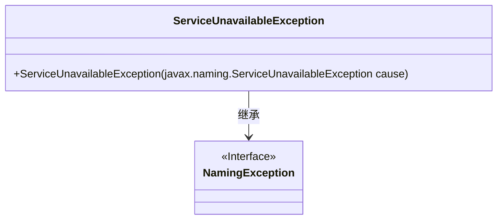
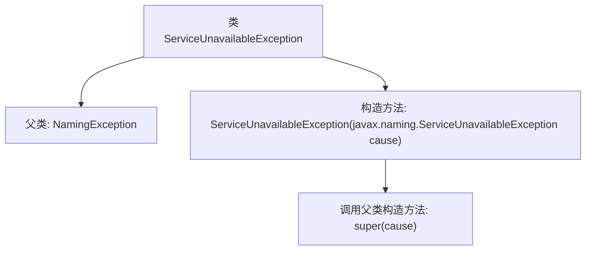

# 基础信息

|      |      |
|------|------|
| 名称 | ServiceUnavailableException |
| 编码语言 | .java |
| 代码路径 | spring-ldap/core/src/main/java/org/springframework/ldap/ServiceUnavailableException.java |
| 包名 | org.springframework.ldap |
| 依赖项 | [] |
| 概述说明 | ServiceUnavailableException继承NamingException，处理服务不可用异常。 |

# 说明

ServiceUnavailableException是NamingException的子类，专门用于处理服务不可用的情况。当应用程序尝试访问某个服务时，如果该服务无法使用或不可达，系统会抛出此异常。该异常的设计目的是为了在服务不可用时提供明确的错误处理机制，帮助开发者识别和解决问题。通过继承NamingException，ServiceUnavailableException能够与其他命名服务相关的异常保持一致，便于统一管理和处理。

# 类列表 Class Summary

| 名称   | 类型  | 说明 |
|-------|------|-------------|
| ServiceUnavailableException | class | ServiceUnavailableException继承NamingException，用于处理服务不可用异常。 |

## 类 ServiceUnavailableException

|      |      |
|------|------|
| 访问范围 | public |
| 类型 | class |
| 名称 | ServiceUnavailableException |
| 说明 | ServiceUnavailableException继承NamingException，用于处理服务不可用异常。 |

### UML类图

这段代码定义了一个 `ServiceUnavailableException` 类，它继承自 `NamingException` 接口。`ServiceUnavailableException` 类包含一个构造函数，该构造函数接受一个 `javax.naming.ServiceUnavailableException` 类型的参数，并将其传递给父类的构造函数。通过这种方式，`ServiceUnavailableException` 类能够捕获并处理服务不可用的异常情况，同时保留了与 `NamingException` 接口的兼容性。

### 内部方法调用关系图

这段代码定义了一个名为`ServiceUnavailableException`的类，它继承自`NamingException`。该类包含一个构造方法，接受一个`javax.naming.ServiceUnavailableException`类型的参数，并在构造方法中调用父类的构造方法`super(cause)`。这个异常类通常用于表示服务不可用的情况，通过继承`NamingException`，它可以与其他命名相关的异常类保持一致的处理方式。

### 字段列表 Field List

| 名称  | 类型  | 说明 |
|-------|-------|------|

### 方法列表 Method List

| 名称  | 类型  | 说明 |
|-------|-------|------|

