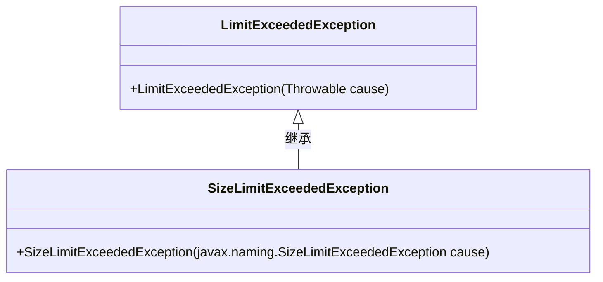
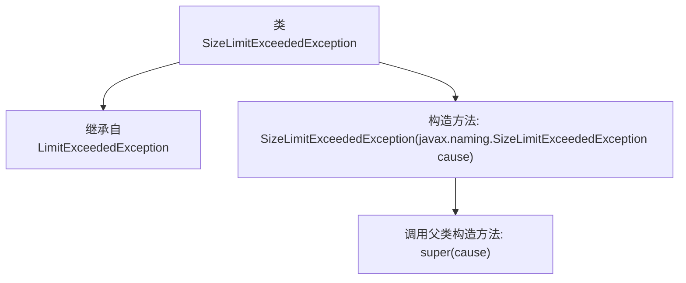

# 基础信息

|      |      |
|------|------|
| 名称 | SizeLimitExceededException |
| 编码语言 | .java |
| 代码路径 | spring-ldap/core/src/main/java/org/springframework/ldap/SizeLimitExceededException.java |
| 包名 | org.springframework.ldap |
| 依赖项 | [] |
| 概述说明 | SizeLimitExceededException继承LimitExceededException，构造函数接收SizeLimitExceededException参数。 |

# 说明

SizeLimitExceededException继承自LimitExceededException，其构造函数接收javax.naming.SizeLimitExceededException作为参数。该异常通常用于表示在命名操作中超出了大小限制的情况。通过继承LimitExceededException，SizeLimitExceededException能够利用父类的异常处理机制，同时通过构造函数接收特定类型的异常参数，以便在需要时提供更详细的错误信息。

# 类列表 Class Summary

| 名称   | 类型  | 说明 |
|-------|------|-------------|
| SizeLimitExceededException | class | SizeLimitExceededException继承LimitExceededException，构造函数接收javax.naming.SizeLimitExceededException作为参数。 |

## 类 SizeLimitExceededException

|      |      |
|------|------|
| 访问范围 | public |
| 类型 | class |
| 名称 | SizeLimitExceededException |
| 说明 | SizeLimitExceededException继承LimitExceededException，构造函数接收javax.naming.SizeLimitExceededException作为参数。 |

### UML类图

这段代码定义了一个 `SizeLimitExceededException` 类，它继承自 `LimitExceededException` 类。`SizeLimitExceededException` 类包含一个构造函数，该构造函数接受一个 `javax.naming.SizeLimitExceededException` 类型的参数，并将其传递给父类的构造函数。类图展示了 `SizeLimitExceededException` 与 `LimitExceededException` 之间的继承关系，表明 `SizeLimitExceededException` 是 `LimitExceededException` 的子类。

### 内部方法调用关系图

这段代码定义了一个名为 `SizeLimitExceededException` 的类，该类继承自 `LimitExceededException`。它包含一个构造方法，该构造方法接受一个 `javax.naming.SizeLimitExceededException` 类型的参数，并在内部调用父类的构造方法 `super(cause)`。这个类的主要作用是处理大小限制超过异常的情况，并通过继承和构造方法的调用，确保异常信息的传递和处理。

### 字段列表 Field List

| 名称  | 类型  | 说明 |
|-------|-------|------|

### 方法列表 Method List

| 名称  | 类型  | 说明 |
|-------|-------|------|

