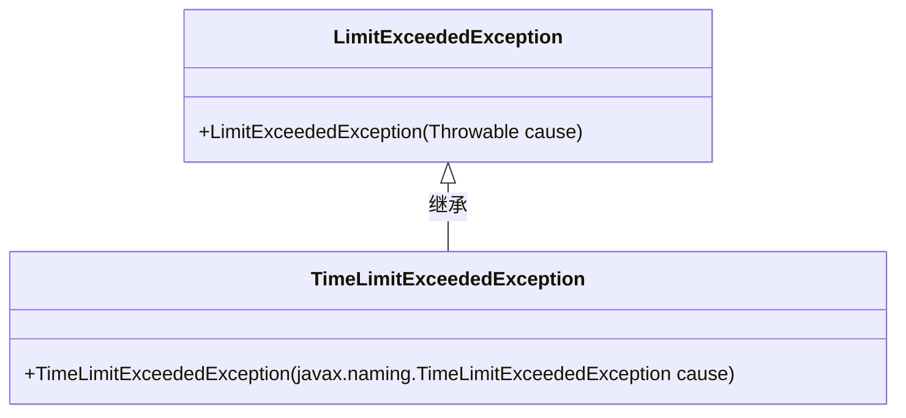
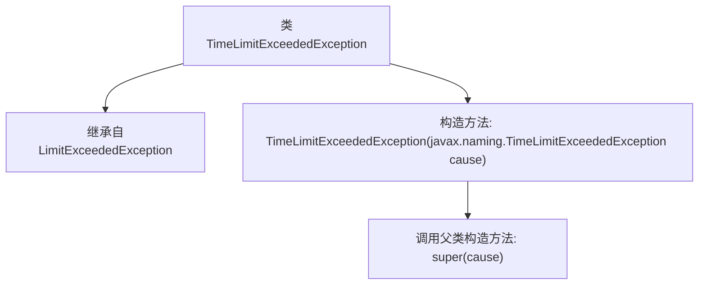

# 基础信息

|      |      |
|------|------|
| 名称 | TimeLimitExceededException |
| 编码语言 | .java |
| 代码路径 | spring-ldap/core/src/main/java/org/springframework/ldap/TimeLimitExceededException.java |
| 包名 | org.springframework.ldap |
| 依赖项 | [] |
| 概述说明 | TimeLimitExceededException继承LimitExceededException，构造函数接收相同类型参数。 |

# 说明

TimeLimitExceededException继承自LimitExceededException，其构造函数接收一个TimeLimitExceededException类型的参数。这表明TimeLimitExceededException是LimitExceededException的子类，专门用于处理时间限制超出的异常情况。通过构造函数接收同类型参数，可能用于传递异常信息或上下文，以便在异常处理中进行更精确的控制和记录。

# 类列表 Class Summary

| 名称   | 类型  | 说明 |
|-------|------|-------------|
| TimeLimitExceededException | class | TimeLimitExceededException继承LimitExceededException，构造函数接收TimeLimitExceededException参数。 |

## 类 TimeLimitExceededException

|      |      |
|------|------|
| 访问范围 | public |
| 类型 | class |
| 名称 | TimeLimitExceededException |
| 说明 | TimeLimitExceededException继承LimitExceededException，构造函数接收TimeLimitExceededException参数。 |

### UML类图

这段代码定义了一个 `TimeLimitExceededException` 类，它继承自 `LimitExceededException` 类。`TimeLimitExceededException` 类包含一个构造函数，该构造函数接受一个 `javax.naming.TimeLimitExceededException` 类型的参数，并将其传递给父类的构造函数。类图展示了 `TimeLimitExceededException` 与 `LimitExceededException` 之间的继承关系，表明 `TimeLimitExceededException` 是 `LimitExceededException` 的子类。

### 内部方法调用关系图

这段代码定义了一个名为 `TimeLimitExceededException` 的异常类，该类继承自 `LimitExceededException`。它包含一个构造方法，该构造方法接受一个 `javax.naming.TimeLimitExceededException` 类型的参数，并调用父类的构造方法 `super(cause)` 来初始化异常。这个类主要用于处理时间限制超时的异常情况。

### 字段列表 Field List

| 名称  | 类型  | 说明 |
|-------|-------|------|

### 方法列表 Method List

| 名称  | 类型  | 说明 |
|-------|-------|------|

