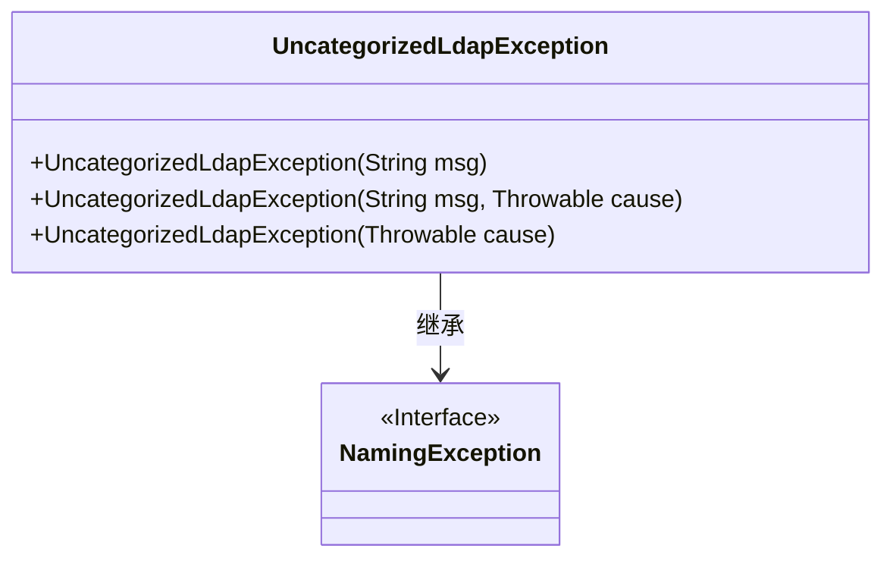
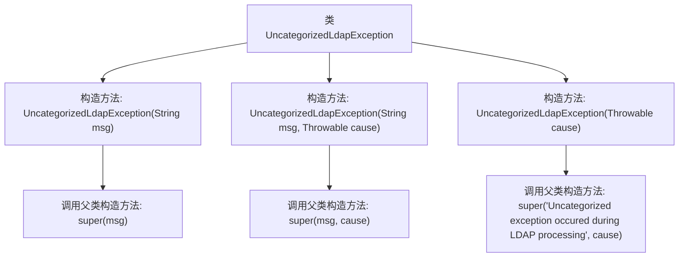

# 基础信息

|      |      |
|------|------|
| 名称 | UncategorizedLdapException |
| 编码语言 | .java |
| 代码路径 | spring-ldap/core/src/main/java/org/springframework/ldap/UncategorizedLdapException.java |
| 包名 | org.springframework.ldap |
| 依赖项 | [] |
| 概述说明 | UncategorizedLdapException继承NamingException，用于处理LDAP异常。 |

# 说明

UncategorizedLdapException是NamingException的子类，专门用于处理与LDAP（轻量级目录访问协议）相关的异常情况。该异常类的主要作用是在LDAP操作中捕获和处理未分类或无法明确归类的错误，确保系统能够有效地管理和响应这些异常。通过继承NamingException，UncategorizedLdapException继承了基本的命名服务异常处理机制，并在此基础上扩展了针对LDAP特定场景的异常处理能力。

# 类列表 Class Summary

| 名称   | 类型  | 说明 |
|-------|------|-------------|
| UncategorizedLdapException | class | UncategorizedLdapException继承NamingException，处理LDAP异常。 |

## 类 UncategorizedLdapException

|      |      |
|------|------|
| 访问范围 | public |
| 类型 | class |
| 名称 | UncategorizedLdapException |
| 说明 | UncategorizedLdapException继承NamingException，处理LDAP异常。 |

### UML类图

这段代码定义了一个名为 `UncategorizedLdapException` 的类，它继承自 `NamingException` 接口。`UncategorizedLdapException` 类有三个构造函数，分别用于处理不同的异常情况：一个接受错误消息的构造函数，一个接受错误消息和原因的构造函数，以及一个仅接受原因的构造函数。这些构造函数都调用了父类的构造函数来初始化异常信息。该类的设计目的是在LDAP处理过程中捕获未分类的异常，并提供详细的错误信息。

### 内部方法调用关系图

这段代码定义了一个名为 `UncategorizedLdapException` 的异常类，继承自 `NamingException`。该类提供了三个构造方法，分别用于处理不同的异常情况：仅包含错误消息、包含错误消息和原因、仅包含原因。每个构造方法都调用了父类的相应构造方法来初始化异常对象。流程图展示了类与其构造方法之间的调用关系，清晰地反映了异常处理的层次结构。

### 字段列表 Field List

| 名称  | 类型  | 说明 |
|-------|-------|------|

### 方法列表 Method List

| 名称  | 类型  | 说明 |
|-------|-------|------|

