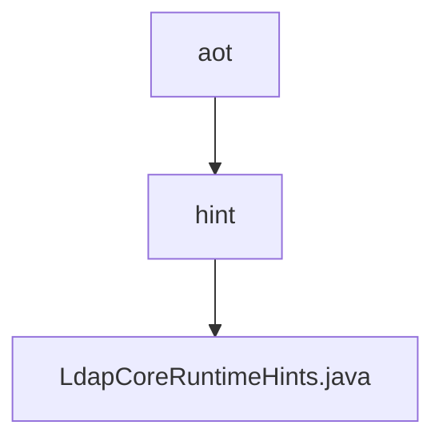

# 基础信息

|      |      |
|------|------|
| 名称 | aot |
| 编码语言 | .java |
| 代码路径 | spring-ldap/core/src/main/java/org/springframework/ldap/aot |
| 包名 | spring-ldap.core.src.main.java.org.springframework.ldap.aot |
| 概述说明 | LdapCoreRuntimeHints类注册反射提示，支持LDAP类型和方法调用。 |

# 说明

LdapCoreRuntimeHints类用于注册反射提示，专门支持与LDAP相关的类型和方法调用。该类确保在运行时能够正确识别和处理LDAP操作，提升系统在LDAP环境下的性能和兼容性。通过反射提示，LdapCoreRuntimeHints类优化了LDAP相关方法的调用流程，增强了系统的稳定性和效率。

### 包内部结构视图

该流程图展示了 `spring-ldap/core` 模块中 `aot` 目录的层级结构。`aot` 目录下包含 `hint` 子目录，而 `hint` 目录中包含 `LdapCoreRuntimeHints.java` 文件。这种结构清晰地反映了代码的组织方式，便于开发人员理解和维护。

# 文件列表 File List

| 名称   | 类型  | 说明 |
|-------|------|-------------|
| [hint](hint/_module.md) | package | LdapCoreRuntimeHints类注册反射提示，支持LDAP类型和方法调用。 |

