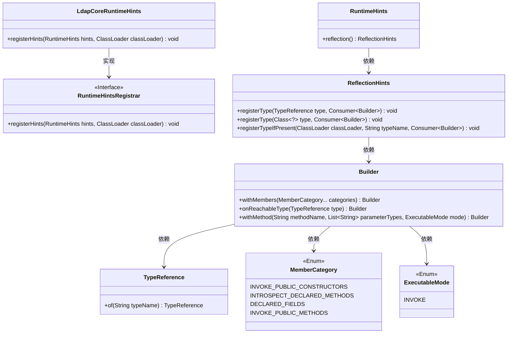
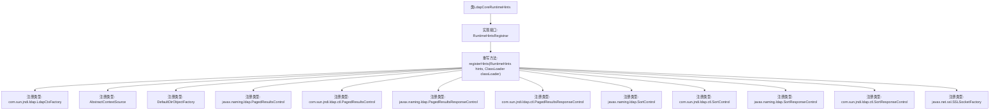

# 基础信息

|      |      |
|------|------|
| 名称 | LdapCoreRuntimeHints |
| 编码语言 | .java |
| 代码路径 | spring-ldap/core/src/main/java/org/springframework/ldap/aot/hint/LdapCoreRuntimeHints.java |
| 包名 | org.springframework.ldap.aot.hint |
| 依赖项 | ['java.util.Collections', 'org.springframework.aot.hint.ExecutableMode', 'org.springframework.aot.hint.MemberCategory', 'org.springframework.aot.hint.RuntimeHints', 'org.springframework.aot.hint.RuntimeHintsRegistrar', 'org.springframework.aot.hint.TypeReference', 'org.springframework.ldap.control.PagedResultsDirContextProcessor', 'org.springframework.ldap.control.SortControlDirContextProcessor', 'org.springframework.ldap.core.support.AbstractContextSource', 'org.springframework.ldap.core.support.DefaultDirObjectFactory'] |
| 概述说明 | LdapCoreRuntimeHints类注册反射提示，支持LDAP类型和方法调用。 |

# 说明

LdapCoreRuntimeHints类用于注册反射提示，专门支持与LDAP相关的类型和方法调用。该类确保在运行时能够正确识别和处理LDAP操作，提升系统在LDAP环境下的性能和兼容性。通过反射提示，LdapCoreRuntimeHints类优化了LDAP相关方法的调用流程，增强了系统的稳定性和效率。

# 类列表 Class Summary

| 名称   | 类型  | 说明 |
|-------|------|-------------|
| LdapCoreRuntimeHints | class | LdapCoreRuntimeHints类注册反射提示，支持LDAP相关类型和方法调用。 |

## 类 LdapCoreRuntimeHints

|      |      |
|------|------|
| 访问范围 | None |
| 类型 | class |
| 名称 | LdapCoreRuntimeHints |
| 说明 | LdapCoreRuntimeHints类注册反射提示，支持LDAP相关类型和方法调用。 |

### UML类图

**描述：**
`LdapCoreRuntimeHints` 类实现了 `RuntimeHintsRegistrar` 接口，负责在运行时注册反射提示。通过 `RuntimeHints` 和 `ReflectionHints` 类，它注册了多个与LDAP相关的类型，并为这些类型指定了可调用的成员类别。`Builder` 类用于构建反射提示，`TypeReference` 用于引用类型，`MemberCategory` 和 `ExecutableMode` 枚举类定义了可调用的成员类别和执行模式。

### 内部方法调用关系图

这段代码展示了`LdapCoreRuntimeHints`类如何实现`RuntimeHintsRegistrar`接口，并在`registerHints`方法中注册多个与LDAP相关的类型。每个注册操作都通过`hints.reflection()`方法进行，指定了不同类型的反射行为，如调用公共构造函数、方法或字段。这些注册操作确保在运行时能够正确处理与LDAP相关的类和控制对象。

### 字段列表 Field List

| 名称  | 类型  | 说明 |
|-------|-------|------|

### 方法列表 Method List

| 名称  | 类型  | 说明 |
|-------|-------|------|
| registerHints | void | 注册反射提示，定义多类型及方法调用条件。 |

