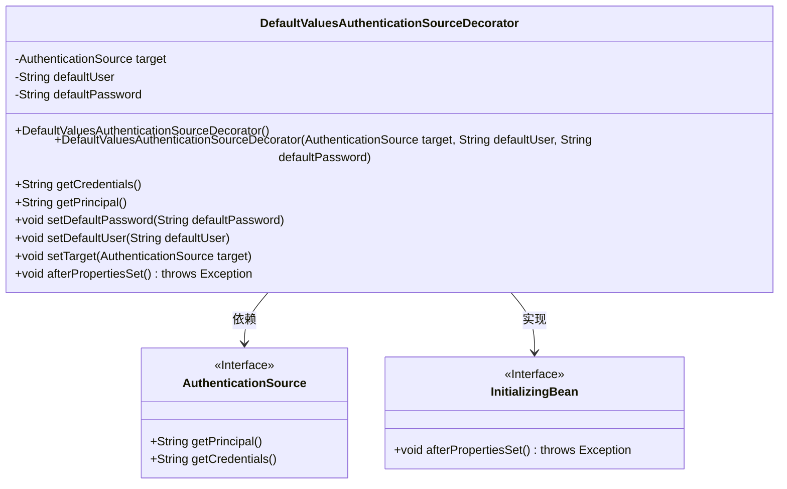

# 基础信息

|      |      |
|------|------|
| 名称 | DefaultValuesAuthenticationSourceDecorator |
| 编码语言 | .java |
| 代码路径 | spring-ldap/core/src/main/java/org/springframework/ldap/authentication/DefaultValuesAuthenticationSourceDecorator.java |
| 包名 | org.springframework.ldap.authentication |
| 依赖项 | ['org.springframework.beans.factory.InitializingBean', 'org.springframework.ldap.core.AuthenticationSource', 'org.springframework.util.StringUtils'] |
| 概述说明 | DefaultValuesAuthenticationSourceDecorator实现接口，提供默认用户密码，目标为空时使用。 |

# 说明

DefaultValuesAuthenticationSourceDecorator是一个实现了AuthenticationSource接口的类，其主要功能是提供默认的用户名和密码。当目标对象为空时，该类会自动使用这些默认值进行身份验证。这种设计确保了在缺乏具体目标信息的情况下，系统仍能通过默认配置完成身份验证过程，增强了系统的健壮性和灵活性。

# 类列表 Class Summary

| 名称   | 类型  | 说明 |
|-------|------|-------------|
| DefaultValuesAuthenticationSourceDecorator | class | DefaultValuesAuthenticationSourceDecorator实现AuthenticationSource接口，提供默认用户和密码，并在目标为空时使用。 |

## 类 DefaultValuesAuthenticationSourceDecorator

|      |      |
|------|------|
| 访问范围 | public |
| 类型 | class |
| 名称 | DefaultValuesAuthenticationSourceDecorator |
| 说明 | DefaultValuesAuthenticationSourceDecorator实现AuthenticationSource接口，提供默认用户和密码，并在目标为空时使用。 |

### UML类图

这段代码定义了一个 `DefaultValuesAuthenticationSourceDecorator` 类，该类实现了 `AuthenticationSource` 和 `InitializingBean` 接口。`DefaultValuesAuthenticationSourceDecorator` 类通过装饰模式扩展了 `AuthenticationSource` 的功能，提供了默认的用户名和密码。当 `AuthenticationSource` 返回空的用户名或密码时，该类会返回预设的默认值。`InitializingBean` 接口用于在属性设置完成后进行验证，确保所有必需的属性都已正确配置。

### 内部方法调用关系图

```mermaid
graph TD
    A["类DefaultValuesAuthenticationSourceDecorator"]
    B["属性: AuthenticationSource target"]
    C["属性: String defaultUser"]
    D["属性: String defaultPassword"]
    E["构造方法: DefaultValuesAuthenticationSourceDecorator()"]
    F["构造方法: DefaultValuesAuthenticationSourceDecorator(AuthenticationSource target, String defaultUser, String defaultPassword)"]
    G["方法: String getCredentials()"]
    H["方法: String getPrincipal()"]
    I["方法: void setDefaultPassword(String defaultPassword)"]
    J["方法: void setDefaultUser(String defaultUser)"]
    K["方法: void setTarget(AuthenticationSource target)"]
    L["方法: void afterPropertiesSet() throws Exception"]

    A --> B
    A --> C
    A --> D
    A --> E
    A --> F
    A --> G
    A --> H
    A --> I
    A --> J
    A --> K
    A --> L
```

这段代码定义了一个名为`DefaultValuesAuthenticationSourceDecorator`的类，该类实现了`AuthenticationSource`和`InitializingBean`接口。该类的主要作用是对目标`AuthenticationSource`进行装饰，提供默认的用户名和密码。当目标`AuthenticationSource`返回空的主体时，类会返回默认的用户名和密码。代码还包含了一些设置方法和一个`afterPropertiesSet`方法，用于在属性设置完成后进行验证。流程图展示了类的结构及其方法之间的调用关系。

### 字段列表 Field List

| 名称  | 类型  | 说明 |
|-------|-------|------|
| defaultUser | String | 定义私有字符串变量defaultUser。 |
| target | AuthenticationSource | 私有认证源目标变量声明。 |
| defaultPassword | String | 默认密码字段声明为私有字符串类型。 |

### 方法列表 Method List

| 名称  | 类型  | 说明 |
|-------|-------|------|
| setDefaultUser | void | 设置默认用户的方法。 |
| setTarget | void | 设置认证源目标对象。 |
| setDefaultPassword | void | 设置默认密码方法，参数为defaultPassword。 |
| getPrincipal | String | 获取目标主体，若无则返回默认用户。 |
| afterPropertiesSet | void | 检查target、defaultUser、defaultPassword属性是否为空，为空则抛出异常。 |
| getCredentials | String | 方法getCredentials返回目标主体凭证，若为空则返回默认密码。 |

