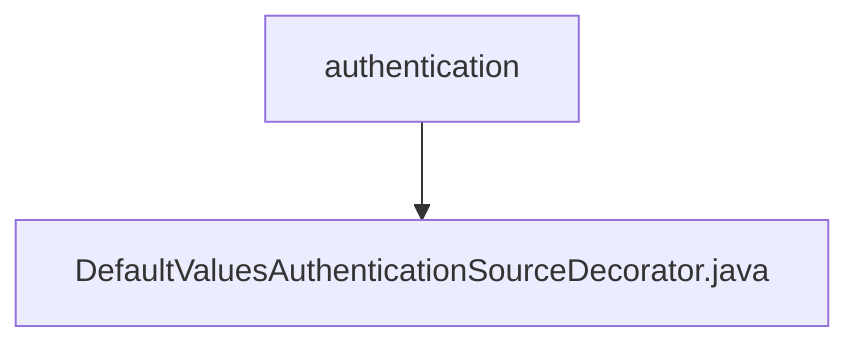

# 基础信息

|      |      |
|------|------|
| 名称 | authentication |
| 编码语言 | .java |
| 代码路径 | spring-ldap/core/src/main/java/org/springframework/ldap/authentication |
| 包名 | spring-ldap.core.src.main.java.org.springframework.ldap.authentication |
| 概述说明 | DefaultValuesAuthenticationSourceDecorator实现接口，提供默认用户密码，目标为空时使用。 |

# 说明

DefaultValuesAuthenticationSourceDecorator是一个实现了AuthenticationSource接口的类，其主要功能是提供默认的用户名和密码。当目标对象为空时，该类会自动使用这些默认值进行身份验证。这种设计确保了在缺乏具体目标信息的情况下，系统仍能通过默认配置完成身份验证过程，增强了系统的健壮性和灵活性。

### 包内部结构视图

该流程图展示了`spring-ldap`项目中`authentication`文件夹与`DefaultValuesAuthenticationSourceDecorator.java`文件之间的层级关系。`authentication`文件夹作为父节点，包含了一个子节点`DefaultValuesAuthenticationSourceDecorator.java`，表示该文件位于`authentication`文件夹下。

# 文件列表 File List

| 名称   | 类型  | 说明 |
|-------|------|-------------|
| [DefaultValuesAuthenticationSourceDecorator.java](DefaultValuesAuthenticationSourceDecorator.md) | file | DefaultValuesAuthenticationSourceDecorator实现接口，提供默认用户密码，目标为空时使用。 |

