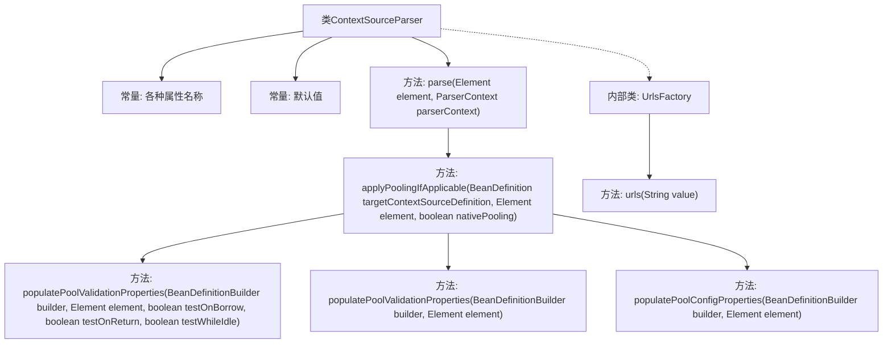

# 基础信息

|      |      |
|------|------|
| 名称 | ContextSourceParser |
| 编码语言 | .java |
| 代码路径 | spring-ldap/core/src/main/java/org/springframework/ldap/config/ContextSourceParser.java |
| 包名 | org.springframework.ldap.config |
| 依赖项 | ['java.util.HashSet', 'java.util.Set', 'org.w3c.dom.Element', 'org.springframework.beans.factory.config.BeanDefinition', 'org.springframework.beans.factory.parsing.BeanComponentDefinition', 'org.springframework.beans.factory.support.BeanDefinitionBuilder', 'org.springframework.beans.factory.xml.AbstractBeanDefinitionParser', 'org.springframework.beans.factory.xml.BeanDefinitionParser', 'org.springframework.beans.factory.xml.ParserContext', 'org.springframework.ldap.CommunicationException', 'org.springframework.ldap.core.support.LdapContextSource', 'org.springframework.ldap.pool.PoolExhaustedAction', 'org.springframework.ldap.pool.factory.PoolingContextSource', 'org.springframework.ldap.pool.validation.DefaultDirContextValidator', 'org.springframework.ldap.pool2.factory.PoolConfig', 'org.springframework.ldap.pool2.factory.PooledContextSource', 'org.springframework.ldap.transaction.compensating.manager.TransactionAwareContextSourceProxy', 'org.springframework.util.Assert', 'org.springframework.util.ClassUtils', 'org.springframework.util.StringUtils', 'org.springframework.util.xml.DomUtils'] |
| 概述说明 | ContextSourceParser类解析LDAP配置并生成BeanDefinition，支持连接池和认证策略。 |

# 说明

ContextSourceParser类负责解析LDAP配置信息，并将其转换为BeanDefinition对象。该类支持配置连接池和认证策略，确保LDAP连接的高效性和安全性。通过解析配置，ContextSourceParser能够生成适用于LDAP服务的BeanDefinition，为后续的LDAP操作提供基础支持。

# 类列表 Class Summary

| 名称   | 类型  | 说明 |
|-------|------|-------------|
| ContextSourceParser | class | ContextSourceParser类解析LDAP配置并生成BeanDefinition，支持连接池和认证策略。 |

## 类 ContextSourceParser

|      |      |
|------|------|
| 访问范围 | public |
| 类型 | class |
| 名称 | ContextSourceParser |
| 说明 | ContextSourceParser类解析LDAP配置并生成BeanDefinition，支持连接池和认证策略。 |

### UML类图

```mermaid
classDiagram
    class ContextSourceParser {
        -String ATT_ANONYMOUS_READ_ONLY
        -String ATT_AUTHENTICATION_SOURCE_REF
        -String ATT_AUTHENTICATION_STRATEGY_REF
        -String ATT_BASE
        -String ATT_PASSWORD
        -String ATT_NATIVE_POOLING
        -String ATT_REFERRAL
        -String ATT_URL
        -String ATT_BASE_ENV_PROPS_REF
        -String ATT_MAX_ACTIVE
        -String ATT_MAX_TOTAL
        -String ATT_MAX_IDLE
        -String ATT_MIN_IDLE
        -String ATT_MAX_WAIT
        -String ATT_WHEN_EXHAUSTED
        -String ATT_TEST_ON_BORROW
        -String ATT_TEST_ON_RETURN
        -String ATT_TEST_WHILE_IDLE
        -String ATT_EVICTION_RUN_MILLIS
        -String ATT_TESTS_PER_EVICTION_RUN
        -String ATT_EVICTABLE_TIME_MILLIS
        -String ATT_VALIDATION_QUERY_BASE
        -String ATT_VALIDATION_QUERY_FILTER
        -String ATT_VALIDATION_QUERY_SEARCH_CONTROLS_REF
        -String ATT_NON_TRANSIENT_EXCEPTIONS
        -String ATT_MAX_IDLE_PER_KEY
        -String ATT_MIN_IDLE_PER_KEY
        -String ATT_MAX_TOTAL_PER_KEY
        -String ATT_EVICTION_POLICY_CLASS
        -String ATT_FAIRNESS
        -String ATT_JMX_ENABLE
        -String ATT_JMX_NAME_BASE
        -String ATT_JMX_NAME_PREFIX
        -String ATT_LIFO
        -String ATT_BLOCK_WHEN_EXHAUSTED
        -String ATT_TEST_ON_CREATE
        -String ATT_SOFT_MIN_EVICTABLE_IDLE_TIME_MILLIS
        -String ATT_USERNAME
        -String DEFAULT_ID
        -int DEFAULT_MAX_ACTIVE
        -int DEFAULT_MAX_TOTAL
        -int DEFAULT_MAX_IDLE
        -int DEFAULT_MIN_IDLE
        -int DEFAULT_MAX_WAIT
        -int DEFAULT_EVICTION_RUN_MILLIS
        -int DEFAULT_TESTS_PER_EVICTION_RUN
        -int DEFAULT_EVICTABLE_MILLIS
        -int DEFAULT_MAX_TOTAL_PER_KEY
        -int DEFAULT_MAX_IDLE_PER_KEY
        -int DEFAULT_MIN_IDLE_PER_KEY
        -String DEFAULT_EVICTION_POLICY_CLASS_NAME
        -boolean DEFAULT_FAIRNESS
        -boolean DEFAULT_JMX_ENABLE
        -String DEFAULT_JMX_NAME_BASE
        -String DEFAULT_JMX_NAME_PREFIX
        -boolean DEFAULT_LIFO
        -int DEFAULT_MAX_WAIT_MILLIS
        -boolean DEFAULT_BLOCK_WHEN_EXHAUSTED
        -int DEFAULT_SOFT_MIN_EVICTABLE_IDLE_TIME_MILLIS
        +BeanDefinition parse(Element element, ParserContext parserContext)
        -BeanDefinition applyPoolingIfApplicable(BeanDefinition targetContextSourceDefinition, Element element, boolean nativePooling)
        -void populatePoolValidationProperties(BeanDefinitionBuilder builder, Element element, boolean testOnBorrow, boolean testOnReturn, boolean testWhileIdle)
        -void populatePoolValidationProperties(BeanDefinitionBuilder builder, Element element)
        -void populatePoolConfigProperties(BeanDefinitionBuilder builder, Element element)
    }

    class UrlsFactory {
        +static String[] urls(String value)
    }

    class BeanDefinition {
        // BeanDefinition properties and methods
    }

    class BeanDefinitionBuilder {
        // BeanDefinitionBuilder properties and methods
    }

    class Element {
        // Element properties and methods
    }

    class ParserContext {
        // ParserContext properties and methods
    }

    class LdapContextSource {
        // LdapContextSource properties and methods
    }

    class TransactionAwareContextSourceProxy {
        // TransactionAwareContextSourceProxy properties and methods
    }

    class PooledContextSource {
        // PooledContextSource properties and methods
    }

    class PoolingContextSource {
        // PoolingContextSource properties and methods
    }

    class PoolConfig {
        // PoolConfig properties and methods
    }

    class DefaultDirContextValidator {
        // DefaultDirContextValidator properties and methods
    }

    ContextSourceParser --> BeanDefinition : 生成
    ContextSourceParser --> BeanDefinitionBuilder : 使用
    ContextSourceParser --> Element : 解析
    ContextSourceParser --> ParserContext : 使用
    ContextSourceParser --> LdapContextSource : 生成
    ContextSourceParser --> TransactionAwareContextSourceProxy : 生成
    ContextSourceParser --> PooledContextSource : 生成
    ContextSourceParser --> PoolingContextSource : 生成
    ContextSourceParser --> PoolConfig : 生成
    ContextSourceParser --> DefaultDirContextValidator : 生成
    ContextSourceParser --> UrlsFactory : 使用
```

**描述：**  
`ContextSourceParser` 是一个用于解析 XML 配置并生成 `BeanDefinition` 的类。它根据配置属性（如 URL、用户名、密码等）构建 `LdapContextSource`，并根据需要应用连接池配置。它还处理与身份验证、连接池和验证相关的属性，并生成相应的 `BeanDefinition`。`UrlsFactory` 是一个辅助类，用于将逗号分隔的 URL 字符串转换为数组。

### 内部方法调用关系图

这段代码定义了一个`ContextSourceParser`类，用于解析XML配置并将其转换为Spring的`BeanDefinition`。类中包含多个常量，用于定义XML元素的属性名称和默认值。`parse`方法是核心逻辑，负责解析XML元素并构建`BeanDefinition`。`applyPoolingIfApplicable`方法用于处理连接池配置，而`populatePoolValidationProperties`和`populatePoolConfigProperties`方法则用于填充验证和配置属性。内部类`UrlsFactory`提供了一个静态方法`urls`，用于将字符串转换为URL数组。

### 字段列表 Field List

| 名称  | 类型  | 说明 |
|-------|-------|------|
| ATT_MAX_TOTAL = "max-total" | String | 定义私有静态常量字符串"max-total"。 |
| ATT_PASSWORD = "password" | String | 定义私有静态常量ATT_PASSWORD，值为"password"。 |
| DEFAULT_JMX_ENABLE = true | boolean | 默认启用JMX功能。 |
| ATT_EVICTABLE_TIME_MILLIS = "min-evictable-time-millis" | String | 私有静态常量定义最小可驱逐时间毫秒参数。 |
| DEFAULT_JMX_NAME_BASE = null | String | 默认JMX名称为空。 |
| ATT_AUTHENTICATION_SOURCE_REF = "authentication-source-ref" | String | 定义私有静态常量字符串，值为"authentication-source-ref"。 |
| DEFAULT_MAX_WAIT_MILLIS = -1 | int | 默认最大等待时间为-1毫秒。 |
| ATT_BASE = "base" | String | 定义常量ATT_BASE，值为"base"。 |
| ATT_MAX_ACTIVE = "max-active" | String | 定义常量字符串ATT_MAX_ACTIVE，值为"max-active"。 |
| ATT_AUTHENTICATION_STRATEGY_REF = "authentication-strategy-ref" | String | 定义常量字符串，用于引用认证策略。 |
| ATT_EVICTION_RUN_MILLIS = "eviction-run-interval-millis" | String | 私有静态常量定义缓存驱逐运行间隔时间。 |
| DEFAULT_LIFO = true | boolean | 默认LIFO设置为true。 |
| DEFAULT_MAX_TOTAL_PER_KEY = 8 | int | 默认每个键的最大总连接数为8。 |
| ATT_LIFO = "lifo" | String | 私有静态常量ATT_LIFO值为"lifo"。 |
| DEFAULT_MIN_IDLE_PER_KEY = 0 | int | 默认每个键的最小空闲连接数为0。 |
| DEFAULT_EVICTABLE_MILLIS = 1000 * 60 * 30 | int | 默认可驱逐时间为30分钟。 |
| ATT_BLOCK_WHEN_EXHAUSTED = "block-when-exhausted" | String | 定义常量字符串，表示资源耗尽时阻塞。 |
| ATT_MIN_IDLE = "min-idle" | String | 定义常量字符串ATT_MIN_IDLE，值为"min-idle"。 |
| DEFAULT_BLOCK_WHEN_EXHAUSTED = true | boolean | 默认情况下，资源耗尽时阻塞操作。 |
| DEFAULT_JMX_NAME_PREFIX = "ldap-pool" | String | 默认JMX名称前缀为"ldap-pool"。 |
| DEFAULT_ID = "contextSource" | String | 定义静态常量DEFAULT_ID，值为"contextSource"。 |
| DEFAULT_MAX_IDLE_PER_KEY = 8 | int | 私有静态常量默认最大空闲数为8。 |
| DEFAULT_MIN_IDLE = 0 | int | 定义静态常量DEFAULT_MIN_IDLE，默认值为0。 |
| ATT_TESTS_PER_EVICTION_RUN = "tests-per-eviction-run" | String | 定义常量字符串，表示每次驱逐运行时的测试次数。 |
| DEFAULT_FAIRNESS = false | boolean | 默认公平性设置为false。 |
| ATT_TEST_WHILE_IDLE = "test-while-idle" | String | 定义常量ATT_TEST_WHILE_IDLE，值为"test-while-idle"。 |
| DEFAULT_MAX_TOTAL = -1 | int | 定义私有静态常量DEFAULT_MAX_TOTAL，默认值为-1。 |
| DEFAULT_MAX_ACTIVE = 8 | int | 定义私有静态常量DEFAULT_MAX_ACTIVE，默认值为8。 |
| ATT_FAIRNESS = "fairness" | String | 定义私有静态常量字符串ATT_FAIRNESS，值为"fairness"。 |
| DEFAULT_MAX_WAIT = -1 | int | 定义私有静态常量DEFAULT_MAX_WAIT，默认值为-1。 |
| ATT_URL = "url" | String | 定义私有静态常量ATT_URL，值为"url"。 |
| ATT_MIN_IDLE_PER_KEY = "min-idle-per-key" | String | 定义私有静态常量字符串ATT_MIN_IDLE_PER_KEY，值为"min-idle-per-key"。 |
| ATT_MAX_WAIT = "max-wait" | String | 定义私有静态常量字符串ATT_MAX_WAIT，值为"max-wait"。 |
| ATT_VALIDATION_QUERY_BASE = "validation-query-base" | String | 定义常量ATT_VALIDATION_QUERY_BASE，值为"validation-query-base"。 |
| ATT_ANONYMOUS_READ_ONLY = "anonymous-read-only" | String | 定义常量ATT_ANONYMOUS_READ_ONLY，值为"anonymous-read-only"。 |
| ATT_BASE_ENV_PROPS_REF = "base-env-props-ref" | String | 定义私有静态常量字符串ATT_BASE_ENV_PROPS_REF，值为"base-env-props-ref"。 |
| ATT_REFERRAL = "referral" | String | 定义私有静态常量字符串ATT_REFERRAL，值为"referral"。 |
| ATT_NON_TRANSIENT_EXCEPTIONS = "non-transient-exceptions" | String | 定义常量`ATT_NON_TRANSIENT_EXCEPTIONS`，值为"non-transient-exceptions"。 |
| ATT_VALIDATION_QUERY_FILTER = "validation-query-filter" | String | 定义常量ATT_VALIDATION_QUERY_FILTER，值为"validation-query-filter"。 |
| ATT_TEST_ON_BORROW = "test-on-borrow" | String | 定义常量ATT_TEST_ON_BORROW，值为"test-on-borrow"。 |
| ATT_SOFT_MIN_EVICTABLE_IDLE_TIME_MILLIS = "soft-min-evictable-idle-time-millis" | String | 私有静态常量定义软最小可回收空闲时间毫秒属性名。 |
| ATT_MAX_IDLE = "max-idle" | String | 定义常量字符串ATT_MAX_IDLE，值为"max-idle"。 |
| ATT_MAX_TOTAL_PER_KEY = "max-total-per-key" | String | 定义常量ATT_MAX_TOTAL_PER_KEY，值为"max-total-per-key"。 |
| ATT_JMX_ENABLE = "jmx-enable" | String | 定义私有静态常量字符串ATT_JMX_ENABLE值为"jmx-enable"。 |
| ATT_NATIVE_POOLING = "native-pooling" | String | 定义私有静态常量字符串ATT_NATIVE_POOLING为"native-pooling"。 |
| DEFAULT_EVICTION_POLICY_CLASS_NAME = "org.apache.commons.pool2.impl.DefaultEvictionPolicy" | String | 默认驱逐策略类名为org.apache.commons.pool2.impl.DefaultEvictionPolicy。 |
| ATT_MAX_IDLE_PER_KEY = "max-idle-per-key" | String | 定义常量`ATT_MAX_IDLE_PER_KEY`，值为`max-idle-per-key`。 |
| ATT_VALIDATION_QUERY_SEARCH_CONTROLS_REF = "validation-query-search-controls-ref" | String | 定义常量ATT_VALIDATION_QUERY_SEARCH_CONTROLS_REF值为"validation-query-search-controls-ref"。 |
| DEFAULT_TESTS_PER_EVICTION_RUN = 3 | int | 默认每次清理运行的测试次数为3。 |
| DEFAULT_SOFT_MIN_EVICTABLE_IDLE_TIME_MILLIS = -1 | int | 私有静态常量DEFAULT_SOFT_MIN_EVICTABLE_IDLE_TIME_MILLIS默认值为-1。 |
| DEFAULT_EVICTION_RUN_MILLIS = -1 | int | 私有静态常量DEFAULT_EVICTION_RUN_MILLIS值为-1。 |
| DEFAULT_MAX_IDLE = 8 | int | 私有静态常量DEFAULT_MAX_IDLE默认值为8。 |
| ATT_JMX_NAME_BASE = "jmx-name-base" | String | 定义一个静态常量字符串，名为ATT_JMX_NAME_BASE，值为"jmx-name-base"。 |
| ATT_USERNAME = "username" | String | 定义常量ATT_USERNAME，值为"username"。 |
| ATT_TEST_ON_CREATE = "test-on-create" | String | 私有静态常量字符串ATT_TEST_ON_CREATE值为"test-on-create"。 |
| ATT_EVICTION_POLICY_CLASS = "eviction-policy-class" | String | 定义私有常量字符串，表示驱逐策略类名。 |
| ATT_WHEN_EXHAUSTED = "when-exhausted" | String | 定义常量ATT_WHEN_EXHAUSTED为"when-exhausted"。 |
| ATT_JMX_NAME_PREFIX = "jmx-name-prefix" | String | 定义常量ATT_JMX_NAME_PREFIX，值为"jmx-name-prefix"。 |
| ATT_TEST_ON_RETURN = "test-on-return" | String | 定义私有静态常量ATT_TEST_ON_RETURN，值为"test-on-return"。 |

### 方法列表 Method List

| 名称  | 类型  | 说明 |
|-------|-------|------|
| populatePoolConfigProperties | void | 方法配置连接池属性并构建Bean定义。 |
| applyPoolingIfApplicable | BeanDefinition | 方法根据元素配置决定是否应用池化，处理相关属性并返回BeanDefinition。 |
| parse | BeanDefinition | 解析XML元素，构建LdapContextSource的Bean定义，设置属性并应用池化配置。 |
| populatePoolValidationProperties | void | 方法填充池验证属性，配置验证器及非瞬态异常类。 |
| populatePoolValidationProperties | void | 方法用于配置连接池验证属性，包括测试选项、验证器、驱逐策略及非瞬态异常类。 |

