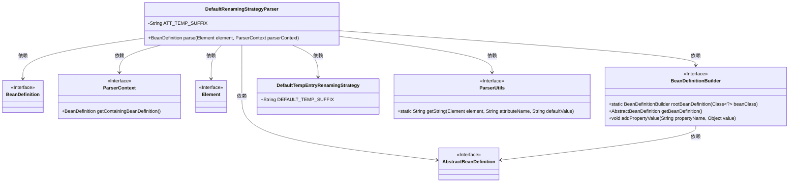
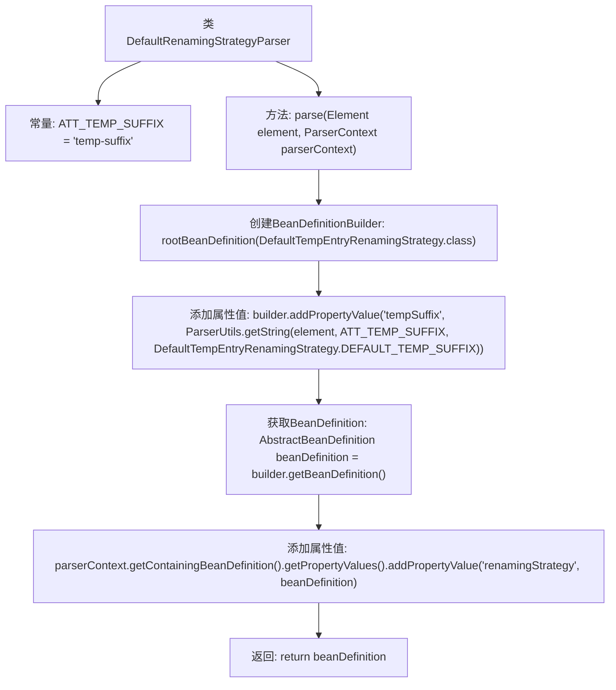

# 基础信息

|      |      |
|------|------|
| 名称 | DefaultRenamingStrategyParser |
| 编码语言 | .java |
| 代码路径 | spring-ldap/core/src/main/java/org/springframework/ldap/config/DefaultRenamingStrategyParser.java |
| 包名 | org.springframework.ldap.config |
| 依赖项 | ['org.w3c.dom.Element', 'org.springframework.beans.factory.config.BeanDefinition', 'org.springframework.beans.factory.support.AbstractBeanDefinition', 'org.springframework.beans.factory.support.BeanDefinitionBuilder', 'org.springframework.beans.factory.xml.BeanDefinitionParser', 'org.springframework.beans.factory.xml.ParserContext', 'org.springframework.ldap.transaction.compensating.support.DefaultTempEntryRenamingStrategy'] |
| 概述说明 | DefaultRenamingStrategyParser类解析XML并生成DefaultTempEntryRenamingStrategy的Bean定义。 |

# 说明

DefaultRenamingStrategyParser类负责解析XML元素，并将其转换为DefaultTempEntryRenamingStrategy的Bean定义。该类的主要功能是从XML配置中提取相关信息，生成对应的Bean定义，以便在应用程序中使用。通过这种方式，开发者可以通过XML配置灵活地定义和管理重命名策略，而无需直接编写代码。这种设计模式提高了代码的可维护性和可扩展性，使得系统能够轻松应对需求变化。

# 类列表 Class Summary

| 名称   | 类型  | 说明 |
|-------|------|-------------|
| DefaultRenamingStrategyParser | class | DefaultRenamingStrategyParser类解析XML元素，生成DefaultTempEntryRenamingStrategy的Bean定义。 |

## 类 DefaultRenamingStrategyParser

|      |      |
|------|------|
| 访问范围 | public |
| 类型 | class |
| 名称 | DefaultRenamingStrategyParser |
| 说明 | DefaultRenamingStrategyParser类解析XML元素，生成DefaultTempEntryRenamingStrategy的Bean定义。 |

### UML类图

**描述：**
`DefaultRenamingStrategyParser` 类实现了 `BeanDefinitionParser` 接口，用于解析 XML 元素并生成 `BeanDefinition`。它依赖于多个接口和类，如 `ParserContext`、`Element`、`BeanDefinitionBuilder`、`DefaultTempEntryRenamingStrategy`、`ParserUtils` 和 `AbstractBeanDefinition`。通过 `BeanDefinitionBuilder`，它构建了一个 `AbstractBeanDefinition`，并将其添加到 `ParserContext` 的 `BeanDefinition` 中。该类主要用于解析 XML 配置，生成临时重命名策略的 Bean 定义。

### 内部方法调用关系图

该流程图描述了`DefaultRenamingStrategyParser`类的`parse`方法的执行流程。首先，创建`BeanDefinitionBuilder`对象，随后通过`ParserUtils`获取属性值并添加到`builder`中。接着，获取`BeanDefinition`并将其作为属性值添加到`parserContext`中。最后，返回生成的`BeanDefinition`。整个过程展示了如何解析XML元素并构建相应的Bean定义。

### 字段列表 Field List

| 名称  | 类型  | 说明 |
|-------|-------|------|
| ATT_TEMP_SUFFIX = "temp-suffix" | String | 定义常量ATT_TEMP_SUFFIX，值为"temp-suffix"。 |

### 方法列表 Method List

| 名称  | 类型  | 说明 |
|-------|-------|------|
| parse | BeanDefinition | 解析元素生成Bean定义，设置临时后缀并添加到上下文。 |

