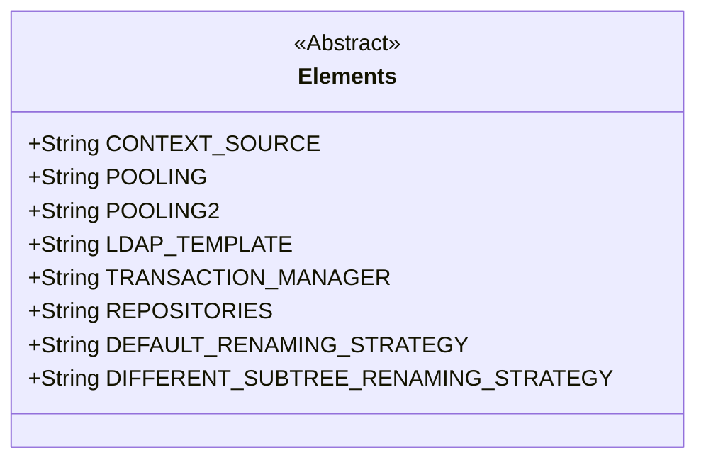
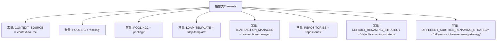

# 基础信息

|      |      |
|------|------|
| 名称 | Elements |
| 编码语言 | .java |
| 代码路径 | spring-ldap/core/src/main/java/org/springframework/ldap/config/Elements.java |
| 包名 | org.springframework.ldap.config |
| 依赖项 | [] |
| 概述说明 | Elements类定义关键元素的静态常量字符串，包括上下文源、池化和LDAP模板。 |

# 说明

Elements类包含多个静态常量字符串，这些字符串用于定义上下文源、池化、LDAP模板等关键元素。这些常量在类中被静态声明，意味着它们在整个应用程序中可以直接通过类名访问，无需实例化对象。这些字符串通常用于配置或引用特定的资源或模板，确保代码的一致性和可维护性。通过将这些关键元素定义为常量，可以减少硬编码，提高代码的可读性和可扩展性。

# 类列表 Class Summary

| 名称   | 类型  | 说明 |
|-------|------|-------------|
| Elements | class | Elements类包含多个静态常量字符串，用于定义上下文源、池化、LDAP模板等关键元素。 |

## 类 Elements

|      |      |
|------|------|
| 访问范围 | public abstract |
| 类型 | class |
| 名称 | Elements |
| 说明 | Elements类包含多个静态常量字符串，用于定义上下文源、池化、LDAP模板等关键元素。 |

### UML类图

这段代码定义了一个抽象类 `Elements`，其中包含了多个公共的静态常量字符串字段。这些字段用于存储不同的配置或策略名称，如上下文源、池化、LDAP模板、事务管理器等。这些常量通常用于在应用程序中引用特定的配置或策略，以避免硬编码字符串。由于 `Elements` 是一个抽象类，它不能被实例化，而是作为其他类的基类使用。

### 内部方法调用关系图

这段代码定义了一个名为`Elements`的抽象类，其中包含了多个静态常量字符串。这些常量主要用于标识不同的元素或配置项，如上下文源、连接池、LDAP模板、事务管理器等。每个常量都有一个特定的字符串值，这些值可能在系统中用于标识或引用相应的元素或配置。代码的结构清晰，常量的命名和赋值都符合Java的编码规范，便于在其他类或模块中引用这些常量。

### 字段列表 Field List

| 名称  | 类型  | 说明 |
|-------|-------|------|
| LDAP_TEMPLATE = "ldap-template" | String | LDAP模板的静态常量字符串定义为"ldap-template"。 |
| DIFFERENT_SUBTREE_RENAMING_STRATEGY = "different-subtree-renaming-strategy" | String | 不同子树重命名策略常量定义。 |
| POOLING = "pooling" | String | 定义静态常量POOLING，值为"pooling"。 |
| POOLING2 = "pooling2" | String | 静态常量POOLING2定义为字符串"pooling2"。 |
| DEFAULT_RENAMING_STRATEGY = "default-renaming-strategy" | String | 默认重命名策略常量定义为"default-renaming-strategy"。 |
| CONTEXT_SOURCE = "context-source" | String | 定义常量CONTEXT_SOURCE，值为"context-source"。 |
| REPOSITORIES = "repositories" | String | 定义了一个静态常量字符串变量，值为"repositories"。 |
| TRANSACTION_MANAGER = "transaction-manager" | String | 定义了一个名为TRANSACTION_MANAGER的静态常量字符串，值为"transaction-manager"。 |

### 方法列表 Method List

| 名称  | 类型  | 说明 |
|-------|-------|------|

