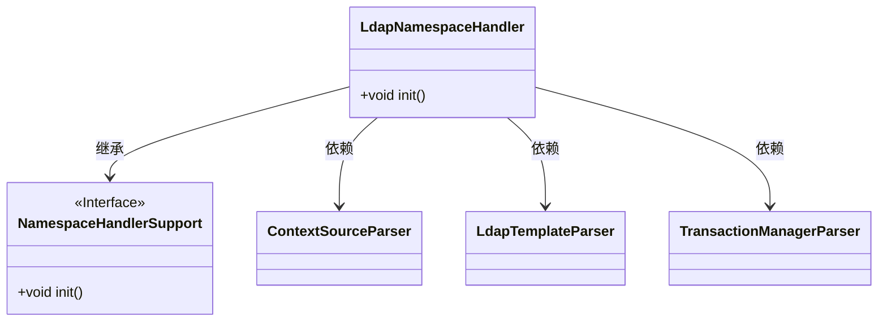
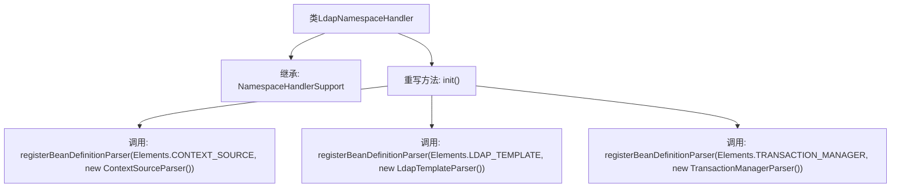

# 基础信息

|      |      |
|------|------|
| 名称 | LdapNamespaceHandler |
| 编码语言 | .java |
| 代码路径 | spring-ldap/core/src/main/java/org/springframework/ldap/config/LdapNamespaceHandler.java |
| 包名 | org.springframework.ldap.config |
| 依赖项 | ['org.springframework.beans.factory.xml.NamespaceHandlerSupport'] |
| 概述说明 | LdapNamespaceHandler注册三个Bean解析器。 |

# 说明

LdapNamespaceHandler在初始化过程中注册了三个Bean定义解析器。这些解析器用于处理与LDAP相关的配置，确保能够正确解析和定义Bean，从而支持LDAP命名空间的配置和管理。这一步骤是LDAP功能实现的基础，确保了系统能够识别和处理LDAP相关的配置信息。

# 类列表 Class Summary

| 名称   | 类型  | 说明 |
|-------|------|-------------|
| LdapNamespaceHandler | class | LdapNamespaceHandler初始化注册三个Bean定义解析器。 |

## 类 LdapNamespaceHandler

|      |      |
|------|------|
| 访问范围 | public |
| 类型 | class |
| 名称 | LdapNamespaceHandler |
| 说明 | LdapNamespaceHandler初始化注册三个Bean定义解析器。 |

### UML类图

这段代码描述了一个 `LdapNamespaceHandler` 类，它继承了 `NamespaceHandlerSupport` 接口，并在 `init` 方法中注册了三个不同的解析器：`ContextSourceParser`、`LdapTemplateParser` 和 `TransactionManagerParser`。这些解析器用于处理不同的 LDAP 元素，如上下文源、LDAP 模板和事务管理器。类图展示了 `LdapNamespaceHandler` 与这些解析器之间的依赖关系，以及它与 `NamespaceHandlerSupport` 接口的继承关系。

### 内部方法调用关系图

这段代码描述了一个名为`LdapNamespaceHandler`的类，该类继承自`NamespaceHandlerSupport`。在`init()`方法中，它注册了三个不同的`BeanDefinitionParser`，分别用于处理`CONTEXT_SOURCE`、`LDAP_TEMPLATE`和`TRANSACTION_MANAGER`元素的解析。这些解析器用于将XML配置转换为Spring框架中的Bean定义。

### 字段列表 Field List

| 名称  | 类型  | 说明 |
|-------|-------|------|

### 方法列表 Method List

| 名称  | 类型  | 说明 |
|-------|-------|------|
| init | void | 初始化方法注册了三个Bean定义解析器：ContextSource、LdapTemplate和TransactionManager。 |

