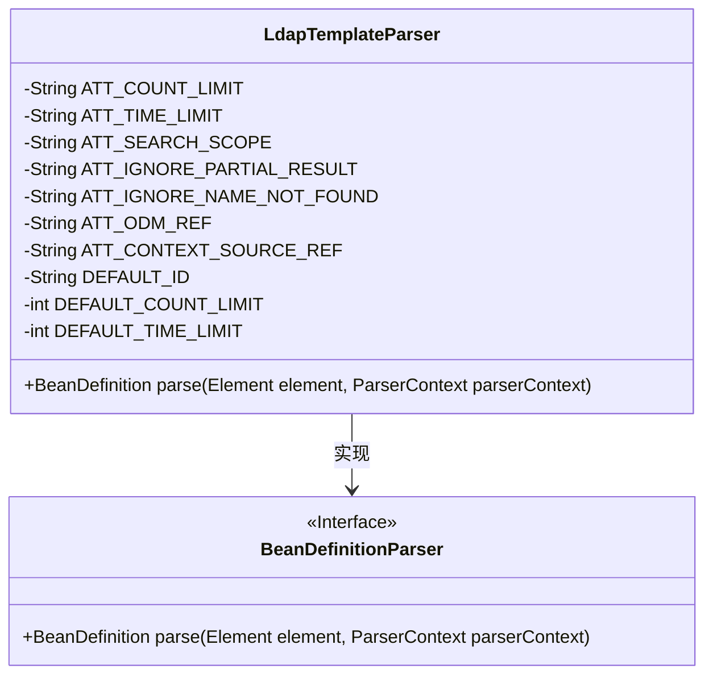
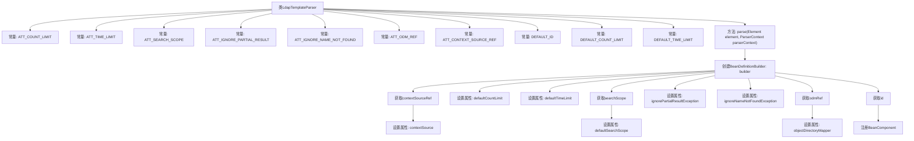

# 基础信息

|      |      |
|------|------|
| 名称 | LdapTemplateParser |
| 编码语言 | .java |
| 代码路径 | spring-ldap/core/src/main/java/org/springframework/ldap/config/LdapTemplateParser.java |
| 包名 | org.springframework.ldap.config |
| 依赖项 | ['org.w3c.dom.Element', 'org.springframework.beans.factory.config.BeanDefinition', 'org.springframework.beans.factory.parsing.BeanComponentDefinition', 'org.springframework.beans.factory.support.BeanDefinitionBuilder', 'org.springframework.beans.factory.xml.AbstractBeanDefinitionParser', 'org.springframework.beans.factory.xml.BeanDefinitionParser', 'org.springframework.beans.factory.xml.ParserContext', 'org.springframework.ldap.core.LdapTemplate', 'org.springframework.ldap.query.SearchScope', 'org.springframework.util.StringUtils'] |
| 概述说明 | LdapTemplateParser解析XML生成LdapTemplate Bean定义。 |

# 说明

LdapTemplateParser通过解析XML元素，生成LdapTemplate的Bean定义。该过程涉及从XML配置中提取相关属性，并将其映射到LdapTemplate对象的各个字段，最终形成一个完整的Bean实例，用于后续的LDAP操作。

# 类列表 Class Summary

| 名称   | 类型  | 说明 |
|-------|------|-------------|
| LdapTemplateParser | class | LdapTemplateParser解析XML元素生成LdapTemplate Bean定义。 |

## 类 LdapTemplateParser

|      |      |
|------|------|
| 访问范围 | public |
| 类型 | class |
| 名称 | LdapTemplateParser |
| 说明 | LdapTemplateParser解析XML元素生成LdapTemplate Bean定义。 |

### UML类图

类图描述：`LdapTemplateParser` 类实现了 `BeanDefinitionParser` 接口，用于解析 XML 元素并生成 `BeanDefinition` 对象。该类包含多个静态常量，用于定义 XML 元素的属性名称和默认值。`parse` 方法根据传入的 XML 元素和解析上下文，构建并注册 `BeanDefinition` 对象，最终返回该对象。

### 内部方法调用关系图

这段代码定义了一个`LdapTemplateParser`类，用于解析XML配置并生成`LdapTemplate`的Bean定义。代码中定义了一系列常量用于解析XML属性，并在`parse`方法中通过`BeanDefinitionBuilder`设置这些属性。最终，生成的Bean定义会被注册到`ParserContext`中。流程图展示了从类定义到方法执行的完整流程，清晰地展示了各个步骤之间的调用关系。

### 字段列表 Field List

| 名称  | 类型  | 说明 |
|-------|-------|------|
| DEFAULT_TIME_LIMIT = 0 | int | 定义默认时间限制为0的静态常量。 |
| DEFAULT_ID = "ldapTemplate" | String | 定义私有静态常量DEFAULT_ID，值为"ldapTemplate"。 |
| ATT_TIME_LIMIT = "time-limit" | String | 定义私有静态常量ATT_TIME_LIMIT，值为"time-limit"。 |
| DEFAULT_COUNT_LIMIT = 0 | int | 定义了私有静态常量DEFAULT_COUNT_LIMIT，默认值为0。 |
| ATT_SEARCH_SCOPE = "search-scope" | String | 定义私有静态常量字符串ATT_SEARCH_SCOPE，值为"search-scope"。 |
| ATT_IGNORE_NAME_NOT_FOUND = "ignore-name-not-found" | String | 定义常量ATT_IGNORE_NAME_NOT_FOUND，值为"ignore-name-not-found"。 |
| ATT_COUNT_LIMIT = "count-limit" | String | 定义私有静态常量字符串变量ATT_COUNT_LIMIT，值为"count-limit"。 |
| ATT_IGNORE_PARTIAL_RESULT = "ignore-partial-result" | String | 定义常量字符串ATT_IGNORE_PARTIAL_RESULT为"ignore-partial-result"。 |
| ATT_CONTEXT_SOURCE_REF = "context-source-ref" | String | 定义私有静态常量字符串ATT_CONTEXT_SOURCE_REF，值为"context-source-ref"。 |
| ATT_ODM_REF = "odm-ref" | String | 定义常量字符串ATT_ODM_REF，值为"odm-ref"。 |

### 方法列表 Method List

| 名称  | 类型  | 说明 |
|-------|-------|------|
| parse | BeanDefinition | 解析XML元素生成LdapTemplate的Bean定义并注册。 |

