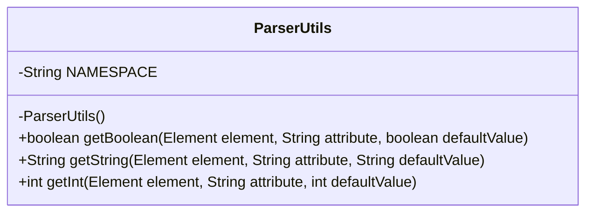
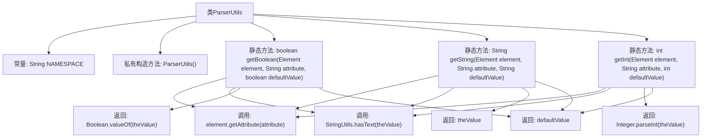

# 基础信息

|      |      |
|------|------|
| 名称 | ParserUtils |
| 编码语言 | .java |
| 代码路径 | spring-ldap/core/src/main/java/org/springframework/ldap/config/ParserUtils.java |
| 包名 | org.springframework.ldap.config |
| 依赖项 | ['org.w3c.dom.Element', 'org.springframework.util.StringUtils'] |
| 概述说明 | ParserUtils类提供静态方法，用于获取元素属性值并支持默认值。 |

# 说明

ParserUtils类提供了一系列静态方法，用于从元素中提取布尔、字符串和整型属性值。这些方法支持默认值，确保在属性不存在或无法解析时返回预设的默认值，增强了代码的健壮性和灵活性。

# 类列表 Class Summary

| 名称   | 类型  | 说明 |
|-------|------|-------------|
| ParserUtils | class | ParserUtils类提供静态方法，用于从元素中获取布尔、字符串和整型属性值，支持默认值。 |

## 类 ParserUtils

|      |      |
|------|------|
| 访问范围 | final |
| 类型 | class |
| 名称 | ParserUtils |
| 说明 | ParserUtils类提供静态方法，用于从元素中获取布尔、字符串和整型属性值，支持默认值。 |

### UML类图

这段代码定义了一个名为 `ParserUtils` 的工具类，用于解析 XML 元素中的属性值。该类包含一个常量 `NAMESPACE` 和三个静态方法：`getBoolean`、`getString` 和 `getInt`，分别用于从 XML 元素中获取布尔值、字符串和整数类型的属性值。如果属性值不存在或为空，则返回默认值。类的构造函数被私有化，以防止实例化。

### 内部方法调用关系图

这段代码定义了一个名为`ParserUtils`的工具类，包含三个静态方法：`getBoolean`、`getString`和`getInt`，用于从XML元素中获取布尔值、字符串和整数类型的属性值。每个方法首先通过`element.getAttribute(attribute)`获取属性值，然后使用`StringUtils.hasText(theValue)`检查该值是否有效。如果有效，则返回转换后的值，否则返回默认值。类中还定义了一个私有构造方法，防止类被实例化。

### 字段列表 Field List

| 名称  | 类型  | 说明 |
|-------|-------|------|
| NAMESPACE = "http://www.springframework.org/schema/ldap" | String | 定义了一个静态常量字符串NAMESPACE，值为Spring框架LDAP的命名空间URL。 |

### 方法列表 Method List

| 名称  | 类型  | 说明 |
|-------|-------|------|
| getString | String | 从元素获取指定属性值，若为空则返回默认值。 |
| getBoolean | boolean | 从XML元素获取布尔属性值，若缺失则返回默认值。 |
| getInt | int | 获取元素属性值，无值返回默认值。 |

