# 基础信息

|      |      |
|------|------|
| 名称 | TransactionManagerParser |
| 编码语言 | .java |
| 代码路径 | spring-ldap/core/src/main/java/org/springframework/ldap/config/TransactionManagerParser.java |
| 包名 | org.springframework.ldap.config |
| 依赖项 | ['org.w3c.dom.Element', 'org.springframework.beans.factory.config.BeanDefinition', 'org.springframework.beans.factory.parsing.BeanComponentDefinition', 'org.springframework.beans.factory.support.BeanDefinitionBuilder', 'org.springframework.beans.factory.xml.AbstractBeanDefinitionParser', 'org.springframework.beans.factory.xml.BeanDefinitionParser', 'org.springframework.beans.factory.xml.ParserContext', 'org.springframework.ldap.transaction.compensating.manager.ContextSourceAndDataSourceTransactionManager', 'org.springframework.ldap.transaction.compensating.manager.ContextSourceAndHibernateTransactionManager', 'org.springframework.ldap.transaction.compensating.manager.ContextSourceTransactionManager', 'org.springframework.ldap.transaction.compensating.support.DefaultTempEntryRenamingStrategy', 'org.springframework.ldap.transaction.compensating.support.DifferentSubtreeTempEntryRenamingStrategy', 'org.springframework.util.Assert', 'org.springframework.util.StringUtils', 'org.springframework.util.xml.DomUtils'] |
| 概述说明 | TransactionManagerParser解析XML配置，创建事务管理器Bean定义。 |

# 说明

TransactionManagerParser负责解析XML配置文件，根据配置中的属性信息创建事务管理器的Bean定义。该过程涉及读取XML中的相关属性，并将其转换为Spring框架中的Bean定义，以便在应用程序中管理和使用事务管理器。

# 类列表 Class Summary

| 名称   | 类型  | 说明 |
|-------|------|-------------|
| TransactionManagerParser | class | TransactionManagerParser解析XML配置，根据属性创建事务管理器Bean定义。 |

## 类 TransactionManagerParser

|      |      |
|------|------|
| 访问范围 | public |
| 类型 | class |
| 名称 | TransactionManagerParser |
| 说明 | TransactionManagerParser解析XML配置，根据属性创建事务管理器Bean定义。 |

### UML类图

```mermaid
classDiagram
    class TransactionManagerParser {
        -String ATT_CONTEXT_SOURCE_REF
        -String ATT_DATA_SOURCE_REF
        -String ATT_SESSION_FACTORY_REF
        -String ATT_TEMP_SUFFIX
        -String ATT_SUBTREE_NODE
        -String DEFAULT_ID
        +BeanDefinition parse(Element element, ParserContext parserContext)
        -BeanDefinition parseDifferentSubtreeRenamingStrategy(Element element)
        -BeanDefinition parseDefaultRenamingStrategy(Element element)
    }

    class BeanDefinition {
        <<Interface>>
    }

    class BeanDefinitionBuilder {
        <<Interface>>
        +static BeanDefinitionBuilder rootBeanDefinition(Class~?~ beanClass)
        +void addPropertyReference(String propertyName, String beanName)
        +void addPropertyValue(String propertyName, Object value)
        +BeanDefinition getBeanDefinition()
    }

    class ParserContext {
        <<Interface>>
        +void registerBeanComponent(BeanComponentDefinition beanComponentDefinition)
    }

    class Element {
        <<Interface>>
        +String getAttribute(String name)
    }

    class ParserUtils {
        <<Interface>>
        +static String getString(Element element, String attributeName, String defaultValue)
    }

    class DomUtils {
        <<Interface>>
        +static Element getChildElementByTagName(Element parent, String tagName)
    }

    class StringUtils {
        <<Interface>>
        +static boolean hasText(String str)
    }

    class Assert {
        <<Interface>>
        +static void hasText(String text, String message)
    }

    class BeanComponentDefinition {
        +BeanComponentDefinition(BeanDefinition beanDefinition, String id)
    }

    class ContextSourceAndDataSourceTransactionManager {
    }

    class ContextSourceAndHibernateTransactionManager {
    }

    class ContextSourceTransactionManager {
    }

    class DifferentSubtreeTempEntryRenamingStrategy {
    }

    class DefaultTempEntryRenamingStrategy {
        -String DEFAULT_TEMP_SUFFIX
    }

    TransactionManagerParser --> BeanDefinition : 依赖
    TransactionManagerParser --> BeanDefinitionBuilder : 依赖
    TransactionManagerParser --> ParserContext : 依赖
    TransactionManagerParser --> Element : 依赖
    TransactionManagerParser --> ParserUtils : 依赖
    TransactionManagerParser --> DomUtils : 依赖
    TransactionManagerParser --> StringUtils : 依赖
    TransactionManagerParser --> Assert : 依赖
    TransactionManagerParser --> BeanComponentDefinition : 依赖
    TransactionManagerParser --> ContextSourceAndDataSourceTransactionManager : 依赖
    TransactionManagerParser --> ContextSourceAndHibernateTransactionManager : 依赖
    TransactionManagerParser --> ContextSourceTransactionManager : 依赖
    TransactionManagerParser --> DifferentSubtreeTempEntryRenamingStrategy : 依赖
    TransactionManagerParser --> DefaultTempEntryRenamingStrategy : 依赖
```

**描述：**
`TransactionManagerParser`类是一个解析器，负责解析XML配置中的事务管理器定义，并根据配置生成相应的`BeanDefinition`。它依赖于多个工具类（如`ParserUtils`、`DomUtils`、`StringUtils`等）来处理XML元素和字符串操作，并生成不同类型的事务管理器（如`ContextSourceAndDataSourceTransactionManager`、`ContextSourceAndHibernateTransactionManager`等）。该类还负责解析重命名策略，并将其应用到生成的事务管理器中。

### 内部方法调用关系图

这段代码定义了一个`TransactionManagerParser`类，用于解析XML配置并生成相应的`BeanDefinition`。代码首先从XML元素中提取各种属性，然后根据这些属性创建不同类型的`BeanDefinitionBuilder`。如果同时指定了`dataSourceRef`和`sessionFactoryRef`，则抛出异常。接着，代码处理默认和不同子树的命名策略，并最终注册和返回生成的`BeanDefinition`。

### 字段列表 Field List

| 名称  | 类型  | 说明 |
|-------|-------|------|
| ATT_DATA_SOURCE_REF = "data-source-ref" | String | 定义私有静态常量字符串"data-source-ref"。 |
| ATT_CONTEXT_SOURCE_REF = "context-source-ref" | String | 定义常量字符串变量ATT_CONTEXT_SOURCE_REF，值为"context-source-ref"。 |
| ATT_TEMP_SUFFIX = "temp-suffix" | String | 定义静态常量ATT_TEMP_SUFFIX，值为"temp-suffix"。 |
| ATT_SUBTREE_NODE = "subtree-node" | String | 定义私有静态常量字符串ATT_SUBTREE_NODE，值为"subtree-node"。 |
| DEFAULT_ID = "transactionManager" | String | 定义默认ID为"transactionManager"的私有静态常量字符串。 |
| ATT_SESSION_FACTORY_REF = "session-factory-ref" | String | 定义私有静态常量ATT_SESSION_FACTORY_REF，值为"session-factory-ref"。 |

### 方法列表 Method List

| 名称  | 类型  | 说明 |
|-------|-------|------|
| parseDifferentSubtreeRenamingStrategy | BeanDefinition | 解析子树重命名策略，构建Bean定义并返回。 |
| parseDefaultRenamingStrategy | BeanDefinition | 解析默认重命名策略，生成Bean定义，设置临时后缀属性。 |
| parse | BeanDefinition | 解析XML元素生成Bean定义，支持数据源或会话工厂，并处理重命名策略。 |

